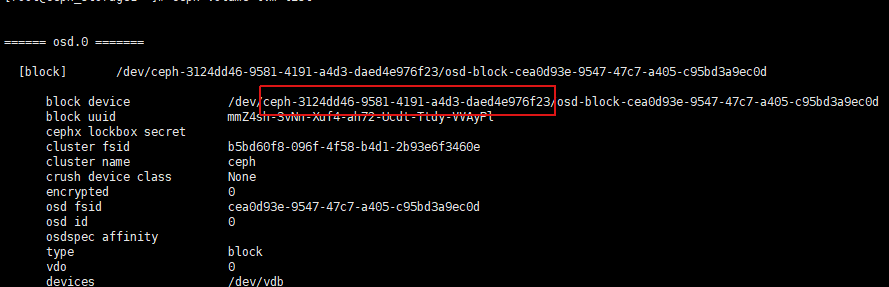

# 部署Ceph集群

## 0.如重新安装，进入`ceph.conf`所在目录，执行以下命令

### a.集群清除
~~~
ceph-deploy purge {node_hostname1} {node_hostname2} ...
ceph-deploy forgetkeys
rm ceph*
~~~
### b.重新安装osd需清除原有ceph-volume，volume_id见图
~~~
ceph-volume lvm list
vgremove {volume_id}
~~~

## 1.给所有节点安装ceph相关软件包（包括client）
~~~
yum -y install epel-release
yum -y install ceph
~~~
### 如使用对象存储服务，需装Ceph Object Gateway
~~~
yum -y install ceph-radosgw
~~~
### tips:官方推荐安装方法，会覆盖自己配置的yum源，而指向官方源，无魔法会安装失败
~~~
ceph-deploy install {node_hostname1} {node_hostname2} ...
~~~

## 2.创建集群
## 进入/etc/ceph目录执行以下命令
### 启动初始化monitor（初始化+扩容monitor，至少3个可满足HA）
~~~
ceph-deploy new {node_hostname1} {node_hostname2} ...
~~~
### 初始化monitor，收集所有key
~~~
ceph-deploy mon create-initial
~~~
### 给指定host提供client admin key和ceph config，使host可以以admin用户执行命令
~~~
ceph-deploy admin {node_hostname1} {node_hostname2} ...
~~~
### 添加manager（至少2个可满足HA）
~~~
ceph-deploy mgr create {node_hostname1} {node_hostname2} ...
~~~
### 添加osd
~~~
ceph-deploy osd create --data /dev/{block1} {node_hostname1}
ceph-deploy osd create --data /dev/{block2} {node_hostname1}
...
ceph-deploy osd create --data /dev/{block1} {node_hostname2}
ceph-deploy osd create --data /dev/{block1} {node_hostname3}
...
~~~

## 3.验证集群状态
~~~
ceph health
#or
ceph -s
#or
ceph -w
~~~
### 常 见HEALTH_WARN状态解决
#### a.`HEALTH_WARN Module 'restful' has failed dependency: No module named 'pecan'`
安装相应的python模块
~~~
pip3 install pecan werkzeug
~~~
#### b.`mons are allowing insecure global_id reclaim`
~~~
ceph config set mon auth_allow_insecure_global_id_reclaim false
~~~

## 4.RBD服务
### a.创建pool
~~~
ceph osd pool create {pool_name} {pg_num} #default pg_num is 32
ceph osd pool set {pool_name} size {size_num}  #default size is 3
~~~
### b.创建拥有访问相关存储池权限的用户
~~~
ceph auth get-or-create client.{user_name} mon 'allow r' osd 'allow * pool={pool_name}'
ceph auth get client.{user_name}
~~~

## 5.CephFS服务
### a.启动mds服务（至少2个可满足HA）
~~~
ceph-deploy mds create {node_hostname1} {node_hostname2} ...
~~~
### b.创建pool
~~~
ceph osd pool create {data_pool_name} {pg_num}
ceph osd pool create {meta_pool_name} {pg_num}
~~~
### c.创建FileSystem
~~~
ceph fs new {fs_name} {meta_pool_name} {data_pool_name}
~~~
### d.Client安装
~~~
yum -y install ceph-fuse
ceph-fuse {dir} --client_fs {fs_name}
~~~