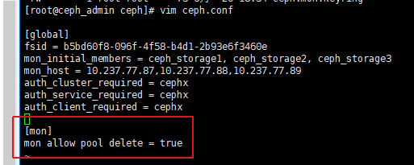
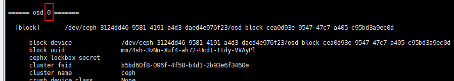

# Ceph运维

## 常用命令

### 1.查看node上启动的所有ceph服务
~~~
systemctl list-units --type=service|grep ceph
or
systemctl list-unit-files|grep enabled|grep ceph
~~~

### 2.HEALTH_WARN:daemons have recently crashed
~~~
ceph crash ls-new
ceph crash info <crash-id>
#new crash归档
ceph crash archive-all
~~~

### 3.查看pool & pool size,pg_num,pgp_num
~~~
ceph osd lspools
ceph osd pool get {pool_name} size
ceph osd pool get {pool_name} pg_num
ceph osd pool get {pool_name} pgp_num
~~~

### 4.查看fs
~~~
ceph fs ls
~~~

### 5.删除 fs & pool
删除pool前，需设置集群参数，允许删除pool\

~~~
ceph fs rm {fs_name} --yes-i-really-mean-it
ceph osd pool rm {pool_name} --yes-i-really-really-mean-it {pool_name} --yes-i-really-really-mean-it
~~~

### 6.查看当前集群仲裁选举的情况
~~~
ceph quorum_status --format json-pretty
~~~

### 7.查看CRUSH map
~~~
#1.输出文件
ceph osd getcrushmap -o {filename}
#2.反编译输出文件
crushtool -d {comp-crushmap-filename} -o {decomp-crushmap-filename}
~~~

### 8.写文件测试
~~~
while true; do echo "$(date)"|tee -a a.txt; sleep 1; done
~~~

### 9.提取monmap到文件
~~~
ceph-mon -i {hostname} --extract-monmap {map-path}
~~~

### 10.pool pg自动扩缩容
~~~
#查看
ceph osd pool autoscale-status
#设置
ceph osd pool set default.rgw.buckets.index pg_autoscale_mode on
~~~

## 集群扩缩容

### 1.monitors扩缩容
#### a.扩容
~~~
ceph-deploy mon create {node_hostname}
~~~
#### b.缩容
~~~
ceph-deploy mon destroy {node_hostname}
~~~

#### c.从不健康集群中移除monitor
集群不健康状态下（例如，monitors无法恢复，没有足够数量形成仲裁集群）
~~~
1.停止所有monitor node上的ceph-mon daemons，保留一个好的
service ceph stop mon || stop ceph-mon-all
or
systemctl stop ceph-mon.target

2.登陆最后保留的monitor节点

3.提取monmap到文件
ceph-mon -i {mon-id} --extract-monmap {map-path}
# 例
ceph-mon -i `hostname` --extract-monmap /tmp/monmap

4.移除不存活和有问题的monitor，例如有3个monitor mon.a, mon.b, and mon.c, 只有mon.a存活，操作如下
monmaptool {map-path} --rm {mon-id}
# 例
monmaptool /tmp/monmap --rm b
monmaptool /tmp/monmap --rm c

5.将monmap副本文件注入到monitor
ceph-mon -i {mon-id} --inject-monmap {map-path}
# 例
ceph-mon -i a --inject-monmap /tmp/monmap

6.启动存活的monitor

7.验证monitor仲裁队列（ceph -s）

8.将移除monitor的/var/lib/ceph/mon目录下的数据移走或删除
~~~

#### d.monitor全部故障，从osd中恢复集群
~~~
1.通过osd收集当前服务器上的mon信息到/tmp/mon-store中，并将所有节点mon信息汇总到ceph_storage1
#{node_hostname3}执行
for osd in /var/lib/ceph/osd/ceph-*; do ceph-objectstore-tool --data-path $osd --op update-mon-db --mon-store-path /tmp/mon-store --no-mon-config; done
rsync -avz /tmp/mon-store/ root@{node_hostname2}:/tmp/mon-store/

#{node_hostname2}执行
for osd in /var/lib/ceph/osd/ceph-*; do ceph-objectstore-tool --data-path $osd --op update-mon-db --mon-store-path /tmp/mon-store --no-mon-config; done
rsync -avz /tmp/mon-store/ root@{node_hostname1}:/tmp/mon-store/

#{node_hostname1}执行
for osd in /var/lib/ceph/osd/ceph-*; do ceph-objectstore-tool --data-path $osd --op update-mon-db --mon-store-path /tmp/mon-store --no-mon-config; done

2.重构store.db，并复制文件到/var/lib/ceph/mon/ceph_storage1下（{node_hostname1}执行）
ceph-monstore-tool /tmp/mon-store/ rebuild -- --keyring /etc/ceph/ceph.client.admin.keyring
cp -r /tmp/mon-store/* /var/lib/ceph/mon/ceph-{node_hostname1}
touch /var/lib/ceph/mon/ceph-{node_hostname1}/done
touch /var/lib/ceph/mon/ceph-{node_hostname1}/systemd
ceph-authtool --create-keyring /var/lib/ceph/mon/ceph-{node_hostname1}/keyring --gen-key -n mon. --cap mon 'allow *'

3.创建monmap，并导入monitor（{node_hostname1}执行）
monmaptool --create --fsid {fsid} --add {node_hostname1} {node_hostname1_ip}:{node_hostname1_port} monmap
ceph-mon -i {node_hostname1} --inject-monmap monmap
chown ceph:ceph -R /var/lib/ceph/mon/
chmod 755 -R /var/lib/ceph/mon/

4.修改ceph.conf，去掉其它的mon节点信息，然后分发到其它节点去（admin执行）
ceph-deploy --overwrite-conf config push {node_hostname1} {node_hostname2} ...

5.启动 {node_hostname1} 的 mon osd服务
systemctl start ceph-mon.target
systemctl start ceph-osd.target

6.ceph -s 查看集群信息，解决不正常问题
# 例
ceph mon enable-msgr2

7.添加mgr（admin执行）
#出现以下错误，需创建密钥
AuthRegistry(0x7f901c0673c8) no keyring found at /etc/ceph/ceph.client.bootstrap-mgr.keyring,/etc/ceph/ceph.keyring,/etc/ceph/keyring,/etc/ceph/keyring.bin,, disabling cephx
handle_auth_bad_method server allowed_methods [2] but i only support [2]
#创建密钥
ceph auth get-or-create client.bootstrap-mgr mon 'allow profile bootstrap-mgr'
#导出秘钥之ceph_storage1:/var/lib/ceph/bootstrap-mgr/ceph.keyring
ceph auth get-or-create client.bootstrap-mgr | tee /var/lib/ceph/bootstrap-mgr/ceph.keyring
#更新admin密钥
ceph auth get-or-create client.bootstrap-mgr | tee /etc/ceph/ceph.bootstrap-mgr.keyring
#创建并启动mgr
ceph-deploy mgr create {node_hostname1}
systemctl restart ceph-mgr.target

8.添加monitor（admin执行）
#收集{node_hostname1}密钥
ceph-deploy gatherkeys {node_hostname1}
#查看你收集的ceph.mon.keyring
cat ceph.mon.keyring
#修改其他mon keyring
vim /var/lib/ceph/mon/ceph-{node_hostname2}/keyring
vim /var/lib/ceph/mon/ceph-{node_hostname3}/keyring
#添加monitor
ceph-deploy mon create {node_hostname2} {node_hostname3}

~~~

### 2.keys管理
#### a.在提供主机以运行OSD或元数据服务器之前，需要收集monitor密钥以及OSD和MDS的引导密钥环
~~~
ceph-deploy gatherkeys {node_hostname1} {node_hostname2} ...
~~~
#### b.销毁或重建集群时执行
~~~
ceph-deploy forgetkeys
~~~

### 3.OSD扩缩容
#### a.扩容
~~~
#清除原有磁盘数据
ceph-deploy disk zap {node_hostname}  /dev/{block_name}

#给指定host提供client admin key和ceph config，使host可以以admin用户执行命令
ceph-deploy admin {node_hostname}

#运行OSD前，需要收集monitor密钥以及OSD的引导密钥环
ceph-deploy gatherkeys {node_hostname}

#OSD卸载重装时，注意要清除/var/lib/ceph下的老配置文件

#创建OSD
ceph-deploy osd create --data /dev/{block_name} {node_hostname} 
~~~
#### b.缩容
~~~
#查看{osd-num}
ceph-volume lvm list
~~~

~~~
#标记osd，将其移出当前集群，集群rebalancing
ceph osd out {osd-num}

#观察数据迁移
ceph -w
可以看到pg状态从active+clean变为active、一些降级的对象，最后在迁移完成时变为active+clean

#重新加回集群(取消缩容时执行)
ceph osd in {osd-num}

#停止osd，登录osd host
systemctl stop ceph-osd@{osd-num}

#移除osd
ceph osd purge {id} --yes-i-really-mean-it

#清除ceph-volume
ceph-volume lvm list
vgremove {volume_id}
~~~

### 4.MDS扩缩容(CephFS用)
#### a.扩容
~~~
#清除原有磁盘数据
ceph-deploy mds create {node_hostname1} {node_hostname2} ...
~~~
#### b.缩容
~~~
#登陆mds node
systemctl stop ceph-mds@{node_hostname}.service
systemctl disable ceph-mds@{node_hostname}.service
~~~

### 5.admin 任务
~~~
#给指定host提供client admin key和ceph config，使host可以以admin用户执行命令
ceph-deploy admin {node_hostname1} {node_hostname2} ...

#更新配置到其他节点
ceph-deploy --overwrite-conf config push {node_hostname1} {node_hostname2} ...
or
ceph-deploy --overwrite-conf config push ceph_storage{1,2...}

#拉取其他节点配置
ceph-deploy config pull {node_hostname}
~~~
####OSD缩容时,执行以下操作
~~~
#修改admin ceph.conf，移除OSD条目（如果存在的话），并将ceph.conf更新到其他节点
~~~

### 6.清除node
~~~
#删除数据（/var/lib/ceph目录下）
ceph-deploy purgedata {node_hostname1} {node_hostname2} ...
#删除数据并卸载ceph
ceph-deploy purge {node_hostname1} {node_hostname2} ...
~~~