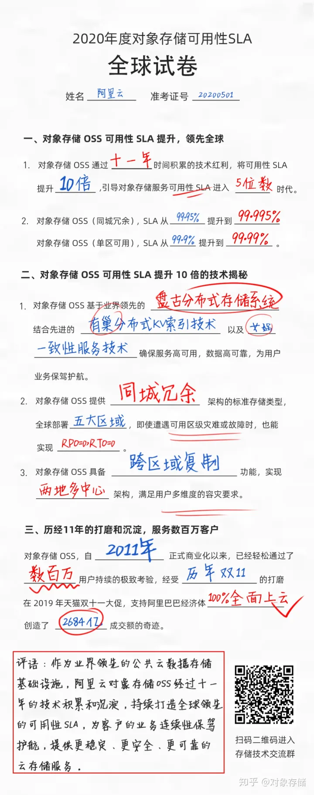

# SLA

## 什么是SLA（服务等级协议）

LA（Service-Level Agreement）服务等级协议，是指系统服务提供者（Provider）对客户（Customer）的一个可量化的服务承诺。
常见于大型分布式系统中，用于衡量系统服务是否稳定健康的常见方法。

## SLA（服务等级协议）常用的衡量指标有哪些

SLA是一种服务承诺，因此指标具备多样性, 业界主流常用指标包含：可用性、准确性、系统容量和延迟。

### Availability（可用性）

系统服务能正常运行所占的时间百分比，业界对可用性的描述，通常采用`年故障时长`。
比如，数据中心机房划分为不同等级，如 T1～T4 机房，它们的`可用性`及`年平均故障时间`如下：

| 机房  | 可用性     | 年平均故障时间（小时） |
|-----|---------|-------------|
| T1  | 99.671% | 28.8        |
| T2  | 99.741% | 22          |
| T3  | 99.982% | 1.6         |
| T4  | 99.995% | 0.4         |

网络服务的可用性，通常也会折算为`不能提供服务的故障时间长`来衡量，比如典型的`5个9`可用性就表示年故障时长为`5`分钟，如下表所示：

| 可用性指标        | 计算公式                        | 年故障时长  |
|--------------|-----------------------------|--------|
| 3个9（99.9%）   | (1-99.9%) * 365 * 24        | 8.76小时 |
| 4个9（99.99%）  | (1-99.99%) * 365 * 24  * 60 | 52.6分钟 |
| 99.995%      | (1-99.995%) * 365 * 24 * 60 | 26.3分钟 |
| 5个9（99.999%） | (1-99.999%) * 365 * 24 * 60 | 5.26分钟 |

### Accuracy（准确性）

准确性是指系统服务中，是否允许某些数据是不准确或者丢失，如果允许这样的情况发生，用户的容忍度（百分比，可以接受的概率）是多少。
常见的衡量方式为：基于服务周期内的错误率计算准确性。

~~~
错误率 = 周期内有效的错误请求数 / 周期内有效的总请求数
~~~

例如，我们在一分钟内发送100个有效请求到系统中，其中有5个请求导致系统返回内部错误。
那这一分钟系统的`错误率`是`5 / 100 = 5%`，`准确率`是`1 - 5% = 95%`。

计算请求错误率时，计算时间范围越长越有利，因为时间越长，总请求数越多，错误率越有可能降得更低。
一般有实力的服务商都会 从客户角度计算错误率，按照5分钟的粒度来计算，因为`5分钟`是业界典型的机器故障恢复时间，能够快速修复机器，降低系统的错误率。

### Capacity（系统容量）

指系统能够支持的负载量，一般会以每秒的请求数为单位来表示，与CPU的消耗、外部接口、IO等等紧密关联，常见衡量指标：

* QPS（Query Per Second）：每秒处理的查询数，是对一个特定的查询服务器在规定时间内所处理流量多少的衡量标准，也即是最大吞吐能力。
* TPS（Transactions Per Second）：每秒处理的事务个数，是软件测试结果的测量单位。
  一个事务是指一个客户机向服务器发送请求到服务器做出反应的全过程，客户机在发送请求时开始计时，收到服务器响应后结束计时，
  以此来计算使用的时间和完成的事务个数，系统整体处理能力取决于处理能力最低模块的TPS值。
* 并发数：系统可以同时承载的正常使用系统功能的用户的数量（同一时间处理的请求数或事务数），与吞吐量相比，并发用户数是一个更直观但也更笼统的性能指标。
* 响应时间：一般取平均响应时间。

常用评估公式：

~~~
QPS = 并发数 / 平均响应时间
最大QPS(峰值QPS) = (总PV数 * 80%) / (每天秒数 * 20%)
机器数 = 峰值QPS / 单机QPS

TPS = 并发数 / 平均响应时间
最大TPS(峰值TPS) = (总PV数 * 80%) / (每天秒数 * 20%)
机器数 = 峰值TPS / 单机TPS
~~~

PV一般指页面浏览量（page view）

峰值QPS或峰值TPS计算原理：每天80%的访问集中在20%的时间里，这20%时间叫做峰值时间。

### Latency（延迟）

延迟（Latency），指系统收到用户请求到响应请求之间的时间间隔。
在定义延迟的SLA时，常用p95和p99这样的延迟声明，这里的p指的是percentile，也就是百分位的意思。
如果p95是1秒的话，那就表示在100个请求里面有95个请求的响应时间会少于1秒，而剩下的5个请求响应时间会大于1秒，P99同理。

## 世界顶级的SLA评判标准和基本能力

以业界领先的分布式系统 - 阿里云对象存储OSS为例

