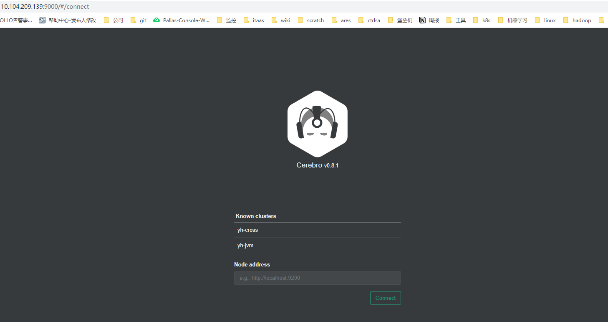

# Cerebro 安装&配置

## 介绍
Cerebro是以前的 Elasticsearch插件Elasticsearch Kopf 的演变,这不适用于 Elasticsearch 版本5.x或更高版本，这是由于删除了site plugins。

Cerebro 是查看分片分配和最有用的界面之一通过图形界面执行常见的索引操作。 完全开放源，并且它允许您添加用户，密码或 LDAP 身份验证问网络界面。Cerebro 是对先前插件的部分重写，并且可以作为自运行工具使用应用程序服务器，基于 Scala 的Play 框架。

Cerebro 是一种现代反应性应用程序； 它使用 Scala 使用 Play 框架在 Scala 中编写，用于后端 REST 和 Elasticsearch 通信。 此外，它使用通过 AngularJS 用JavaScript 编写的单页应用程序（SPA）前端。

源码地址：https://github.com/lmenezes/cerebro

## 安装

### 下载
~~~
wget -c https://github.com/lmenezes/cerebro/releases/download/v0.8.5/cerebro-0.8.5.tgz
~~~

### 解压安装
~~~
tar xfvz cerebro-0.8.5.tgz -C /usr/local/es/
~~~

### 配置
vim conf/application.conf
~~~
# Secret will be used to sign session cookies, CSRF tokens and for other encryption utilities.
# It is highly recommended to change this value before running cerebro in production.
secret = "ki:s:[[@=Ag?QI`W2jMwkY:eqvrJ]JqoJyi2axj3ZvOv^/KavOT4ViJSv?6YY4[N"

# Application base path
basePath = "/"

# Defaults to RUNNING_PID at the root directory of the app.
# To avoid creating a PID file set this value to /dev/null
#pidfile.path = "/var/run/cerebro.pid"
pidfile.path=/dev/null

# Rest request history max size per user
rest.history.size = 50 // defaults to 50 if not specified

# Path of local database file
#data.path: "/var/lib/cerebro/cerebro.db"
data.path = "./cerebro.db"

es = {
  gzip = true
}

# Authentication
auth = {
  # Example of LDAP authentication
  #type: ldap
    #settings: {
      #url = "ldap://host:port"
      #base-dn = "ou=active,ou=Employee"
      # OpenLDAP might be something like
      #base-dn = "ou=People,dc=domain,dc=com"
      # Usually method should be left as simple
      # Otherwise, set it to the SASL mechanisms to try
      #method  = "simple"
      # Usernames in the form of email addresses (containing @) are passed through unchanged
      # Set user-domain to append @user-domain to bare usernames
      #user-domain = "domain.com"
      # Or leave empty to use user-format formatting
      #user-domain = ""
      # user-format executes a string.format() operation where
      # username is passed in first, followed by base-dn
      # Leave username unchanged
      #user-format = "%s"
      # Like setting user-domain
      #user-format = "%s@domain.com"
      # Common for OpenLDAP
      #user-format = "uid=%s,%s"
    #}
  # Example of simple username/password authentication
  #type: basic
    #settings: {
      #username = "admin"
      #password = "1234"
    #}
}

# A list of known hosts
hosts = [
  {
    host = "http://10.95.67.1:9200"
    name = "yh-cross"
  },
  {
    host = "http://10.95.61.78:9200"
    name = "yh-jvm"
  }
]
~~~

### 运行 cerebro
~~~
cd /usr/local/es/cerebro-0.8.5
nohup ./bin/cerebro 2>&1 >cerebro.log &
~~~
cerebro默认端口：9000

