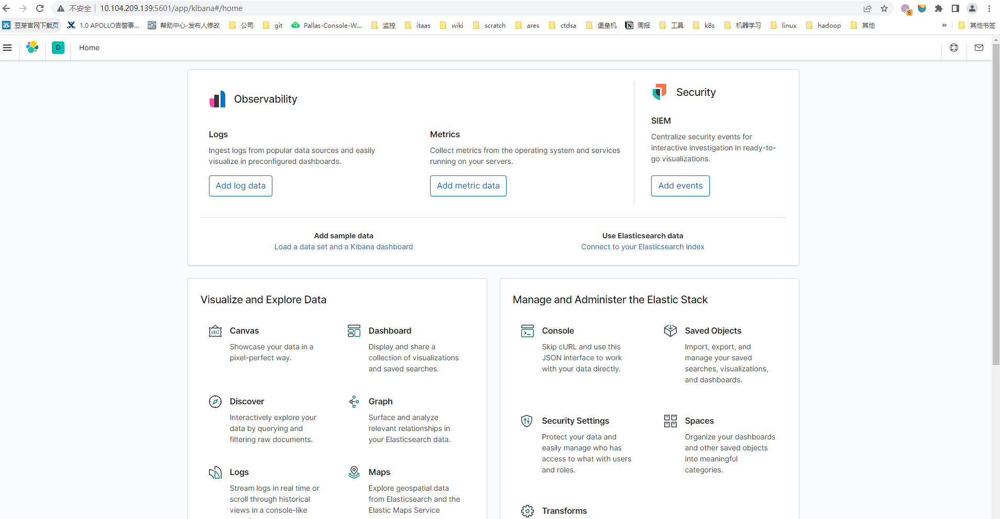

# Kibana 安装&配置

## 介绍
探索和可视化您的数据和管理所有 Elastic Stack 的东西

无论您是用户还是管理员，Kibana 都通过提供三个关键功能使您的数据具有可操作性。
* 一个开源的分析和可视化平台。使用 Kibana 来探索 Elasticsearch 数据，然后构建漂亮的可视化和仪表板。
* 用于管理 Elastic Stack 的 UI。管理您的安全设置、分配用户角色、生成快照、roll up 数据等，所有这些都来自 Kibana UI 的便利性。
* 一个集中的 Elastic 解决方案集线器。从日志分析到文档发现再到 SIEM, Kibana 是访问这些功能和其他功能的门户。

## 安装

### 下载
~~~
# download
curl -O https://artifacts.elastic.co/downloads/kibana/kibana-7.8.0-linux-x86_64.tar.gz

# Compares the SHA of the downloaded .tar.gz archive and the published checksum, which should output kibana-{version}-linux-x86_64.tar.gz: OK
curl https://artifacts.elastic.co/downloads/kibana/kibana-7.8.0-linux-x86_64.tar.gz.sha512 | shasum -a 512 -c - 
~~~

### 解压安装
~~~
tar -xzf kibana-7.8.0-linux-x86_64.tar.gz
~~~

### 配置
vim kibana.yml
~~~
# Kibana is served by a back end server. This setting specifies the port to use.
#server.port: 5601

# Specifies the address to which the Kibana server will bind. IP addresses and host names are both valid values.
# The default is 'localhost', which usually means remote machines will not be able to connect.
# To allow connections from remote users, set this parameter to a non-loopback address.
#server.host: "localhost"

# Enables you to specify a path to mount Kibana at if you are running behind a proxy.
# Use the `server.rewriteBasePath` setting to tell Kibana if it should remove the basePath
# from requests it receives, and to prevent a deprecation warning at startup.
# This setting cannot end in a slash.
#server.basePath: ""

# Specifies whether Kibana should rewrite requests that are prefixed with
# `server.basePath` or require that they are rewritten by your reverse proxy.
# This setting was effectively always `false` before Kibana 6.3 and will
# default to `true` starting in Kibana 7.0.
#server.rewriteBasePath: false

# The maximum payload size in bytes for incoming server requests.
#server.maxPayloadBytes: 1048576

# The Kibana server's name.  This is used for display purposes.
#server.name: "your-hostname"

# The URLs of the Elasticsearch instances to use for all your queries.
#elasticsearch.hosts: ["http://localhost:9200"]

# When this setting's value is true Kibana uses the hostname specified in the server.host
# setting. When the value of this setting is false, Kibana uses the hostname of the host
# that connects to this Kibana instance.
#elasticsearch.preserveHost: true

# Kibana uses an index in Elasticsearch to store saved searches, visualizations and
# dashboards. Kibana creates a new index if the index doesn't already exist.
#kibana.index: ".kibana"

# The default application to load.
#kibana.defaultAppId: "home"

# If your Elasticsearch is protected with basic authentication, these settings provide
# the username and password that the Kibana server uses to perform maintenance on the Kibana
# index at startup. Your Kibana users still need to authenticate with Elasticsearch, which
# is proxied through the Kibana server.
#elasticsearch.username: "kibana_system"
#elasticsearch.password: "pass"

# Enables SSL and paths to the PEM-format SSL certificate and SSL key files, respectively.
# These settings enable SSL for outgoing requests from the Kibana server to the browser.
#server.ssl.enabled: false
#server.ssl.certificate: /path/to/your/server.crt
#server.ssl.key: /path/to/your/server.key

# Optional settings that provide the paths to the PEM-format SSL certificate and key files.
# These files are used to verify the identity of Kibana to Elasticsearch and are required when
# xpack.security.http.ssl.client_authentication in Elasticsearch is set to required.
#elasticsearch.ssl.certificate: /path/to/your/client.crt
#elasticsearch.ssl.key: /path/to/your/client.key

# Optional setting that enables you to specify a path to the PEM file for the certificate
# authority for your Elasticsearch instance.
#elasticsearch.ssl.certificateAuthorities: [ "/path/to/your/CA.pem" ]

# To disregard the validity of SSL certificates, change this setting's value to 'none'.
#elasticsearch.ssl.verificationMode: full

# Time in milliseconds to wait for Elasticsearch to respond to pings. Defaults to the value of
# the elasticsearch.requestTimeout setting.
#elasticsearch.pingTimeout: 1500

# Time in milliseconds to wait for responses from the back end or Elasticsearch. This value
# must be a positive integer.
#elasticsearch.requestTimeout: 30000

# List of Kibana client-side headers to send to Elasticsearch. To send *no* client-side
# headers, set this value to [] (an empty list).
#elasticsearch.requestHeadersWhitelist: [ authorization ]

# Header names and values that are sent to Elasticsearch. Any custom headers cannot be overwritten
# by client-side headers, regardless of the elasticsearch.requestHeadersWhitelist configuration.
#elasticsearch.customHeaders: {}

# Time in milliseconds for Elasticsearch to wait for responses from shards. Set to 0 to disable.
#elasticsearch.shardTimeout: 30000

# Time in milliseconds to wait for Elasticsearch at Kibana startup before retrying.
#elasticsearch.startupTimeout: 5000

# Logs queries sent to Elasticsearch. Requires logging.verbose set to true.
#elasticsearch.logQueries: false

# Specifies the path where Kibana creates the process ID file.
#pid.file: /var/run/kibana.pid

# Enables you specify a file where Kibana stores log output.
#logging.dest: stdout

# Set the value of this setting to true to suppress all logging output.
#logging.silent: false

# Set the value of this setting to true to suppress all logging output other than error messages.
#logging.quiet: false

# Set the value of this setting to true to log all events, including system usage information
# and all requests.
#logging.verbose: false

# Set the interval in milliseconds to sample system and process performance
# metrics. Minimum is 100ms. Defaults to 5000.
#ops.interval: 5000

# Specifies locale to be used for all localizable strings, dates and number formats.
# Supported languages are the following: English - en , by default , Chinese - zh-CN .
#i18n.locale: "en"

server.port: 5601
server.host: "10.103.94.59"
server.name: "10.103.94.59"
elasticsearch.hosts: ["http://10.98.13.171:9200", "http://10.95.67.1:9200"]

kibana.defaultAppId: "discover"

pid.file: ./kibana.pid
logging.silent: true
monitoring.enabled: false

xpack.encryptedSavedObjects.encryptionKey: encryptedSavedObjects12345678909876543210
xpack.security.encryptionKey: encryptionKeysecurity12345678909876543210
xpack.reporting.encryptionKey: encryptionKeyreporting12345678909876543210

xpack.apm.enabled: false
xpack.ml.enabled: false
xpack.monitoring.enabled: false
xpack.rollup.enabled: false
xpack.ilm.enabled: false
~~~
官网配置项说明
https://www.elastic.co/guide/en/kibana/7.8/settings.html

### 运行 kibana
~~~
cd kibana-7.8.0-linux-x86_64/
nohup ./bin/kibana 2>&1 >kibana.log &
~~~

