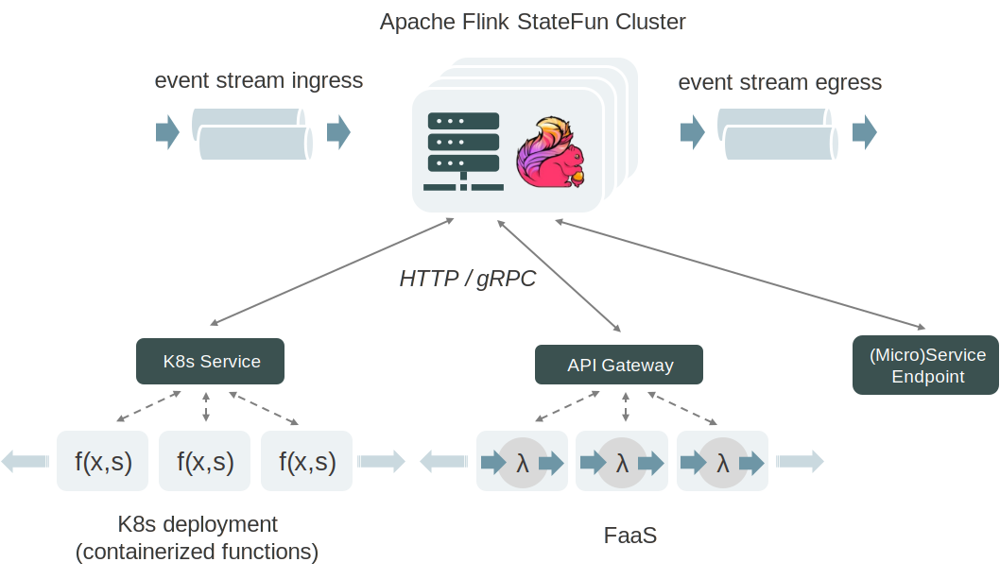

# Stateful Functions: A Platform-Independent Stateful Serverless Stack

在现代基础设施上创建高效、可扩展和一致性的应用程序的简单方法（无论规模大小）。

属于[FaaS](../../common/serverless/serverless.md)范畴

`有状态函数（Stateful Functions）`是一种API，它使用了`为无服务器架构（serverless architectures）构建的运行时`
来简化`分布式有状态应用程序`的构建。
它结合了`有状态流处理的优点（处理具有低延迟和有限资源约束的大型数据集）`
以及`用于建模有状态实体的运行时，支持位置透明性、并发性、可伸缩性和弹性`。

它被设计用于现代架构，如云原生部署（cloud-native deployments）和热门的事件驱动（event-driven）的FaaS平台，
如AWS Lambda和KNative，并提供开箱即用的一致性状态和消息传递，同时保留这些平台的无服务器体验和弹性。

详见[官网文档](https://nightlies.apache.org/flink/flink-statefun-docs-stable/)

