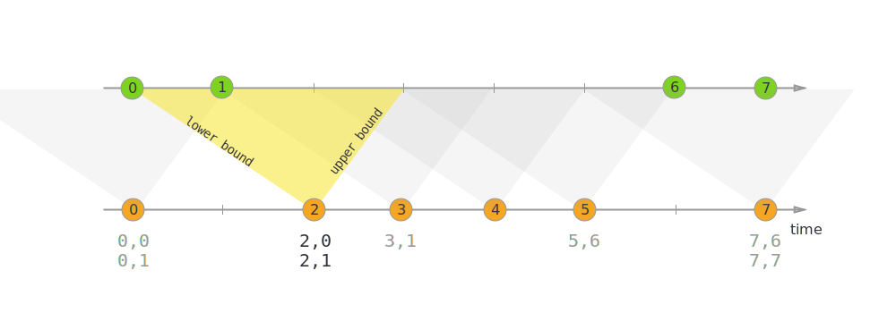

# Joining

## Window Join

Window join 作用在两个流中有相同 key 且处于相同窗口的元素上。这些窗口可以通过 [window assigner]()
定义，并且两个流中的元素都会被用于计算窗口的结果。

两个流中的元素在组合之后，会被传递给用户定义的 JoinFunction 或 FlatJoinFunction，用户可以用它们输出符合 join 要求的结果。

常见的用例可以总结为以下代码：

~~~
stream.join(otherStream)
    .where(<KeySelector>)
    .equalTo(<KeySelector>)
    .window(<WindowAssigner>)
    .apply(<JoinFunction>);
~~~

语义上有一些值得注意的地方：

* 从两个流中创建成对的元素与 inner-join 类似，即一个流中的元素在与另一个流中对应的元素完成 join 之前不会被输出。
* 完成 join 的元素会将他们的 timestamp 设为对应窗口中允许的最大 timestamp。比如一个边界为 [5, 10) 窗口中的元素在 join 之后的
  timestamp 为 9。
  接下来我们会用例子说明各种 window join 如何运作。

### 滚动 Window Join

使用滚动 window join 时，所有 key 相同且共享一个滚动窗口的元素会被组合成对，并传递给 JoinFunction 或
FlatJoinFunction。因为这个行为与 inner join 类似，所以一个流中的元素如果没有与另一个流中的元素组合起来，它就不会被输出！

如图所示，我们定义了一个大小为 2 毫秒的滚动窗口，即形成了边界为 [0,1], [2,3], ... 的窗口。图中展示了如何将每个窗口中的元素组合成对，组合的结果将被传递给
JoinFunction。注意，滚动窗口 [6,7] 将不会输出任何数据，因为绿色流当中没有数据可以与橙色流的 ⑥ 和 ⑦ 配对。

~~~
import org.apache.flink.api.java.functions.KeySelector;
import org.apache.flink.streaming.api.windowing.assigners.TumblingEventTimeWindows;
import org.apache.flink.streaming.api.windowing.time.Time;
 
...

DataStream<Integer> orangeStream = ...;
DataStream<Integer> greenStream = ...;

orangeStream.join(greenStream)
    .where(<KeySelector>)
    .equalTo(<KeySelector>)
    .window(TumblingEventTimeWindows.of(Time.milliseconds(2)))
    .apply (new JoinFunction<Integer, Integer, String> (){
        @Override
        public String join(Integer first, Integer second) {
            return first + "," + second;
        }
    });
~~~

### 滑动 Window Join

当使用滑动 window join 时，所有 key 相同且处于同一个滑动窗口的元素将被组合成对，并传递给 JoinFunction 或
FlatJoinFunction。当前滑动窗口内，如果一个流中的元素没有与另一个流中的元素组合起来，它就不会被输出！注意，在某个滑动窗口中被
join 的元素不一定会在其他滑动窗口中被 join。

本例中我们定义了长度为两毫秒，滑动距离为一毫秒的滑动窗口，生成的窗口实例区间为 [-1, 0],[0,1],[1,2],[2,3], …。 X
轴下方是每个滑动窗口中被 join 后传递给 JoinFunction 的元素。图中可以看到橙色 ② 与绿色 ③ 在窗口 [2,3] 中
join，但没有与窗口 [1,2] 中任何元素 join。

~~~
import org.apache.flink.api.java.functions.KeySelector;
import org.apache.flink.streaming.api.windowing.assigners.SlidingEventTimeWindows;
import org.apache.flink.streaming.api.windowing.time.Time;

...

DataStream<Integer> orangeStream = ...;
DataStream<Integer> greenStream = ...;

orangeStream.join(greenStream)
    .where(<KeySelector>)
    .equalTo(<KeySelector>)
    .window(SlidingEventTimeWindows.of(Time.milliseconds(2) /* size */, Time.milliseconds(1) /* slide */))
    .apply (new JoinFunction<Integer, Integer, String> (){
        @Override
        public String join(Integer first, Integer second) {
            return first + "," + second;
        }
    });
~~~

### 会话 Window Join

使用会话 window join 时，所有 key 相同且组合后符合会话要求的元素将被组合成对，并传递给 JoinFunction 或
FlatJoinFunction。这个操作同样是 inner join，所以如果一个会话窗口中只含有某一个流的元素，这个窗口将不会产生输出！

这里我们定义了一个间隔为至少一毫秒的会话窗口。图中总共有三个会话，前两者中两个流都有元素，它们被 join 并传递给
JoinFunction。而第三个会话中，绿流没有任何元素，所以 ⑧ 和 ⑨ 没有被 join！

~~~
import org.apache.flink.api.java.functions.KeySelector;
import org.apache.flink.streaming.api.windowing.assigners.EventTimeSessionWindows;
import org.apache.flink.streaming.api.windowing.time.Time;
 
...

DataStream<Integer> orangeStream = ...;
DataStream<Integer> greenStream = ...;

orangeStream.join(greenStream)
    .where(<KeySelector>)
    .equalTo(<KeySelector>)
    .window(EventTimeSessionWindows.withGap(Time.milliseconds(1)))
    .apply (new JoinFunction<Integer, Integer, String> (){
        @Override
        public String join(Integer first, Integer second) {
            return first + "," + second;
        }
    });
~~~

## Interval Join

Interval join 组合元素的条件为：两个流（我们暂时称为 A 和 B）中 key 相同且 B 中元素的 timestamp 处于 A 中元素 timestamp
的一定范围内。

这个条件可以更加正式地表示为 b.timestamp ∈ [a.timestamp + lowerBound; a.timestamp + upperBound] 或 a.timestamp +
lowerBound <= b.timestamp <= a.timestamp + upperBound

这里的 a 和 b 为 A 和 B 中共享相同 key 的元素。上界和下界可正可负，只要下界永远小于等于上界即可。 Interval join 目前仅执行
inner join。

当一对元素被传递给 ProcessJoinFunction，他们的 timestamp 会从两个元素的 timestamp 中取最大值 （timestamp 可以通过
ProcessJoinFunction.Context 访问）。

Interval join 目前仅支持 event time。

上例中，我们 join 了橙色和绿色两个流，join 的条件是：以 -2 毫秒为下界、+1 毫秒为上界。 默认情况下，上下界也被包括在区间内，但
.lowerBoundExclusive() 和 .upperBoundExclusive() 可以将它们排除在外。

图中三角形所表示的条件也可以写成更加正式的表达式：

orangeElem.ts + lowerBound <= greenElem.ts <= orangeElem.ts + upperBound

~~~
import org.apache.flink.api.java.functions.KeySelector;
import org.apache.flink.streaming.api.functions.co.ProcessJoinFunction;
import org.apache.flink.streaming.api.windowing.time.Time;

...

DataStream<Integer> orangeStream = ...;
DataStream<Integer> greenStream = ...;

orangeStream
    .keyBy(<KeySelector>)
    .intervalJoin(greenStream.keyBy(<KeySelector>))
    .between(Time.milliseconds(-2), Time.milliseconds(1))
    .process (new ProcessJoinFunction<Integer, Integer, String>(){

        @Override
        public void processElement(Integer left, Integer right, Context ctx, Collector<String> out) {
            out.collect(left + "," + right);
        }
    });
~~~

