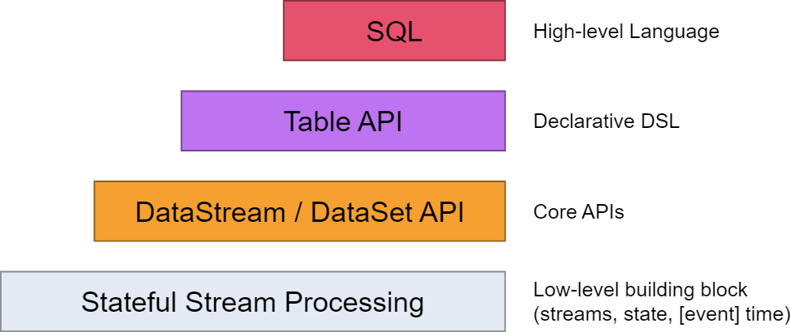

# Concepts

此概念提供了对Flink的架构和运行时如何实现这些概念的更深层次的理解。

## Flink’s APIs

Flink为开发流/批处理应用程序提供了不同层次的抽象。

* 最低层次的抽象只提供`有状态和及时的流处理`。它通过`Process Function`嵌入到`DataStream API`中。
  它允许用户从一个或多个流中自由处理事件,并提供`一致的容错状态`。此外，用户还可以注册`事件时间`和`处理时间`回调，程序得以实现复杂的计算。
* 在实践中，许多应用程序不需要上面描述的`低级抽象`，而是使用核心API`DataStream API(有界/无界流)`
  和`DataSet API(有界的数据集)`。
  这些使用流畅的API为数据处理提供了`常见的构建块`，比如各种不同形式的转换、连接、聚合、窗口、状态等。在这些API中处理的数据类型由各自的编程语言中的类所代表。
   低层次的`Process Function`与`DataStream API`相结合，可以在有需要时使用较低层次的抽象。
  `DataSet API`则在有界数据集上提供了额外的原语，比如循环/迭代。
* `Table API`是一个以表为中心的声明性DSL（领域特定语言）,它可能是动态更改的表(当表示流时)。
  `Table API`遵循(扩展的)关系模型：表有一个schema（模式，类似于关系数据库中的表) 和 提供`可比操作的API`
  ，如select、project、join、group by、total等。
  `Table API`程序声明定义应该完成什么逻辑操作,而不是详细说明操作的代码是如何表现。
  虽然`Table API`是通过各种UDF扩展的，但它比核心API缺少表达能力（缺乏灵活多样性），而旨在更简洁地使用（编写的代码更少）。
  此外，`Table API`程序还可以通过一个优化器在执行前进行优化。
   `Table`和`DataStream/DataSet`之间可以无缝转换，允许程序将`Table API`与DataStream和数据集API混合。
* Flink提供的最高层次抽象是SQL。这个抽象在语义和表达上与`Table API`类似，但以`SQL查询表达式`作为表现形式。
  SQL抽象与`Table API`紧密地交互,SQL查询可以在`Table API`中定义的表上执行。

