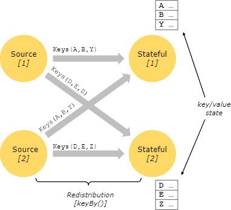
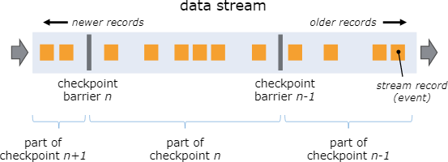
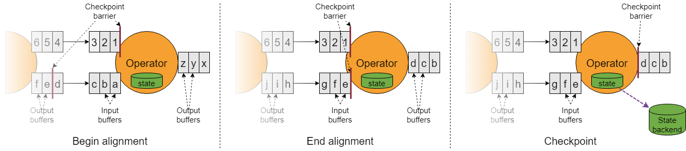
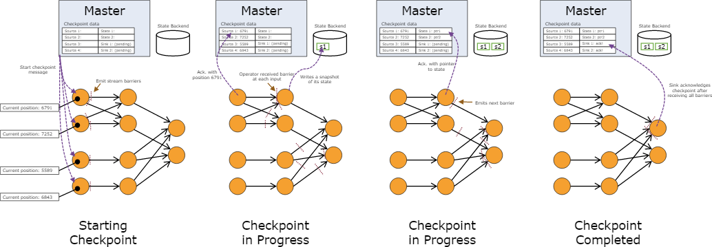

# Stateful Stream Processing

## 什么是状态（state）?

虽然数据流（dataflow）中的许多操作都只是一次仅看一个单独的事件(例如一个事件解析器), 但有一些操作需要记住跨多个事件(
例如`window operators`)的信息。这些操作被称为`有状态的（stateful）`。

有状态操作的例子：

* 当应用程序搜索某些事件模式（patterns）时，`state`将存储目前遇到的所有事件序列。
* 当处理每分钟/小时/小时聚合事件时，`state`将持有等待（pending）的聚合。
* 当在数据点的流中进行训练机器学习模型时，`state`持有模型参数的当前版本。
* 当需要管理历史数据时，`state`可以有效地访问发生在过去的事件。

Flink通过使用`checkpoints`和`savepoints`， 来使`state`具有容错能力。
 Flink应用程序进行伸缩操作时也使用了`state`，此时Flink会在并行实例中重新分配状态。
 `Queryable state`允许在运行时从Flink外部访问`state`。
 Flink提供了不同的`state backend`，这些状态后端指定了`state`的存储方式和位置。

## Keyed State

`Keyed state`可以认为是一个嵌入式的`键/值存储`。这种`state`与`stateful operators`所读取的`streams`
一起，会被严格地进行分区（partitioned）和分配（distributed）。
因此，只能在`keyed streams`上访问`key/value state`（即在一个`keyed/分区`的数据交换之后，值将与当前事件的`key`限制到一起）。
对`streams`和`state`的键进行对齐操作，可以确保所有`state`更新都是`本地操作`，并确保在没有`事务开销`的情况下保证`一致性`。
这种对齐也允许Flink重新分配（redistribute）`state`，并透明地调整流分区（stream partitioning）。

总结：`Keyed state`和相应的`streams`，会根据`key`做一次分区（partitioning）操作

`Keyed state`被进一步组织成所谓的`Key Groups`。`Key Groups`是由Flink可以重新分配`Keyed State`的原子单元。
`Key Groups`的数量决定了`最大并行度`。在执行时，一个`keyed operator`的每个并行实例都与一个或多个`Key Groups`一起工作。

## state持久化

Flink使用`stream replay`和`checkpointing`的组合来实现容错。
一个`checkpoint`标志着每个输入流的一个`特定点`，以及每个`operator`对应的`state`。
通过恢复`operator`的`state`，并从`checkpoint`的点重新回放记录，可以从`checkpoint`
恢复数据流，同时保持`一致性(精准一次处理的语义)`。

Flink在执行过程中通过重新播放记录来处理容错，`恢复时间`取决于`需要重新播放的记录的数量`
，数量越多，恢复时间越长，恢复开销就越大；检查点间隔（checkpoint interval）是权衡`容错开销`的一种方法。

容错机制不断地对分布式流（distributed streaming）的数据流（dataflow）进行快照操作（snapshot）。
对于带有小状态的流式应用程序，这些快照是非常轻量级的，可以频繁操作，且通常不会对性能产生影响。
流式应用程序的`state`存储在一个可配置的位置，通常放在分布式文件系统中。

程序失败出现了情况(由于机器、网络或软件故障)，Flink会停止了分布式流数据。
然后系统会重新启动`operators`，并将它们重新设置到最新成功的`checkpoint`。输入流则被重置到了`state`的快照点。
任何被处理的记录都是重启的并行数据流的一部分，并行数据流保证不影响之前的已经进行`checkpoint`操作的`state`。

Tips
 1、默认情况下，`checkpointing`是禁用的。
 2、为了配合实现这一机制，数据流的源（如消息队列或broker）需要能够将`流`重新转换到定义好的`最近点`。
比如`Apache Kafka`就具有这种能力，而 Flink 连接 Kafka 的 connector 便使用了这个特性。
 3、因为Flink的`checkpoints`是通过分布式`snapshots`实现的，所以我们可以交替使用单词`snapshot`和`checkpoint`。
通常我们还使用`snapshot`来表示`checkpoint`或`savepoint`。

### Checkpointing

Flink的容错机制的核心是绘制`分布式数据流`和`operator state`的一致性快照。
这些快照作为一个一致的`checkpoints`,系统可以在失败的情况下进行回退（fall back）。
Flink绘制这些快照的机制被描述为"[分布式数据流的轻量级异步快照](https://arxiv.org/abs/1506.08603)"。
它的灵感来自于分布式快照的标准`Chandy-Lamport算法`，该算法专门针对Flink的执行模型。

请记住，`checkpointing`所做的处理都可以异步执行。检查点障碍（checkpoint barriers）不能锁定步骤，操作可以异步地对`state`
进行`snapshot`。

从Flink 1.11开始,`checkpoints`可以使用也可以不使用对齐（alignment）。在本节中，我们首先描述对齐的`checkpoints`。

#### Barriers（屏障）

Flink的分布式snapshotting中的一个核心元素是`stream barriers`。这些`barriers`被注入到数据流中，并和记录（records）一起作为数据流的一部分。
`barriers`永远不会超过记录，它们会严格地流动。一个`barrier`将数据流中的记录分为`当前快照的记录集`和`下一个快照的记录集`。
每个`barrier`都携带着`snapshot ID`，`snapshot`的记录在`snapshot`的前面。障碍不会中断流，因此非常轻量级。
来自不同`snapshot`的`barrier`可以同时存在于流中，这意味着不同的`snapshot`可能同时发生。

`Stream barriers`被注入到`流源（stream sources）`的并行数据流中。快照n的barriers被注入的点(让我们称它为Sn)
是源流中的位置,它的快照覆盖了数据。
例如,在`Apache Kafka`中,这个位置将是分区中最后一个记录的偏移值。该位置Sn被报告给`检查点协调器（checkpoint coordinator）`(
Flink的JobManager)。

然后，这些`barriers`流向下游。当一个中间`operator`从它的所有输入流接收到`snapshot n`的一个`barrier`
时，它才会向`所有传出的流`发出`snapshot n`的`barrier`。
一旦一个`sink operator`(流DAG的末尾)从它的所有输入流接收到`barrier n`，那它就会对`检查点协调器`承认`snapshot n`。
只有当所有的sinks都承认了快照，它被认为已经完成了。

一旦`snapshot n`完成，任务将再也不会请求从Sn之前的记录，因为此时，Sn之前的记录(及其后代记录)已经通过了整个数据流拓扑，即已经完成流式处理。

接收多个输入流的`operator `需要将输入流对齐到`snapshot barriers`。上图说明了这一点:

* 当`operator`从传入的流接收`snapshot barrier n`时，它不能从该流中处理任何进一步的记录，直到它从`其余输入`
  中接收到`snapshot barrier n`。 否则，它将混合了属于`snapshot n`以及属于`snapshot n+1`的记录。
* 一旦最后的流到达了`barrier n`，`operator`将发出`所有正在等待的输出记录`，然后发出`snapshot n barriers`。
* `operator`对`state`进行`snapshot`，并继续（resume）从所有输入流中处理记录（在从流中处理记录之前，会先从输入缓冲区处理记录）。
* 最后，`operator`将`state`异步写入`state backend`。

#### Snapshotting Operator State

当`operator`包含任何形式的`state`时,这个`state`也必须是快照的一部分。

`operator`会在从输入流接收到所有的`snapshot barriers`后，并赶在向输出流的`snapshot barriers`之前，及时地对其`state`
进行`snapshot`。
此时，在`barriers`之前的记录，所有到`state`的更新都已经完成；而在`barriers`之后的记录，将不会更新。
由于`snapshot`的`state`可能会很大，它存储在一个可配置的`state backend`。
默认情况下，`state backend`使用JobManager的内存，但生产环境，应该配置为可靠的分布式存储(如HDFS)。
在存储状态后，`operator`对`checkpoint`进行确认（acknowledge），并将`snapshot barrier`发送到输出流，然后进行后续处理。

结果快照现在包含以下内容：

* 对于每个并行流数据源，在启动快照时，流中的偏移/位置（offset/position）。
* 对于每个`operator`来说，有一个指向`state`的指针，作为`snapshot`的一部分存储。

