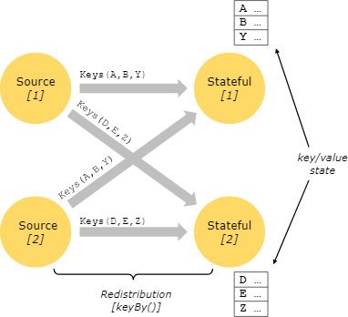
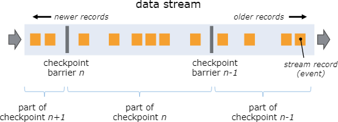
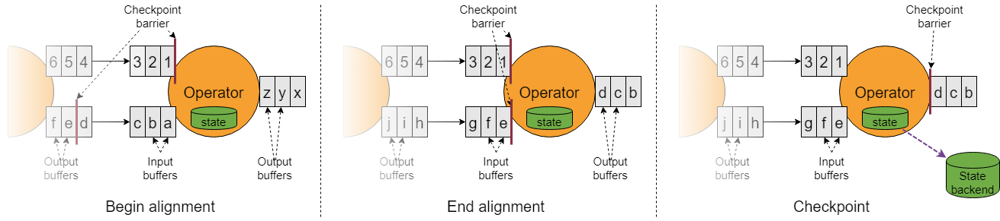
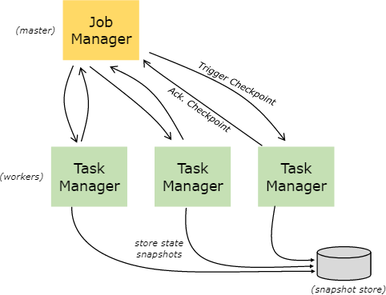

# Stateful Stream Processing

## 什么是状态（state）?

虽然数据流（dataflow）中的许多操作都只是一次仅看一个单独的事件(例如一个事件解析器), 但有一些操作需要记住跨多个事件(
例如`window operators`)的信息。这些操作被称为`有状态的（stateful）`。

有状态操作的例子：

* 当应用程序搜索某些事件模式（patterns）时，`state`将存储目前遇到的所有事件序列。
* 当处理每分钟/小时/小时聚合事件时，`state`将持有等待（pending）的聚合。
* 当在数据点的流中进行训练机器学习模型时，`state`持有模型参数的当前版本。
* 当需要管理历史数据时，`state`可以有效地访问发生在过去的事件。

Flink需要使用`state`，并通过使用`checkpoint`和`savepoint`机制，来提供容错能力。
 Flink应用程序进行伸缩操作时也使用了`state`，此时Flink会在并行实例中重新分配状态。
 `Queryable state`允许在运行时从Flink外部访问`state`。
 Flink提供了不同的`state backend`，这些状态后端指定了`state`的存储方式和位置。

## Keyed State

`Keyed state`可以认为是一个嵌入式的`键/值存储`。这种`state`与`stateful operators`所读取的`streams`
一起，会被严格地进行分区（partitioned）和分配（distributed）。
因此，只能在`keyed streams`上访问`key/value state`（即在一个`keyed/分区`的数据交换之后，值将与当前事件的`key`限制到一起）。
对`streams`和`state`的键进行对齐操作，可以确保所有`state`更新都是`本地操作`，并确保在没有`事务开销`的情况下保证`一致性`。
这种对齐也允许Flink重新分配（redistribute）`state`，并透明地调整流分区（stream partitioning）。

总结：`Keyed state`和相应的`streams`，会根据`key`做一次分区（partitioning）操作

`Keyed state`被进一步组织成所谓的`Key Groups`。`Key Groups`是由Flink可以重新分配`Keyed State`的原子单元。
`Key Groups`的数量决定了`最大并行度`。在执行时，一个`keyed operator`的每个并行实例都与一个或多个`Key Groups`一起工作。

## state持久化

Flink使用`stream replay`和`checkpointing`的组合来实现容错。
一个`checkpoint`标记了每个输入流的一个`特定点`，这些点伴随着每个`operator`对应的`state`。
通过恢复`operator`的`state`，并从`checkpoint`的点开始重新回放记录，数据流可以从一个`checkpoint`
恢复，同时保持`一致性(精确一次处理的语义)`。

Flink在执行过程中通过重新播放记录来处理容错，`恢复时间`取决于`需要重新播放的记录的数量`
，数量越多，恢复时间越长，恢复开销就越大；检查点间隔（checkpoint interval）是权衡`容错开销`的一种方法。

容错机制不断地对分布式流（distributed streaming）的数据流（dataflow）进行快照操作（snapshot）。
对于带有小状态的流式应用程序，这些快照是非常轻量级的，可以频繁操作，且通常不会对性能产生影响。
流式应用程序的`state`存储在一个可配置的位置，通常放在分布式文件系统中。

程序一旦出现了失败情况(由于机器、网络或软件故障)，Flink会停止分布式流的数据流（distributed streaming dataflow）。
然后，系统会重新启动`operators`，并将它们重新设置到最新成功的`checkpoint`。输入流则被重置到了`state snapshot`的点。
重启的并行数据流中的所有记录都保证不会影响到之前已经进行`checkpoint`操作的`state`。

Tips
 1、默认情况下，`checkpointing`是禁用的。
 2、为了配合实现这一机制，数据流的源（如消息队列或broker）需要能够将`流`重新回放到一个`最近点`。
比如`Apache Kafka`就具有这种能力，而 Flink 连接 Kafka 的 connector 便使用了这个特性。
 3、因为Flink的`checkpoint`功能是通过分布式`snapshot`机制实现的，所以我们可以交替使用单词`snapshot`和`checkpoint`。
通常我们还使用`snapshot`来表示`checkpoint`或`savepoint`。

### Checkpointing

Flink的容错机制的核心是绘制`分布式数据流`和`operator state`的一致性快照。
这些`snapshots`被作为一致性的`checkpoints`，让系统在失败的情况下可以进行回退（fall back）。
Flink绘制这些`snapshots`的机制被描述为"[分布式数据流的轻量级异步快照](https://arxiv.org/abs/1506.08603)"。
它的灵感来自于分布式快照的标准`Chandy-Lamport算法`，该算法专门针对Flink的执行模型。

请记住，`checkpointing`所做的处理都可以异步执行。
`检查点障碍（checkpoint barriers）`不会锁住任何处理步骤，每个操作都可以异步地对其`state`进行`snapshot`。

从Flink 1.11开始,`checkpoints`可以使用也可以不使用对齐（alignment）。在本节中，我们首先描述对齐的`checkpoints`。

#### Barriers（屏障）

Flink的`分布式snapshotting`中的一个核心元素是`stream barriers`。
这些`barriers`被注入到数据流中，并和记录（records）一起作为数据流的一部分进行流动。
`barriers`会严格地按照顺序流动，永远不会超过对应的记录。
一个`barrier`将数据流中的记录分隔为`当前快照的记录集合`和`下一个快照的记录集合`。
每个`barrier`都携带着`snapshot ID`，`snapshot`将记录推动到自己的前面。`barrier`不会中断流，因此非常轻量级。
来自不同`snapshot`的`barrier`可以同时存在于流中，这意味着不同的`snapshot`可能同时发生。

`Stream barriers`被注入到`流源（stream sources）`的并行数据流中。
`snapshot n`的`barriers`被注入到的`点(我们称它为Sn)`是源流中`snapshot`涵盖数据的位置。
比如，在`Apache Kafka`中，这个位置将是分区中最后一个记录的`offset`。
该位置Sn被报告给`检查点协调器（checkpoint coordinator）`(Flink的JobManager)。

然后，这些`barriers`流向下游。当一个中间`operator`从它的所有输入流接收到`snapshot n`的一个`barrier`后，
它才会向`所有传出的流`发出`snapshot n`的`barrier`。
一旦一个`sink operator`(流DAG的末尾)从它的所有输入流接收到`barrier n`，那它就会向`检查点协调器`
确认（acknowledge）`snapshot n`。只有当所有的sinks都确认了这个`snapshot`，它才被认为是完成了的。

一旦`snapshot n`完成，任务将再也不会向源请求`Sn之前的记录`，因为此时，Sn之前的记录(及其`后代记录`)已经通过了整个数据流拓扑，即已经完成流式处理。

接收多个输入流的`operator`需要将输入流对齐到`snapshot barriers`。上图说明了这一点:

* 当`operator`从传入的流接收`snapshot barrier n`时，它不能从该流中处理任何的后续记录，直到它从`剩余输入`
  中接收到`snapshot barrier n`。 否则，它将混合了属于`snapshot n`以及属于`snapshot n+1`的记录。
* 当`最后的流`也到达了`barrier n`，`operator`将发出`所有正在等待输出的记录`，然后发出`snapshot n barriers`。
* `operator`对`state`进行`snapshot`，并恢复（resume）从所有输入流中处理记录（在从流中处理记录之前，会先从输入缓冲区处理记录）。
* 最后，`operator`将`state`异步写入`state backend`。

#### Snapshotting Operator State

当`operator`包含任何形式的`state`时，这个`state`也必须是快照的一部分。

`operator`会在从输入流接收到所有的`snapshot barriers`后，并赶在向输出流的`snapshot barriers`之前，及时地对其`state`
进行`snapshot`。
此时，在`barriers`之前的记录到`state`的所有更新都已经完成；而在`barriers`之后的记录的更新不会进行处理。
由于`snapshot`的`state`可能会很大，它存储在一个可配置的`state backend`。
默认情况下，`state backend`使用JobManager的内存，但生产环境，应该配置为可靠的分布式存储(如HDFS)。
在`state`存储完成后，`operator`会对`checkpoint`进行确认（acknowledge），并将`snapshot barrier`发送到输出流，然后开始进行后续处理。

生成的快照现在包含以下内容：

* 每个并行流的数据源在启动快照时的流中的`偏移/位置（offset/position）`。
* 每个`operator`的一个指向`state`的指针，作为`snapshot`的一部分存储。

#### Recovery

在这种机制下的恢复是直接的：失败时，Flink选择最新完成的`checkpoint k`。
系统重新部署整个分布式数据流，并给每个`operator`一个`state`，这个`state`是在`checkpoint k`过程中被快照处理的。
数据源将从`Sk`位置读取流。 例如，在`Apache Kafka`中，这意味着告诉consumer从被`offset Sk`开始拉取数据。

如果`state`进行的是增量快照，operator会从`最新的完整快照`的`state`开始处理，然后将一系列`增量快照`更新到这个`state`。

### Unaligned Checkpointing

`Checkpointing`也可以不对齐。基本的想法是，只要`in-flight`数据成为了`operator state`的一部分，`checkpoints`
就能超过所有的`in-flight`数据。

注意，这种方法实际上更接近于`Chandy-Lamport算法`，
但Flink依旧在源中插入`barrier`，以避免`checkpoint coordinator`超载。

上图描述了`operator`如何处理`unaligned checkpoint barriers`:

* `operator`对存储在其输入缓冲区中的第一个`barrier`进行反应。
* `operator`立即将`barrier`添加到输出缓冲区的末尾，转发给下游的`operator`。
* `operator`标记所有被赶上的`被异步存储`的记录，并创建自己的`state`的快照。

因此，`operator`只会短暂地停止`输入处理`来`标记缓冲区`，转发`barrier`，并创建另一个`state`的快照。

`Unaligned checkpointing`确保`barrier`能尽可能快地到达`sink`。这特别适合于至少有一个`缓慢移动数据路径`（对齐时间可以长达数小时）的应用程序。
然而，因为它引入了额外的`I/O压力`，当到`state backend`的`I/O`成为瓶颈时，这就对性能带来不了任何帮助了。

注意`savepoints`总是对齐的。

#### Unaligned Recovery

在`unaligned checkpointing`中，当前`operator`在开始处理上游`operator`的任何数据之前，会首先恢复`in-flight`数据。
除此之外，它执行的步骤与`aligned checkpoints`恢复时的相同。

### State Backends

`key/value`索引存储的`精确数据结构`取决于所选的`state backend`。
有的`state backend`数据存储到内存中的`hash map`里，有的`state backend`则将`RocksDB`作为`key/value`存储。
除了定义持有`state`的数据结构之外，`state backend`还实现了获取`key/value state`的时间点`snapshot`，并将该`snapshot`
存储为`checkpoint`一部分的逻辑。
`state backend`可以在不更改应用程序逻辑的情况下进行配置。

### Savepoints

所有使用`checkpointing`的程序都可以从`savepoint`恢复执行。`savepoint`允许在不丢失任何`state`的情况下更新程序和Flink集群。

`savepoint`是手动触发的`checkpoint`，它对程序进行快照，并将其写入`state backend`。
`savepoint`依赖于定期的`checkpointing mechanism`。

`savepoint`与`checkpoint`类似，但它是由用户触发的，当`newer checkpoint`完成时，`savepoint`不会自动过期。

### Exactly Once vs. At Least Once

对齐步骤可能会增加流式程序的延迟。通常，这个额外的延迟以几毫秒的顺序排列，但实际场景中也出现过一些延迟明显增加的情况。
对于需要一直非常低的延迟(毫秒级)的应用程序，Flink在`checkpoint`中有一个切换到`跳过流对齐`的开关。
而当`operator`从每个输入中看到`checkpoint barrier`时，检查点快照操作仍然会进行。

当开启`跳过对齐`时，`operator`将继续处理所有输入，即使在`checkpoint n`的`checkpoint barriers`到达后也不例外。
这样，`operator`在`checkpoint n`的`state snapshot`创建之前，还会同时处理属于`checkpoint n+1`的元素。
在恢复时，这些记录将会出现重复，因为它们既包含在`checkpoint n`的`state snapshot`中，也会作为`checkpoint n`之后的数据的一部分被重新处理。

对齐只会对 有多个predecessors(joins)的`operator` 和 有多个senders(经过流分区/洗牌后)
的`operator`产生作用。
因此，当数据流仅有并行流操作(map(), flatMap(), filter(), …)时，即使在`least once`模式下，也提供了`exactly once`保证。

## State and Fault Tolerance in Batch Programs

Flink将批处理程序作为一个特殊的流处理程序，此时流是有界的(有限数量的元素)。`DataSet`会被内部处理为`数据流`。
所以批处理程序的概念与流式处理程序的概念基本一致，除了以下的例外：

* 批处理程序的容错不使用`checkpointing`。通过完全重新处理流来进行恢复。这增加了`恢复成本`，但因为没有`checkpoints`
  从而减少了`处理成本`。
* `DataSet API`中的状态操作使用了简化的`内存/核外（in-memory/out-of-core）`数据结构，而不是`key/value`索引。
* `DataSet API`引入了特殊的同步(superstep-based)迭代。

