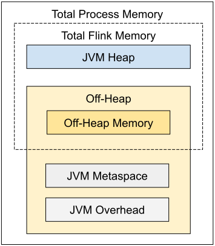

# 配置 JobManager 内存

JobManager 是 Flink 集群的控制单元。 它由三种不同的组件组成：ResourceManager、Dispatcher 和每个正在运行作业的 JobMaster。
本篇文档将介绍 JobManager 内存在整体上以及细粒度上的配置方法。

本文接下来介绍的内存配置方法适用于 1.11 及以上版本。 Flink 在 1.11
版本中对内存配置部分进行了较大幅度的改动，从早期版本升级的用户请参考[升级指南]()。

提示 本篇内存配置文档仅针对 JobManager！ 与 [TaskManager]() 相比，JobManager
具有相似但更加简单的内存模型。

## 配置总内存

配置 JobManager 内存最简单的方法就是进程的[配置总内存]()。 [本地执行模式]()下不需要为 JobManager 进行内存配置，配置参数将不会生效。

## 详细配置

如上图所示，下表中列出了 Flink JobManager 内存模型的所有组成部分，以及影响其大小的相关配置参数。

组成部分 配置参数 描述  
JVM 堆内存 jobmanager.memory.heap.size JobManager 的 JVM 堆内存。
堆外内存 jobmanager.memory.off-heap.size JobManager 的堆外内存（直接内存或本地内存）。
JVM Metaspace jobmanager.memory.jvm-metaspace.size Flink JVM 进程的 Metaspace。
JVM 开销 jobmanager.memory.jvm-overhead.min
jobmanager.memory.jvm-overhead.max
jobmanager.memory.jvm-overhead.fraction 用于其他 JVM 开销的本地内存，例如栈空间、垃圾回收空间等。该内存部分为基于进程总内存的受限的等比内存部分。

| **组成部分**          | **配置参数**                                                                                                                          | **描述**                                                          |
|-------------------|-----------------------------------------------------------------------------------------------------------------------------------|-----------------------------------------------------------------|
| [VM 堆内存]()        | [jobmanager.memory.heap.size]()                                                                                                   | JobManager 的 JVM 堆内存。                                           |
| [堆外内存]()          | [jobmanager.memory.off-heap.size]()                                                                                               | JobManager 的堆外内存（直接内存或本地内存）。                                    |
| [JVM Metaspace]() | [jobmanager.memory.jvm-metaspace.size]()                                                                                          | Flink JVM 进程的 Metaspace。                                        |
| JVM 开销            | [jobmanager.memory.jvm-overhead.min]() [jobmanager.memory.jvm-overhead.max]() [jobmanager.memory.jvm-overhead.fraction]() | 用于其他 JVM 开销的本地内存，例如栈空间、垃圾回收空间等。该内存部分为基于[进程总内存]()的[受限的等比内存部分]()。 |

### 配置 JVM 堆内存

如[配置总内存]()中所述，另一种配置 JobManager 内存的方式是明确指定 JVM 堆内存的大小（[jobmanager.memory.heap.size]()）。
通过这种方式，用户可以更好地掌控用于以下用途的 JVM 堆内存大小。

* Flink 框架
* 在作业提交时（例如一些特殊的批处理 Source）及 Checkpoint 完成的回调函数中执行的用户代码

Flink 需要多少 JVM 堆内存，很大程度上取决于运行的作业数量、作业的结构及上述用户代码的需求。

提示 如果已经明确设置了 JVM 堆内存，建议不要再设置进程总内存或 Flink 总内存，否则可能会造成内存配置冲突。

在启动 JobManager 进程时，Flink 启动脚本及客户端通过设置 JVM 参数 -Xms 和 -Xmx 来管理 JVM 堆空间的大小。
请参考 [JVM 参数]()。

### 配置堆外内存

堆外内存包括 JVM 直接内存 和 本地内存。 可以通过配置参数 [jobmanager.memory.enable-jvm-direct-memory-limit]() 设置是否启用
JVM 直接内存限制。 如果该配置项设置为 true，Flink 会根据配置的堆外内存大小设置 JVM 参数 `-XX:MaxDirectMemorySize`。
请参考 [JVM 参数]()。

可以通过配置参数 [jobmanager.memory.off-heap.size]() 设置堆外内存的大小。 如果遇到 JobManager 进程抛出 “OutOfMemoryError:
Direct buffer memory” 的异常，可以尝试调大这项配置。 请参考[常见问题]()。

以下情况可能用到堆外内存：

* Flink 框架依赖（例如 Akka 的网络通信）
* 在作业提交时（例如一些特殊的批处理 Source）及 Checkpoint 完成的回调函数中执行的用户代码

提示 如果同时配置了 Flink 总内存和 JVM 堆内存，且没有配置堆外内存，那么堆外内存的大小将会是 Flink 总内存减去JVM 堆内存。
这种情况下，堆外内存的默认大小将不会生效。

## 本地执行

如果你是在本地运行 Flink（例如在 IDE 中）而非创建一个集群，那么 JobManager 的内存配置将不会生效。

