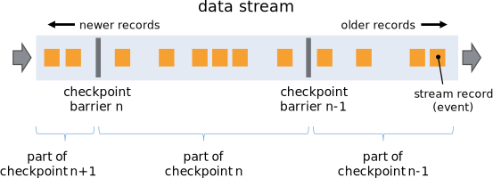

# Fault Tolerance via State Snapshots

## State Backends

由Flink管理的`keyed state`是一种分片的`key/value`存储，每个`keyed state`项的工作副本保存在`负责该key`的`taskmanager`
的`本地某个地方`。`Operator state`对于需要它的机器来说也是本地的。

Flink管理的`state`存储在`state backend`。有两种`state backend`实现可用：

* 一个基于`RocksDB`，一种嵌入式的`key/value`存储，将工作`state`存储在磁盘上；
* 另一个基于堆的`state backend`，将其工作`state`保存在Java堆上的内存中。

| Name                        | Working State        | Snapshotting       |                                        |
|-----------------------------|----------------------|--------------------|----------------------------------------|
| EmbeddedRocksDBStateBackend | Local disk (tmp dir) | Full / Incremental | * 支持大于可用内存的状态   * 经验法则:比基于堆的后端慢10倍 |
| HashMapStateBackend         | JVM Heap             | Full               | * 快速，需要大堆   * 以GC为准                |

当处理保存在基于堆的`state backend`的状态时，访问和更新涉及到读取和写入堆上的对象。
但是对于保存在`EmbeddedRocksDBStateBackend`中的对象，访问和更新涉及`序列化`和`反序列化`，因此`成本要高得多`。
但是`RocksDB`的`state`数量只受本地磁盘大小的限制。
还要注意，只有`EmbeddedRocksDBStateBackend`能够执行`增量快照`，这对于具有`大量缓慢变化的state`的应用程序来说是一个显著的好处。

这两个`state backend`都能够执行异步快照，这意味着它们可以在不妨碍正在进行的流处理的情况下创建快照。

## Checkpoint Storage

Flink定期获取每个`operator`的所有`state`的持久快照，并将这些快照复制到更持久的地方，比如`分布式文件系统`。
如果发生故障，Flink可以还原应用程序的完整`state`，并恢复处理过程，就像没有发生任何错误一样。

存储这些快照的位置是通过作业的`checkpoint storage`定义的。
`checkpoint storage`有两种可用的实现：

* 一种将其`state`的快照持久化到分布式文件系统；
* 另一种使用JobManager的堆。

| Name                        | State Backup            |                                                 |
|-----------------------------|-------------------------|-------------------------------------------------|
| FileSystemCheckpointStorage | Distributed file system | * 支持非常大的`state`大小   * 长期持久   * 建议用于生产部署 |
| JobManagerCheckpointStorage | JobManager JVM Heap     | * 适用于小`state`(本地)的测试和实验                         |

## State Snapshots

### Definitions

* Snapshot
   指Flink作业`state`的全局一致镜像的通用术语。`snapshot`包括指向每个`data sources`的`指针`(例如，指向`文件`
  或`Kafka分区`的`offset`)，以及来自每个作业的`有状态operators`的`state`副本，这些`operators`是由处理到`sources`
  中那些位置的所有事件产生的。
* Checkpoint
   Flink自动创建的`snapshot`，以便能够从故障中恢复。`Checkpoints`可以是增量的，并针对快速恢复进行了优化。
* Externalized Checkpoint
   通常`checkpoints`不打算被用户操控。Flink在作业运行时只保留`n个最近的checkpoints`(`n`是可配置的)，并在作业取消时删除它们。
  但是您可以将它们配置为`保留`，在这种情况下，您可以手动从它们恢复。
* Savepoint
   由`用户`(或`API调用`)为某些操作目的`手动触发`的`snapshot`，比如有状态的`redeploy`或`upgrade`或`rescaling`操作。
  `savepoints`总是完整的，并针对操作灵活性进行了优化。

### How does State Snapshotting Work?

Flink使用了`Chandy-Lamport算法`的一种变体，称为`asynchronous barrier snapshotting`。

当`checkpoint coordinator`(`JobManager`的一部分)指示`TaskManager`开始`checkpoint`时，它会让所有`sources`
记录它们的`offsets`，并将编号了的`checkpoint barriers`插入到它们的流中。这些`barriers`流经`JobGraph`，指示每个`checkpoint`
之前和之后的流部分。

`Checkpoint n`将包含每个`operator`的`state`，这些`operator`在`checkpoint barrier n`之前消费了所有事件，而没有消费之后的任何事件。

当`作业图`中的每个`operator`接收到这些`barriers`之一时，它记录其`state`。具有两个输入流(例如`CoProcessFunction`)
的`operators`执行`barrier alignment`，因此`snapshot`反映了`从`两个输入流`到(但不超过)`两个`barriers`
之间的消费事件所产生的`state`。

Flink的`state backends`使用`写时复制(copy-on-write)机制`，允许流处理在旧版本`state`被`异步快照`时不受阻碍地继续进行。
只有当快照被持久持久化时，这些旧版本的`state`才会被`垃圾回收`。

### Exactly Once Guarantees

当流处理应用程序出现问题时，可能会丢失或重复结果。使用Flink，取决于您为应用程序和运行它的集群所做的选择，以下结果都是可能的：

* Flink从不努力从失败中恢复(at most once)
* 没有什么损失，但您可能会遇到重复的结果(at least once)。
* 没有任何东西丢失或出现重复(exactly once)

假设Flink通过`倒带（rewinding）`和`重放（replaying）`源数据流来从故障中恢复，当理想情况被描述为`exactly once`
时，并不意味着每个事件都将被恰好处理一次。相反，这意味着每个事件只会对Flink管理的`state`产生`精确一次（exactly once）`地影响。

只有在提供`exactly once`保证时才需要`barrier alignment`。如果您不需要`exactly once`
，您可以通过配置Flink使用`CheckpointingMode.AT_LEAST_ONCE`来获得一些性能，它具有禁用`barrier alignment`的效果。

### Exactly Once End-to-end

要实现端到端的`exactly once`，以便来自`sources`的每个事件对`sinks`产生`精确一次`地影响，必须满足以下条件：

* 1.`sources`必须是可重复播放的；
* 2.`sinks`必须是事务性的(或幂等的)。

## Hands-on

[Flink Operations Playground](https://nightlies.apache.org/flink/flink-docs-release-1.17/docs/try-flink/flink-operations-playground/)
包括一个关于`Observing Failure & Recovery`的部分。

## Further Reading

* Stateful Stream Processing
* State Backends
* Fault Tolerance Guarantees of Data Sources and Sinks
* Enabling and Configuring Checkpointing
* Checkpoints
* Savepoints
* Tuning Checkpoints and Large State
* Monitoring Checkpointing
* Task Failure Recovery

