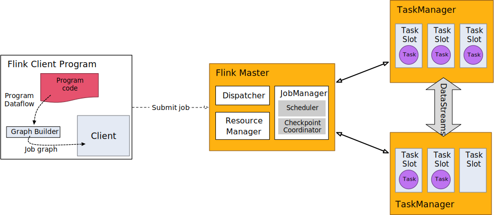

# Intro to the DataStream API

本培训的重点是广泛地涵盖`DataStream API`，以便您能够开始编写流应用程序。

## What can be Streamed?

Flink的`DataStream API`允许将它们可以`序列化`的任何内容进行流式传输。Flink`自己的序列化器`用于

* 基本类型，如String, Long, Integer, Boolean, Array
* 复合类型：Tuples（元组）, POJOs 和 Scala case classes

对于其他类型，Flink则退回到使用`Kryo`进行序列化。也可以在Flink中使用其他序列化器。特别是`Avro`，它得到了很好的支持。

### Java tuples and POJOs

Flink的`原生序列化器`可以有效地操作tuples和POJOs。

#### Tuples

对于Java, Flink通过`Tuple25`类型定义了自己的Tuple0。

~~~
Tuple2<String, Integer> person = Tuple2.of("Fred", 35);

// zero based index!  
String name = person.f0;
Integer age = person.f1;
~~~

#### POJOs

如果满足以下条件，Flink将数据类型识别为POJO类型(并允许`“by-name`的字段引用)

* class 是`public`且`独立的(没有非静态内部类)`
* class 有一个`public`的`无参数构造函数`
* class (以及所有超类)中的所有`non-static`、`non-transient`字段要么是 `public` 的(并且是`非final`的)；
  要么具有`public`的`getter`和`setter`方法，这些方法遵循`Java bean`对`getter`和`setter`的命名约定。

例：

~~~
public class Person {
    public String name;  
    public Integer age;  
    public Person() {}
    public Person(String name, Integer age) {  
        . . .
    }
}  

Person person = new Person("Fred Flintstone", 35);
~~~

### Scala tuples and case classes

所有`Flink Scala APIs`都已弃用，并将在未来的Flink版本中删除。

## A Complete Example

本例将关于人的记录流作为输入，并将其过滤到包括`成年人`记录

~~~
import org.apache.flink.streaming.api.environment.StreamExecutionEnvironment;
import org.apache.flink.streaming.api.datastream.DataStream;
import org.apache.flink.api.common.functions.FilterFunction;

public class Example {

    public static void main(String[] args) throws Exception {
        final StreamExecutionEnvironment env =
                StreamExecutionEnvironment.getExecutionEnvironment();

        DataStream<Person> flintstones = env.fromElements(
                new Person("Fred", 35),
                new Person("Wilma", 35),
                new Person("Pebbles", 2));

        DataStream<Person> adults = flintstones.filter(new FilterFunction<Person>() {
            @Override
            public boolean filter(Person person) throws Exception {
                return person.age >= 18;
            }
        });

        adults.print();

        env.execute();
    }

    public static class Person {
        public String name;
        public Integer age;
        public Person() {}

        public Person(String name, Integer age) {
            this.name = name;
            this.age = age;
        }

        public String toString() {
            return this.name.toString() + ": age " + this.age.toString();
        }
    }
}
~~~

### Stream execution environment

每个Flink应用程序都需要一个执行环境，如本例所示的`env`。流应用程序需要使用`StreamExecutionEnvironment`。

在应用程序中进行的`DataStream API`调用构建了一个附加到`StreamExecutionEnvironment`的作业图。
当调用`env.execute()`时，此图被打包并发送到`JobManager`, `JobManager`将作业并行化，并将其切片分发给`TaskManagers`执行。
作业的每个并行切片将在一个`task slot`中执行。

注意，如果不调用`execute()`，应用程序将不会运行。

这个分布式运行时取决于您的应用程序是否可序列化。它还要求集群中的每个节点都可以使用所有依赖项。

### Basic stream sources

上面的示例使用`env.fromElements(...)`构造了一个`DataStream<Person>`。这是将一个简单的流组合在一起用于原型或测试的方便方法。
在`StreamExecutionEnvironment`上还有一个`fromCollection(Collection)`方法。所以也可以这样做：

~~~
List<Person> people = new ArrayList<Person>();

people.add(new Person("Fred", 35));
people.add(new Person("Wilma", 35));
people.add(new Person("Pebbles", 2));

DataStream<Person> flintstones = env.fromCollection(people);
~~~

在原型设计时，另一种方便的将数据放入流的方法是使用`socket`

~~~
DataStream<String> lines = env.socketTextStream("localhost", 9999);
~~~

或使用文件

~~~
DataStream<String> lines = env.readTextFile("file:///path");
~~~

在实际应用程序中，最常用的`数据源`是那些支持`低延迟`、`高吞吐量`且能`并行读取`的数据源，并结合了高性能和容错的先决条件，
如`Apache Kafka`、`Kinesis`和`各种文件系统`。`REST APIs`和`数据库`也经常用于充实流数据。

### Basic stream sinks

上面的示例使用adults.print()将其结果打印到`TaskManager`的logs中(在IDE中运行时将出现在IDE的console中)。
这实际是对流的每个元素调用`toString()`。

输出看起来像这样

~~~
1> Fred: age 35
2> Wilma: age 35
~~~

其中`1>`和`2>`表示哪个`sub-task(即线程)`产生了输出。

在生产中，常用的`sinks`包括`FileSink`、`各种数据库`和几个`pub-sub`系统。

### Debugging

在生产环境中，应用程序将在远程集群或一组容器中运行。如果失败了，它也会远程失败。
`JobManager`和`TaskManager`日志在调试此类故障时非常有帮助，但是在IDE中进行本地调试要容易得多，这是Flink支持的。
可以设置断点、检查局部变量和逐步执行代码。还可以进入Flink的代码，如果对Flink的工作原理感到好奇，这是了解其内部更多信息的好方法。

## Hands-on

至此，您已经掌握了足够的知识，可以开始编写代码并运行一个简单的数据流应用程序。
Clone[flink-training-repo](https://github.com/apache/flink-training/tree/release-1.17/)，
按照README中的说明进行操作后，执行第一个练习:[Filtering a Stream (Ride Cleansing)](https://github.com/apache/flink-training/blob/release-1.17//ride-cleansing)。

## Further Reading

* [Flink Serialization Tuning Vol. 1: Choosing your Serializer — if you can]
* [Anatomy of a Flink Program]
* [Data Sources]
* [Data Sinks]
* [DataStream Connectors]
