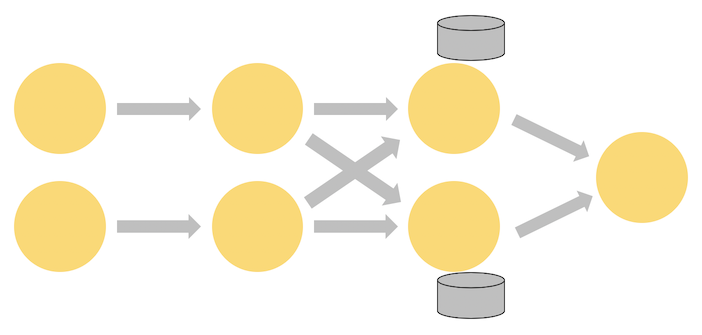
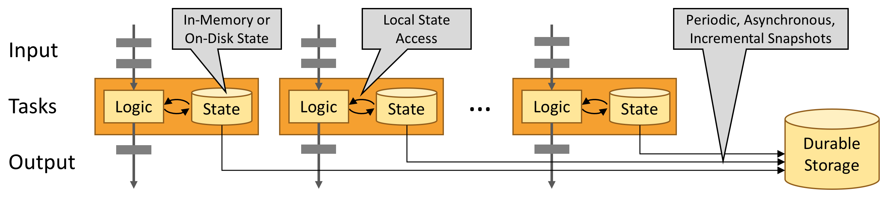

# Learn Flink

本培训介绍了`Apache Flink`，其中包括足以让您开始编写可扩展的流ETL，分析和事件驱动的应用程序，同时省略了许多细节。
重点是提供Flink用于管理`状态`和`时间`的API的简单介绍，希望掌握了这些基础知识后，您就可以更好地从更详细的参考文档中学习您需要了解的其余内容。
每个部分末尾的链接将引导您了解更多信息。

具体内容：

* 如何实现流式数据处理管道
* Flink如何以及为什么管理状态
* 如何使用事件时间来持续计算准确的分析
* 如何在连续流上构建事件驱动的应用程序
* Flink如何提供容错，有状态的流处理与`exactly-once`语义

该培训侧重于四个关键概念:流数据的连续处理、事件时间、有状态流处理和状态快照。本页将介绍这些概念。

## Stream Processing

流是数据的自然栖息地。无论是来自web服务器的事件，股票交易所的交易，还是工厂车间机器的传感器读数，数据都是作为流的一部分创建的。
但是当分析数据时，可以围绕有界流或无界流来组织处理，选择哪一种模型会产生深远的影响。

`Batch processing`是处理有界数据流时使用的范例。在这种操作模式中，可以选择在生成任何结果之前摄取整个数据集，
这意味着可以对数据进行排序、计算全局统计信息或生成汇总所有输入的最终报告。

另一方面，`Stream processing`涉及无界数据流。至少从概念上讲，输入可能永远不会结束，因此必须在数据到达时不断地处理数据。

在Flink中，应用程序由`streaming dataflows`组成，`streaming dataflows`可以通过用户定义的`operators`进行转换。
这些`dataflows`形成有向图，从一个或多个`sources`开始，并以一个或多个`sinks`结束。

通常在程序中的`transformations`和`dataflow`中的`operators`之间存在一对一的对应关系。
然而，有时，一个`transformation`可能包含多个`operators`。

应用程序可以从`streaming sources(如消息队列或分布式日志)`中消费实时数据，如Apache Kafka或Kinesis。
但是flink也可以使用来自各种数据源的有限的历史数据。
类似地，Flink应用程序产生的结果流可以发送到各种各样的系统，这些系统可以作为`sinks`连接起来。

### Parallel Dataflows

Flink中的程序本质上是`并行（parallel）`和`分布式（distributed）`的。在执行过程中，流有一个或多个`流分区（stream partitions）`，
每个`operator`有一个或多个`operator subtasks`。
`operator subtasks`彼此独立，在不同的线程中执行，且可能在不同的机器或容器上执行。

`operator subtasks`的数量是该特定`operator`的`并行度（parallelism）`。同一程序的不同`operators`可能具有不同的并行级别。

流可以在两个`operators`之间以`一对一(或forwarding)`模式传输数据，也可以以`重分发（redistributing）`模式传输数据

* `One-to-one streams`(例如上图中`source`和`map()`两个`operators`之间的流)保留了元素的划分和排序。
  这意味着`map() operator`的subtask[1]将以与`source operator`的subtask[1]以相同的顺序看到相同的元素。
* `Redistributing streams`(比如上图的 `map()`与`keyBy/window`之间，以及 `keyBy/window`与`Sink`之间) 改变了streams的分区情况。
  根据选择的`transformation`，每个`operator subtask`将数据发送到不同的`目标subtasks`。
  例如：`keyBy()（通过对key进行hash操作重新分区）`，`broadcast()` 或 `rebalance()(随机地重分区)`。
  在重分配交换中，元素之间的顺序仅在每对`发送`和`接收`的`subtasks`中保留（例如`map()`的subtask[1]和`keyBy/window`
  的subtask[2]之间）。
  例如：上图中`keyBy/window`和`Sink`两个`operators`之间的重分配，到达`Sink`的`不同key的聚合结果`的`顺序`将存在`不确定性`。

## Timely Stream Processing

对于大多数`流应用程序`来说，无论如何，能够使用用于处理实时数据的相同代码重新处理历史数据并产生确定性的、一致的结果是非常有价值的。

注意`events`发生的顺序(而不是它们交付处理的顺序)以及能够推断一组`events`何时完成(或应该完成)也很重要。
例如，考虑电子商务交易或金融交易中涉及的一组事件。

这些及时流处理的需求可以通过使用记录在数据流中的`event time`时间戳来满足，而不是使用处理数据的机器的时钟。

## Stateful Stream Processing

Flink操作可以是`有状态的`。这意味着如何处理一个事件可能取决于在它之前发生的所有事件的累积效果。
`State`可以用于简单的事情，例如每分钟计数事件以显示在仪表板上，也可以用于更复杂的事情，例如欺诈检测模型的计算功能。

Flink应用程序在分布式集群上并行运行。给定`operator`的各种并行实例将在单独的线程中独立执行，并且通常将在不同的机器上运行。

有状态`operator`的并行实例集实际上是一个分片的`key-value`存储。每个并行实例负责处理一组特定key的事件，这些key的`state`
保存在本地。

下图显示了在`作业图（JobGraph）`中的前三个`operators`上以`并行度为2`的方式运行的作业，并以`并行度为1`的`sink`终止。
第三个`operator`是有状态的，可以看到在第二个和第三个`operator`之间发生了`全连接网络`的`shuffle`。
这样做是为了按某个key对流进行分区，以便将需要一起处理的所有事件分开。

`State`总是在本地访问，这有助于Flink应用程序实现`高吞吐量`和`低延迟`。
可以选择将`state`保存在`JVM堆`上，或者如果`state`太大，可以选择将其保存在`高效的磁盘上的数据结构`中。

## Fault Tolerance via State Snapshots

Flink能够通过`状态快照（state snapshots）`和`流重播（stream replay）`的组合提供容错、`exactly-once`的语义。
这些`snapshots`捕获分布式管道的整个状态，记录输入队列中的偏移量以及整个作业图的`state`，这些`state`是由摄取到该点为止的数据产生的。
当发生故障时，`sources`被倒回，`state`被恢复，处理被恢复。如上所述，这些`state snapshots`是异步创建的，不会妨碍正在进行的处理。

