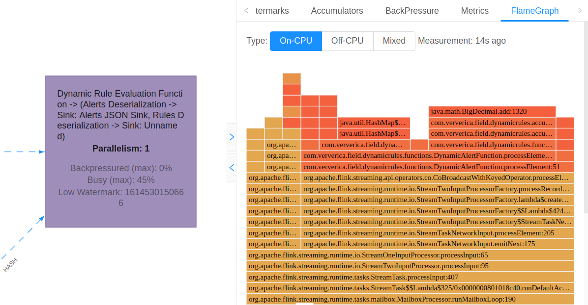
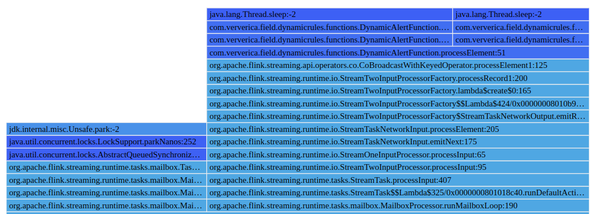
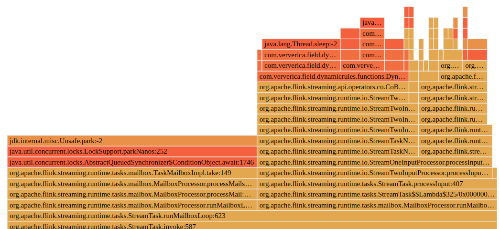
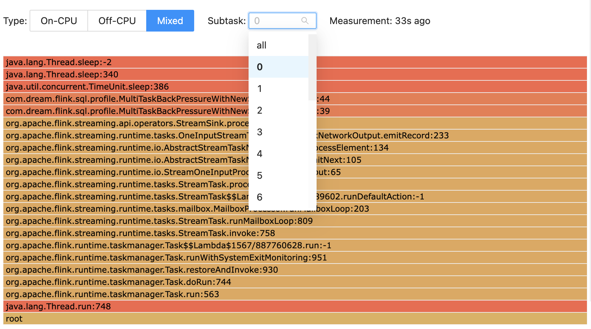

# Flame Graphs

[Flame Graphs]() are a visualization that effectively surfaces answers to questions like:

* Which methods are currently consuming CPU resources?
* How does consumption by one method compare to the others?
* Which series of calls on the stack led to executing a particular method?

Flame Graph

Flame Graphs are constructed by sampling stack traces a number of times. Each method call is presented by a bar, where
the length of the bar is proportional to the number of times it is present in the samples.

Starting with Flink 1.13, Flame Graphs are natively supported in Flink. In order to produce a Flame Graph, navigate to
the job graph of a running job, select an operator of interest and in the menu to the right click on the Flame Graph
tab:

Operator’s On-CPU Flame Graph

Any measurement process in and of itself inevitably affects the subject of measurement (see
the [double-split experiment]()). Sampling CPU stack traces is no exception. In order to prevent unintended impacts on
production environments, Flame Graphs are currently available as an opt-in feature. To enable it, you’ll need to
set [rest.flamegraph.enabled: true]() in conf/flink-conf.yaml. We recommend enabling it in development and
pre-production environments, but you should treat it as an experimental feature in production.

Apart from the On-CPU Flame Graphs, [Off-CPU]() and Mixed visualizations are available and can be switched between by
using the selector at the top of the pane:

The Off-CPU Flame Graph visualizes blocking calls found in the samples. A distinction is made as follows:

* On-CPU: Thread.State in **[RUNNABLE, NEW]**
* Off-CPU: Thread.State in **[TIMED_WAITING, WAITING, BLOCKED]**

Off-CPU Flame Graph

Mixed mode Flame Graphs are constructed from stack traces of threads in all possible states.

Flame Graph in Mixed Mode

## Sampling process

The collection of stack traces is done purely within the JVM, so only method calls within the Java runtime are visible (
no system calls).

Flame Graph construction is performed at the level of an individual [operator]() by default, i.e. all [task]() threads
of that operator are sampled in parallel and their stack traces are combined. If a method call consumes 100% of the
resources in one of the parallel tasks but none in the others, the bottleneck might be obscured by being averaged out.

Starting with Flink 1.17, Flame Graph provides “drill down” visualizations to the task level. Select a subtask of
interest, and you can see the flame graph of the corresponding subtask.

Flame Graph to the subtask level
