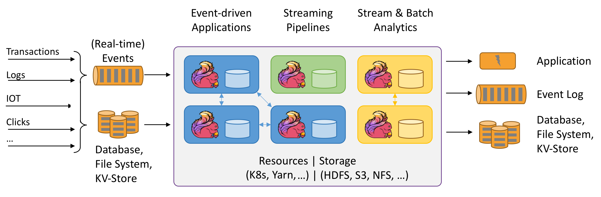

# Apache Flink - Stateful Computations over Data Streams

## 概述

* All streaming use cases
    * Event-driven Applications
    * Stream & Batch Analytics
    * Data Pipelines & ETL
* Guaranteed correctness
    * Exactly-once state consistency
    * Event-time processing
    * Sophisticated late data handling
* Layered APIs
    * SQL on Stream & Batch Data
    * DataStream API & DataSet API
    * ProcessFunction (Time & State)
* Operational Focus
    * Flexible deployment（灵活部署）
    * High-availability setup
    * Savepoints
* Scales to any use case
    * Scale-out architecture（可扩展架构）
    * Support for very large state
    * Incremental checkpointing
* Excellent Performance
    * Low latency
    * High throughput
    * In-Memory computing

## 文档

* [What is Apache Flink?](what-is-flink.md)
* [What is Stateful Functions?](what-is-stateful-functions.md)
* [What is Flink ML?](what-is-flink-ml.md)
* [What is the Flink Kubernetes Operator?](what-is-the-flink-kubernetes-operator.md)
* [What is Flink Table Store?](what-is-flink-table-store.md)
* [Use Cases](use-cases.md)
* [Flink 1.17(stable)](../v1.17/document.md)
