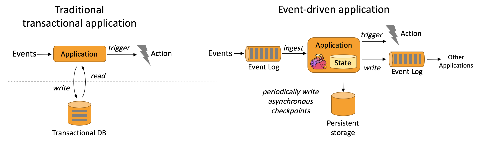

# Use Cases

由于拥有广泛的特性，Apache Flink是开发和运行许多不同类型应用程序的绝佳选择。
Flink的特性包括支持`流处理`和`批处理`、`复杂的状态管理`、`事件时间处理语义`以及状态的`精准一次（exactly-once）`的一致性保证。
此外，Flink可以部署在各种资源提供者(如`YARN`和`Kubernetes`)上，也可以作为裸机硬件上的独立集群。支持高可用性，Flink没有单点故障。
Flink已被证明可以扩展到`数千个核心`和`TB级的应用程序状态`，提供`高吞吐量`和`低延迟`，并为世界上一些最苛刻的流处理应用程序提供支持。

## 1.事件驱动的应用程序（Event-driven Applications）

事件驱动的应用程序是一种有状态的应用程序，它从一个或多个事件流中摄取事件，并通过触发计算、状态更新或外部操作来响应传入的事件。

传统应用程序具有分离的计算层和数据存储层。在此体系结构中，应用程序从远程事务数据库读取数据并将数据保存到该数据库。

事件驱动的应用程序是传统应用程序设计的演变，它基于有状态流处理应用程序。在这种设计中，数据和计算位于同一位置，从而产生本地(
内存或磁盘中)数据访问。通过定期将检查点写入远程持久存储来实现容错。

下图描述了传统应用程序体系结构与事件驱动应用程序之间的区别

### 事件驱动应用程序的优点：

* 事件驱动的应用程序不需要查询远程数据库，而是在本地访问它们的数据，从而在吞吐量和延迟方面产生更好的性能。
* 远程持久存储的定期检查点可以异步和增量地完成。因此，检查点对常规事件处理的影响非常小。
* 由于每个事件驱动的应用程序负责自己的数据，更改数据表示（representation）或扩展应用程序需要很少的协调。

### Flink对事件驱动的应用程序的支持

事件驱动应用程序的限制取决于流处理器处理时间和状态的能力。Flink有许多突出功能都围绕着这些概念。
Flink提供了一组丰富的状态原语（state primitives），可以管理非常大的数据量(高达几TB)，并保证精准一次一致性。
Flink对`事件时间`、`高度可定制的窗口逻辑`以及`由ProcessFunction提供的细粒度时间控制`的支持，使得能够实现高级业务逻辑。
此外，Flink还提供了一个用于复杂事件处理(CEP)的库，用于检测数据流中的模式。

对于事件驱动的应用程序，Flink的突出特性是保存点（savepoint）。保存点是一个一致的状态镜像，可以用作兼容应用程序的起点。
给定保存点，应用程序可以更新或调整其规模，或者可以启动应用程序的多个版本进行`A/B测试`。

### 典型的事件驱动应用程序

* 欺诈检测
* 异常检测
* 基于规则的提醒
* 业务流程监控
* Web应用程序(社交网络)

## 2.数据分析应用程序（Data Analytics Applications）

数据分析工作是从原始数据中提取信息和见解。传统上，分析是作为对`记录事件`的`有限数据集`的批量查询或应用程序执行。
为了将最新数据合并到分析结果中，必须将其添加到分析的数据集中，并重新运行查询或应用程序。结果被写入存储系统或作为报告发出。

使用复杂的流处理引擎，还可以以`实时方式`执行分析。流查询或应用程序摄取实时事件流，并在事件被消耗时不断生成和更新结果。
结果要么写入外部数据库，要么作为内部状态维护。仪表板（Dashboard）应用程序可以从外部数据库读取最新的结果，也可以直接查询应用程序的`内部状态`。

Apache Flink支持流和批处理分析应用程序，如下图所示

### 流式分析应用程序的优势

* 与批处理分析相比，由于没有定期导入和查询执行，连续流式分析从事件（events）到洞察（insight）的延迟要低得多。
* 与批处理查询相比，流查询不必处理输入数据中的边界（这些边界是由周期性导入和输入的有界特性引起的）。
* 更简单的应用程序体系结构。批处理分析管道需要由几个独立的组件组成，用于定期调度数据摄取和查询执行。且一个组件的故障会影响管道的后续步骤。
  相比之下，在Flink等复杂的流式处理器上运行的流式分析应用程序包含了从数据摄取到连续结果计算的所有步骤。因此，它可以依靠Flink引擎的故障恢复机制。

### Flink对数据分析应用程序的支持

Flink对连续流和批处理分析提供了很好的支持。具体来说，它提供了一个兼容ansi的SQL接口，具有用于批处理和流查询的统一语义。
SQL查询计算相同的结果，无论它们是运行在记录事件的静态数据集上还是运行在实时事件流上。
支持丰富的`用户定义函数（UDF）`，确保可以在SQL查询中执行自定义代码。
如果需要更多的自定义逻辑，Flink的`DataStream API`或`DataSet API`提供更多的`低级控制`。

### 典型的数据分析应用程序

* 电信网络质量监测
* 移动应用产品更新分析及实验评估
* 消费者技术中实时数据的Ad-hoc分析
* 大规模图分析

## 3.数据管道应用（Data Pipeline Applications）

提取-转换-加载(ETL)是在存储系统之间转换和移动数据的常用方法。通常会定期触发ETL作业，将数据从`事务性数据库系统`
复制到`分析数据库`或`数据仓库`。

`数据管道`的用途与ETL作业类似。它们可以`转换和丰富`数据，并将数据从一个存储系统转移到另一个存储系统。
但是，它们以`连续流模式`运行，而不是周期性触发。 因此，它们能够从不断产生数据的源读取记录，并以低延迟将其移动到目的地。
例如，`数据管道`可以监视文件系统目录中的新文件，并将其数据写入事件日志。也可以将事件流具体化到数据库，或者增量地构建和优化搜索索引。

下图描述了周期性ETL作业和连续数据管道之间的区别

### 数据管道的优势

* 与周期性ETL作业相比，连续数据管道的明显优势是减少了将数据移动到目的地的延迟。
* 数据管道更加通用，可以用于更多的用例，因为它们能够持续地消费和发出数据。

### Flink对数据管道的支持

Flink的`SQL接口`或`Table API`及`用户定义函数（UDF）`可以解决许多常见的数据`转换或丰富`任务。
数据管道可以通过使用更为通用的`DataStream API`，来满足更高级的需求。
Flink提供了一组丰富的连接器到各种存储系统，如Kafka、Kinesis、Elasticsearch和JDBC数据库系统。
它还具有用于监视目录的文件系统的`连续源（continuous sources）` 和 以`时间桶（time-bucketed）`方式写入文件的`sink`。

### 典型的数据管道应用程序

* 电子商务中实时搜索索引的建立
* 电子商务中的持续ETL

