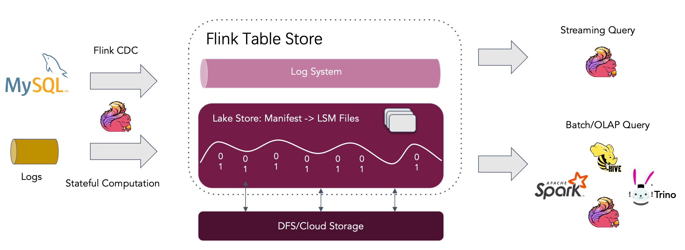

# Apache Flink Table Store

`Flink Table Store`是一个统一的存储，用于在Flink中构建流处理和批处理的`动态表`，支持`高速数据摄取`和`及时的数据查询`。

表存储提供以下核心功能:

* 支持存储大数据集，允许批处理和流模式的读/写。
* 支持流查询，最小延迟低至毫秒级。
* 支持批处理/OLAP查询，最小延迟低至第二级。
* 默认情况下支持流消费的增量快照。因此用户不需要自己合并不同的数据管道。

## 架构

* 读/写：表存储支持一种通用的方式来读/写数据和执行OLAP查询。
    * 对于读，它支持消费数据
        * 从历史快照(批处理模式)
        * 从最近的偏移量(在流模式下)
        * 以混合方式读取增量快照。
    * 对于写操作，它支持从数据库变更日志(CDC)进行流同步，或者从离线数据进行批量插入/覆盖。

* 生态系统:除了Apache Flink, Table Store还支持其他计算引擎的读取，比如Apache Hive、Apache Spark和Trino。
* 内部:在底层，Table Store使用混合存储架构，使用l`ake格式`存储历史数据，使用`队列系统`存储增量数据。
  前者将列状文件存储在文件系统/对象存储中，并使用`LSM树结构`来支持大量数据更新和高性能查询。后者使用`Apache Kafka`来实时捕获数据。

## 统一存储

Flink SQL中有三种类型的连接器：

* 消息队列，比如Apache Kafka，它在管道的源和中间阶段都被使用，以保证延迟保持在秒内。
* OLAP系统，如ClickHouse，它以流方式接收处理过的数据，并为用户提供即席查询（ad-hoc）服务。
* 批处理存储，如Apache Hive，它支持传统批处理的各种操作，包括`INSERT OVERWRITE`。

Flink Table Store提供了表抽象。它的使用方式与传统数据库没有什么不同:

* 在Flink批处理执行模式下，它就像一个Hive表，支持批处理SQL的各种操作。查询最新快照。
* 在Flink流执行模式下，它就像一个消息队列。查询行为类似于从历史数据永不过期的消息队列查询`流更改日志（changelog）`。

## 基本概念

详见[官网文档](https://nightlies.apache.org/flink/flink-table-store-docs-release-0.3/docs/concepts/basic-concepts/)

