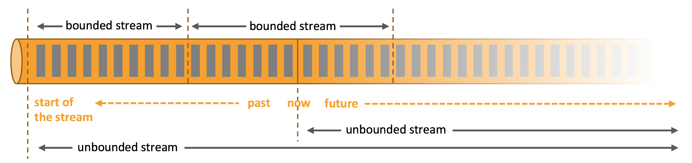
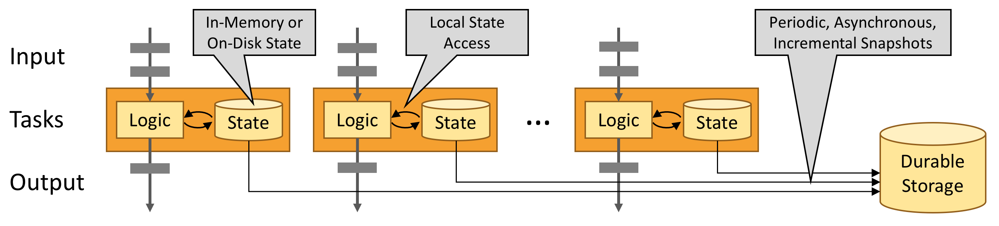
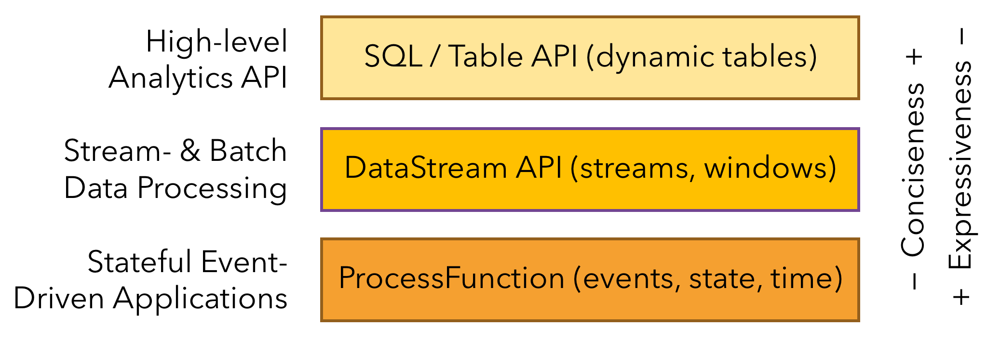

# What is Apache Flink

## 1.架构

`Apache Flink`是一个`框架`和`分布式处理引擎`，用于`无界和有界数据流`的`有状态计算`。
Flink被设计成可以在所有`常见的集群环境`中运行，以`内存中（in-memory）的速度`和`任何规模`执行计算。

### 处理无界和有界数据

任何类型的数据都是作为`事件流`产生的。信用卡交易、传感器测量、机器日志或网站或移动应用程序上的用户交互，所有这些数据都以`流`
的形式生成。

数据可以被分为`无界流`或`有界流`：

* 无界流有开始，但没有确定的结束。它们不会终止并在生成数据时提供数据。无界流必须被连续处理，也就是说，事件必须在被摄取后被迅速处理。
  等待所有输入数据到达是不可能的，因为输入是无界的，在任何时间点都不会完成。
  处理无界数据通常需要以特定顺序(例如事件发生的顺序)摄取事件，以便能够推断结果的完整性。
* 有界流有定义的开始和结束。有界流可以通过在执行任何计算之前摄取所有数据来处理。处理有界流不需要有序摄取，因为有界数据集总是可以排序的。
  有界流的处理也称为`批处理`。

### 能在任何地方部署应用程序

Apache Flink擅长处理无界和有界数据集。精确的时间和状态控制使Flink的运行时可以在无限流上运行任何类型的应用程序。
有界流在内部由专门为固定大小的数据集设计的算法和数据结构处理，产生出色的性能。

Apache Flink是一个分布式系统，需要计算资源来执行应用程序。
Flink集成了所有常见的集群资源管理器，如`Hadoop YARN`、`Apache Mesos`和`Kubernetes`，但也可以设置为作为独立集群运行。

Flink被设计成可以很好地工作于前面列出的每个资源管理器。这是通过`特定于资源管理器的部署模式`实现的，
该模式允许Flink以惯用的方式与每个资源管理器交互。

在部署Flink应用程序时，Flink会根据应用程序配置的`并行性`自动识别所需的资源，并从资源管理器请求它们。
如果发生故障，Flink将通过`请求新资源`来`替换失败的容器`。提交或控制应用程序的所有通信都是通过REST调用进行的。这简化了Flink在许多环境中的集成。

### 能以任何规模运行应用程序

Flink旨在运行`任何规模`的`有状态流`应用程序。应用程序可能被`并行化`为数千个任务，这些任务分布在集群中并并发执行。
因此，应用程序可以利用几乎无限量的cpu、主存、磁盘和网络IO。此外，Flink很容易维护非常大的应用程序状态。
它的异步和增量检查点算法确保对处理延迟的影响最小，同时保证`精确一次（exactly-once）状态`一致性。

[Flink用户报告了他们生产环境的用例，其规模数字令人印象深刻](https://flink.apache.org/powered-by/)

每天处理`数万亿个事件`，维护`多个TB状态`，以及运行在`数千个核`上的应用程序。

### 利用内存性能

有状态Flink应用程序针对`本地状态`访问进行了优化。
任务状态始终保存在内存中，或者，如果状态大小超过`可用内存`，则保存在`访问效率高`的磁盘数据结构中。
因此，任务通过访问`本地(通常在内存中)状态`来执行所有计算，从而产生`非常低的处理延迟`。
Flink通过`定期和异步`地做`checkpoint`将`本地状态`持久化到存储，从而保证在发生故障时`精确一次（exactly-once）状态`的一致性。

## 2.应用程序

Flink提供了`不同抽象级别`的多个`API`，并为常见用例提供了`专用库`。

### 流式应用程序的构建模块

`可以使用流处理框架构建和执行`的应用程序类型，是由框架对`流（streams）`、`状态（state）`和`时间（time）`的控制程度来定义的。

#### 流（streams）

`流`是`流式处理`的一个基本方面。然而，流可以具有不同的特征，这些特征会影响流的处理方式。Flink是一个通用的处理框架，可以处理任何类型的流。

* 有界和无界流：流可以是无界的，也可以是有界的，即固定大小的数据集。Flink具有复杂的功能来处理无界流，但也有专门的操作符来有效地处理有界流。
* 实时流和记录流：所有数据都以流的形式生成。有两种处理数据的方法。在生成流时进行实时处理，或者将流持久化到存储系统(
  例如文件系统或对象存储)，然后再进行处理。Flink应用程序可以处理记录或实时流。

#### 状态（state）

每个重要的流式应用程序都是`有状态的`，只有`转换单个事件`的应用程序才不需要`状态`。
任何运行基本业务逻辑的应用程序都需要`记住事件或中间结果`，以便`在以后的时间点访问它们`。

`状态`是Flink的一等公民。

* 多状态原语（Multiple State Primitives）：Flink为不同的数据结构(如原子值、列表或映射)提供了`状态原语`。
  开发人员可以根据函数的访问模式选择最有效的状态原语。
* 可插状态后端（Pluggable State Backends）：应用程序状态由`可插状态后端`管理和进行checkpoint。
  Flink具有不同的状态后端，这些后端将状态存储在内存或RocksDB(一种高效的嵌入式磁盘数据存储)中。也可以插入自定义状态后端。
* 精确一次状态一致性（Exactly-once state consistency）：Flink的`checkpoint和恢复算法`保证了应用程序状态在发生故障时的一致性。
  因此，可以`透明地（transparently）`处理故障，并且不会影响应用程序的正确性。
* 非常大的状态（Very Large State）：Flink能够维护`几TB大小`的应用程序状态，归功于它的异步和增量checkpoint算法。
* 可伸缩应用程序（Scalable Applications）：Flink通过将状态重新分配给更多或更少的worker来支持有状态应用程序的伸缩。

原语（Primitives）：在计算机中表示一个不可拆分的操作或一组不可拆分的操作，必须被当作一个整体对待，要么成功，要么失败

#### 时间（time）

时间是流式应用程序的另一个重要组成部分。大多数事件流都具有固有的时间语义，因为每个事件都是在特定的时间点产生的。
此外，许多常见的流计算都是基于时间的，例如窗口聚合、会话化、模式检测和基于时间的连接。
流处理的一个重要方面是应用程序如何对时间采取措施，即事件时间和处理时间的差异。

* 事件时间模式（Event-time Mode）：使用事件时间语义处理流的应用程序基于`事件的时间戳`计算结果。
  因此，无论处理的是记录事件还是实时事件，事件时间处理都会得到准确和一致的结果。
* 水位标志支持（Watermark Support）：Flink在事件时间应用程序中使用watermark来推断时间。
  watermark也是一种权衡`结果的延迟和完整性`的灵活机制。
* 延迟数据处理（Late Data Handling）：当以带有watermark的`事件时间模式`处理流时，可能会发生在所有相关事件到达之前计算已经完成的情况。
  这样的事件被称为`延迟事件`。Flink具有多个选项来处理延迟事件，例如通过`旁路输出`和`更新先前完成的结果`。
* 处理时间模式（Processing-time Mode）：除了它的事件时间模式，Flink还支持`处理时间`语义，它执行由处理机器的时钟时间触发的计算。
  处理时间模式可能适用于具有严格的低延迟要求、可以容忍近似结果的某些应用程序。

### 分层的API

Flink提供了三层API。每层API在简洁性和表达性之间提供了不同的权衡，并适用于不同的用例。

#### ProcessFunctions

ProcessFunctions是Flink提供的最有表现力的函数接口。Flink提供ProcessFunctions来处理来自一个或两个输入流或事件的单独事件，这些事件被分组在一个窗口中。
ProcessFunctions提供对时间和状态的细粒度控制。ProcessFunction可以任意修改其状态并注册计时器（timers），这些计时器将在将来触发回调函数。
因此，ProcessFunctions可以根据许多有状态事件驱动的应用程序的需要实现复杂的单事件业务逻辑。

#### DataStream API

DataStream API为许多常见的流处理操作提供了原语，例如`打开窗口`、`一次记录转换`以及`通过查询外部数据存储来丰富事件`。
DataStream API可用于Java和Scala，并基于map()、reduce()和aggregate()等函数。
这些函数可以通过扩展接口定义，也可以作为`Java或Scala`的lambda函数定义。

#### SQL & Table API

Flink提供了两个关系API, `Table API`和`SQL`。
这两个API都是用于批处理和流处理的统一API，也就是说，查询在无界的实时流或有界的记录流上以相同的语义执行，并产生相同的结果。
Table API和SQL利用Apache Calcite进行解析、验证和查询优化。它们可以与`DataStream和DataSet API`无缝集成，
并支持用户定义的标量、聚合和表值（table-valued）函数。

Flink的关系API旨在简化`数据分析`、`数据流水线`和`ETL应用程序`的定义。

### 库

Flink为常见的数据处理用例提供了几个库。这些库通常嵌入在API中，并不是完全自包含的。因此，它们可以从API的所有特性中受益，并与其他库集成。

* 复杂事件处理（Complex Event Processing,CEP）：模式检测是事件流处理的一个非常常见的用例。
  Flink的CEP库提供了一个API来指定事件模式(想想正则表达式或状态机)。CEP库与Flink的数据流API集成在一起，这样模式就可以在数据流上进行评估。
  CEP库的应用包括网络入侵检测、业务流程监控和欺诈检测。
* DataSet API：DataSet API是Flink批处理应用程序的核心API。DataSet API的原语包括map、reduce、(outer)join、co-group和iterate。
  所有操作都由算法和数据结构支持，这些算法和数据结构对内存中的序列化数据进行操作，如果数据大小超过内存预算，则溢出到磁盘。
  Flink的DataSet API的数据处理算法受到传统数据库操作符的启发，例如混合哈希连接或外部合并排序。
* Gelly：Gelly是一个可扩展的图形处理和分析库。Gelly是在DataSet API之上实现并与之集成的。因此，它受益于其可扩展和健壮的操作符。
  Gelly具有内置算法，如标签传播、三角形枚举和页面排名，但也提供了一个图形API，可以简化自定义图形算法的实现。

## 3.运维

由于许多流应用程序被设计为以最小的停机时间连续运行，流处理器必须提供出色的`故障恢复`能力，以及在应用程序运行时监视和维护应用程序的工具。

### 7*24不间断地运行应用程序

Flink提供了以下功能，以确保应用程序保持运行和保持一致:

* 一致性检查点（Consistent Checkpoints）：Flink的恢复机制基于应用程序状态的一致性检查点。
  如果发生故障，则重新启动应用程序，并从最近的检查点加载其状态。 结合可重置的流数据源，保证`精确一次状态一致性`。
* 高效的检查点（Efficient Checkpoints）：如果应用程序维护`几TB的状态`，那么对应用程序的状态进行检查点可能会非常昂贵。
  Flink可以执行异步和增量检查点，以便使检查点对应用程序延迟[SLA](../../common/sla/sla.md)的影响非常小。
* 端到端的精确一次性（End-to-End Exactly-Once）：Flink为特定的存储系统提供事务接收器（sink），确保即使发生故障，数据也只精准地写一次。
* 与集群管理器集成（Integration with Cluster Managers）：Flink与集群管理器紧密集成，例如Hadoop YARN或Kubernetes。
  当一个处理过程失败时，将自动启动一个处理过程来接管其工作。
* 高可用性设置（High-Availability Setup）：Flink具有高可用性模式，消除了所有单点故障。
  ha模式基于Apache ZooKeeper（一个经过实战验证的可靠分布式协调服务）。

### 更新、迁移、挂起和恢复应用程序

支持关键业务服务的流应用程序需要维护。漏洞需要修复，改进或新功能需要实现。然而，更新有状态流应用程序并非易事。
通常不能简单地停止应用程序并重新启动固定或改进的版本，因为不能承受丢失应用程序状态的后果。

Flink的保存点（Savepoint）是一个独特而强大的功能，它解决了更新有状态应用程序和许多其他相关挑战的问题。
保存点是应用程序状态的一致快照，因此非常类似于检查点。与检查点相比，保存点需要手动触发，并且在应用程序停止时不会自动删除。
保存点可用于启动状态兼容的应用程序并初始化其状态。

保存点启用以下功能:

* 应用程序演化（Application Evolution）：保存点可用于演化（evolve ）应用程序。可以从应用程序以前版本的保存点重新启动应用程序的固定版本或改进版本。
  还可以从较早的时间点启动应用程序(如果存在这样的保存点)，以修复有缺陷版本产生的不正确结果。
* 集群迁移（Cluster Migration）：使用保存点，可以将应用程序迁移(或克隆)到不同的集群。
* Flink版本更新（Flink Version Updates）：可以使用保存点将应用程序迁移到新的Flink版本上运行。
* 应用程序扩展（Application Scaling）：保存点可用于增加或减少应用程序的并行性。
* A/B测试和假设场景（A/B Tests and What-If Scenarios）：可以通过从相同保存点启动不同版本的应用程序来比较应用程序的两个(
  或更多)不同版本的性能或质量。
* 暂停和恢复（Pause and Resume）：可以通过获取保存点并停止应用程序来暂停应用程序。在以后的任何时间点，都可以从保存点恢复应用程序。
* 存档（Archiving）：保存点可以存档，以便能够将应用程序的状态重置为较早的时间点。

### 监视和控制您的应用程序

持续运行的流应用程序需要被监督并集成到运营基础设施中，即组织的监控和日志服务。
监控有助于预测问题并提前做出反应。日志记录支持对故障进行根本原因分析。
最后，控制正在运行的应用程序的易于访问的接口是一个重要的特性。

Flink很好地集成了许多常见的日志和监视服务，并提供了一个REST API来控制应用程序和查询信息。

* Web UI：Flink提供了一个web UI来检查、监控和调试正在运行的应用程序。它还可以用于提交执行或取消执行。
* Logging：Flink实现了流行的slf4j日志接口，并集成了日志框架log4j或logback。
* Metrics：Flink具有复杂的指标系统来收集和报告系统和用户定义的指标。
  指标可以导出到几个报表，包括JMX、Ganglia、Graphite、Prometheus、StatsD、Datadog和Slf4j。
* REST API：Flink公开了一个REST API，用于提交新应用程序、获取正在运行的应用程序的保存点或取消应用程序。
  REST API还公开元数据和收集的正在运行或已完成的应用程序的度量。

