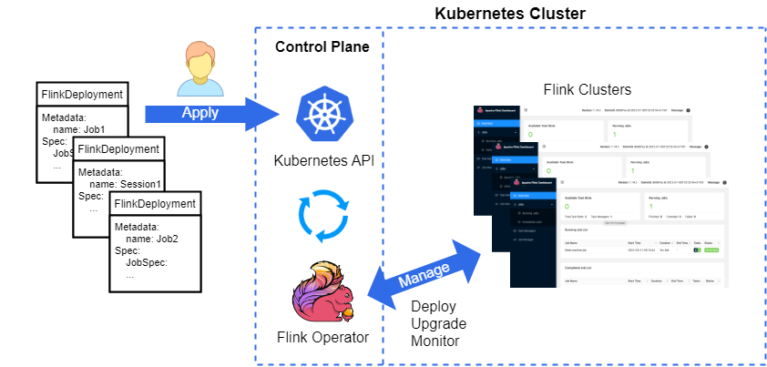

# Flink Kubernetes Operator

`Flink Kubernetes Operator`扩展了`Kubernetes API`，具有管理和操作Flink部署的能力。

该Operator的特点包括:

* 部署和监控Flink应用程序和会话的 deployments
* 提供升级、挂起和删除 deployments 功能
* 集成了完整的日志记录和度量（metrics）
* 使用Kubernetes工具，灵活地将 deployments 和`k8s原生环境`进行集成

## 概述

`Flink Kubernetes Operator`作为一个控制平面来管理`Apache Flink应用程序`的完整部署生命周期。
虽然Flink的原生Kubernetes集成已经允许直接在运行的Kubernetes(k8s)集群上部署Flink应用程序，
但`自定义资源(CDR)`和`operator模式`也已经成为Kubernetes原生部署的核心理念。

支持的Flink版本:v1.13, v1.14, v1.15, v1.16

详见[官网文档](https://nightlies.apache.org/flink/flink-kubernetes-operator-docs-release-1.4/docs/concepts/overview/)

