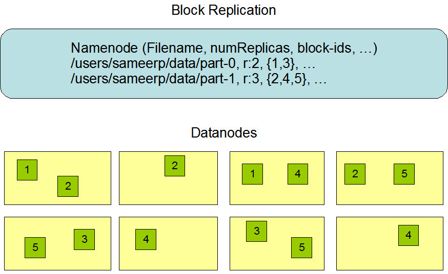

# HDFS架构

## 简介

* Hadoop分布式文件系统(HDFS)是一个分布式文件系统
* HDFS是高度容错的，设计用于部署在低成本的硬件上
* HDFS提供对应用程序数据的高吞吐量访问，适用于具有大数据集的应用程序
* HDFS放宽了一些POSIX要求，以支持对文件系统数据的流访问

HDFS最初是作为Apache Nutch web搜索引擎项目的基础设施而构建的。是Apache Hadoop 核心项目的一部分。

## 设想和目标

* 硬件故障
   
  硬件故障是常态，而不是例外。HDFS实例可能由数百或数千台服务器组成，每台服务器存储文件系统数据的一部分。事实上，有大量的组件，每个组件都有一个重要的故障概率，这意味着HDFS的一些组件总是无功能的。因此，故障检测和快速自动恢复是HDFS的核心架构目标。
* 流式数据访问
   
  在HDFS上运行的应用程序需要流式访问它们的数据集。它们不是通常在通用文件系统上运行的通用应用程序。HDFS的设计更多是为了批处理，而不是用户的交互使用。重点是数据访问的高吞吐量，而不是数据访问的低延迟。POSIX强加了许多硬要求，这些要求对于以HDFS为目标的应用程序来说是不需要的。为了提高数据吞吐率，一些关键领域的POSIX语义已经被交换。
* 大数据集
   
  在HDFS上运行的应用程序有大量的数据集。HDFS中典型的文件大小为gb到tb。因此，HDFS被调优为支持大文件。它应该提供高聚合数据带宽，并可扩展到单个集群中的数百个节点。它应该在单个实例中支持数千万个文件。
* 简单的一致性模型
   
  HDFS应用程序需要文件的写一次读多访问模型。文件一旦创建、写入和关闭就不需要更改，除了追加和截断。支持将内容附加到文件末尾，但不能在任意点更新。这种假设简化了数据一致性问题，并支持高吞吐量数据访问。MapReduce应用程序或网络爬虫应用程序非常适合这个模型。
* 移动计算比移动数据更便宜
   
  应用程序请求的计算如果在它所操作的数据附近执行，效率会高得多。当数据集非常大时尤其如此。这样可以最大限度地减少网络拥塞，提高系统的总体吞吐量。假设将计算迁移到离数据所在位置更近的地方，而不是将数据迁移到运行应用程序的地方，这通常会更好。HDFS为应用程序提供接口，使其更靠近数据所在的位置。
* 跨异构硬件和软件平台的可移植性
   
  HDFS 是用 Java 语言构建的；任何支持 Java 的机器都可以运行 NameNode 或 DataNode 软件。

## NameNode and DataNodes

HDFS 采用`master/slave`架构。HDFS集群由单个NameNode组成，NameNode是管理`文件系统命名空间`和规范客户端对文件访问的主服务器。
此外，还有许多 datanode (通常集群中的每个节点一个)，它们管理附加到它们所运行的节点上的存储。
HDFS 公开了一个`文件系统命名空间`，允许用户数据存储在文件中。在内部，一个文件被分割成一个或多个块，这些块存储在一组datanode中。
NameNode 执行文件系统命名空间操作，如打开、关闭和重命名文件和目录。它还决定了块到 datanode 的映射。
datanode 负责处理来自文件系统客户端的读写请求。datanode 还根据 NameNode 的指令执行块的创建、删除和复制。
集群中单个 NameNode 的存在极大地简化了系统架构。NameNode 是所有 HDFS 元数据的仲裁器和存储库。用户数据从不流经 NameNode。

## 文件系统命名空间(file system namespace)

HDFS支持传统的分层文件组织。用户或应用程序可以创建目录并在这些目录中存储文件。
文件系统命名空间层次结构与大多数其他现有文件系统相似;用户可以创建和删除文件，将文件从一个目录移动到另一个目录，或者重命名文件。
HDFS支持用户配额和访问权限。HDFS不支持硬链接和软链接。然而，HDFS架构并不排除实现这些特性。

NameNode维护文件系统命名空间。对文件系统名称空间或其属性的任何更改都由NameNode记录。并存储HDFS维护的文件副本的数量。

## 数据复制(Data Replication)

HDFS的设计目的是在大型集群中跨机器可靠地存储非常大的文件。它将每个文件存储为一个块序列。复制文件的块是为了容错。每个文件的块大小和复制(`replication`)
因子是可配置的。
文件中除了最后一个块之外的所有块都是相同的大小，而用户可以在添加了对可变长度块的支持后开始一个新的块，而无需将最后一个区块填充到配置的区块大小。
应用程序可以指定文件的副本数量。复制因子可以在文件创建时指定，以后可以更改。HDFS中的文件除了`追加`和`截断`
，都是一次写入(`write-once`)，并且在任何时候严格规定单写。
NameNode做出所有关于块复制的决定。它定期从集群中的每个datanode接收一个Heartbeat和一个Blockreport。接收到Heartbeat表示DataNode工作正常。Blockreport包含一个DataNode上所有block的列表。

* Replica Placement
   
  副本的位置对HDFS的可靠性和性能至关重要。[机架感知](rack-awareness.md)副本放置策略可以提高数据可靠性、可用性和网络带宽利用率。这需要在生产系统上验证和测试。
   
  大型HDFS实例运行在计算机集群上，通常分布在许多机架上。位于不同机架的两个节点之间的通信必须通过交换机。在大多数情况下，同一机架中机器之间的网络带宽大于不同机架中机器之间的网络带宽。
   
  NameNode通过Hadoop`机架感知`过程确定每个DataNode所属的机架id。一个简单但非最佳的策略是将每个单独副本放在唯一的机架上。
  这可以防止在整个机架故障时丢失数据，并允许在读取数据时使用多个机架的带宽。此策略将副本均匀地分布在集群中，以便在组件故障时平衡负载。但是，这种策略增加了写操作的成本，因为写操作需要将块传输到多个机架。
   
  对于常见情况，当replication为3时，HDFS的放置策略是，如果写入器在datanode上，则将一个副本放在本地机器上，否则在随机datanode上，另一个副本放在不同机架中的节点上，最后一个副本放在同一远程机架中的不同节点上。
  该策略减少了机架间的写流量，从而提高了写性能。机架故障的概率远小于节点故障的概率;此策略不影响数据可靠性和可用性保证。它减少了读取数据时使用的总网络带宽，因为一个块只放在两个唯一的机架中，而不是三个。
  使用此策略，文件的副本不会均匀地分布在机架上。1/3的副本在一个节点上，1/3的副本在一个机架上，另外1/3均匀分布在其余机架上。在不影响数据可靠性和读性能的前提下，提高写性能。
   
  如果replication大于3，则随机确定第4个及以后副本的位置，同时保持每个机架的副本数量低于上限(基本上是(replicas - 1) /机架+
  2)。
   
  由于NameNode不允许datanode拥有相同块的多个副本，因此创建的最大副本数是datanode的总数。
   
  在对`存储类型`和`存储策略`的支持被添加到HDFS之后，除了上面描述的机架感知之外，NameNode还考虑了副本放置的策略。
  NameNode首先根据`机架感知`选择节点，然后检查候选节点是否具有与文件关联的策略所需的存储空间。如果候选节点没有存储类型，NameNode将寻找另一个节点。
  如果在第一个路径中找不到足够的节点来放置副本，NameNode将在第二个路径中查找具有后备存储类型的节点。

* Replica Selection
   
  为了最小化全局带宽消耗和读取延迟，HDFS尝试满足来自最接近读取器的副本的读取请求。如果在与读取节点相同的机架上存在副本，则优先选择该副本来满足读取请求。如果HDFS集群跨越多个数据中心，那么驻留在本地数据中心的副本优于任何远程副本。

* Safemode
   
  在启动时，NameNode进入一种称为Safemode的特殊状态。NameNode处于Safemode状态时，不进行数据块复制。NameNode接收来自datanode的Heartbeat和Blockreport消息。
  Blockreport包含DataNode托管的数据块列表。每个块都有指定的最小副本数量。当该数据块的最小副本已检入到NameNode时，就认为该块已被`安全复制`。
  在一定比例的安全复制数据块检入NameNode后(外加30秒)
  ，NameNode退出Safemode状态。接着，NameNode确定仍然少于指定副本数量的数据块列表(如果有的话)，然后NameNode将这些块复制到其他datanode。

## 文件系统元数据持久化(The Persistence of File System Metadata)

HDFS的命名空间由NameNode存储。NameNode使用一个名为EditLog的事务日志来持久地记录发生在文件系统元数据中的每一个更改。
例如，在HDFS中创建一个新文件会导致NameNode在EditLog中插入一条记录。类似地，更改文件的复制因子会导致在EditLog中插入一条新记录。
NameNode使用本地主机操作系统文件系统中的文件存放EditLog。
整个文件系统命名空间，包括块到文件的映射和文件系统属性，都存储在一个名为FsImage的文件中。FsImage也作为文件存储在NameNode的本地文件系统中。

NameNode在内存中保存了整个`文件系统命名空间`和`文件块映射`的映像。
当NameNode启动时，或者检查点被一个可配置的阈值触发时，它从磁盘读取FsImage和EditLog，将EditLog中的所有事务应用到FsImage的内存表示中，并将这个新版本刷新到磁盘上的新FsImage中。
然后，它可以截断旧的EditLog，因为它的事务已经应用到持久的FsImage。这个过程称为检查点。
检查点的目的是通过获取文件系统元数据的快照并将其保存到FsImage，以确保HDFS具有一致的文件系统元数据视图。尽管读取FsImage是有效的，但直接对FsImage进行增量编辑是不有效的。
我们不是为每次编辑修改FsImage，而是将编辑保存在EditLog中。在检查点期间，来自EditLog的更改应用于FsImage。
检查点可以在以秒为单位的给定时间间隔(dfs.namenode.checkpoint.period)触发，也可以在积累了给定数量的文件系统事务之后触发(
dfs.namenode.checkpoint.txns)。
如果设置了这两个属性，则到达的第一个阈值将触发检查点。NameNode在内存中保存了整个文件系统命名空间和文件块映射的映像。

DataNode将HDFS数据以文件的形式存储在本地文件系统中。DataNode不了解HDFS文件。它将每个HDFS数据块存储在本地文件系统的单独文件中。DataNode不会在同一个目录下创建所有文件。
相反，它使用启发式方法来确定每个目录的最佳文件数量，并适当地创建子目录。在同一目录中创建所有本地文件并不是最优的，因为本地文件系统可能无法有效地支持单个目录中的大量文件。
当DataNode启动时，它会扫描本地文件系统，生成与每个本地文件对应的所有HDFS数据块列表，并将此报告发送给NameNode。该报告被称为Blockreport。

## 通讯协议(The Communication Protocols)

所有HDFS通信协议都是在TCP/IP协议之上分层的。客户端建立到NameNode机器上的可配置TCP端口的连接。客户端使用Client协议与NameNode通信。DataNode使用DataNode协议与NameNode通信。
远程过程调用(RPC)抽象封装了Client协议和DataNode协议。按照设计，NameNode从不发起任何rpc。相反，它只响应由datanode或客户机发出的RPC请求。

## 健壮性(Robustness)

HDFS的主要目标是即使出现故障也能可靠地存储数据。常见的三种故障类型是NameNode故障、DataNode故障和网络分区故障。

* Data Disk Failure, Heartbeats and Re-Replication
   
  每个DataNode定时向NameNode发送心跳信息。网络分区可能导致datanode的一个子集失去与NameNode的连接。NameNode通过Heartbeat消息的缺失来检测这种情况。
  NameNode将最近没有心跳的datanode标记为死亡，并且不会向它们转发任何新的IO请求。任何注册到死DataNode的数据对HDFS都不可用。
  DataNode死亡可能导致某些块的复制因子低于其指定值。NameNode不断跟踪需要复制的块，并在必要时启动复制。
  需要重新复制的原因有很多: DataNode可能不可用，副本可能损坏，DataNode上的硬盘可能故障，或者文件的复制因子可能增加。
  为避免datanode状态振荡引起的复制风暴，标记datanode死亡的超时时间保守设置为长(默认超过10分钟)。
  对于性能敏感的工作负载，用户可以通过配置设置更短的时间间隔，将datanode标记为stale(失效)状态，避免读写时出现stale节点。

* Cluster Rebalancing（未实现）
   
  HDFS架构兼容数据再平衡方案。如果DataNode上的可用空间低于某个阈值，方案可能会自动将数据从一个DataNode移动到另一个DataNode。
  如果突然对某个特定文件有很高的需求，那么方案可能会动态地创建额外的副本，并重新平衡集群中的其他数据。这些类型的数据再平衡方案尚未实现。

* Data Integrity
   
  从DataNode获取的数据块可能会损坏。这种损坏可能是由于存储设备故障、网络故障或软件错误造成的。HDFS客户端软件对HDFS文件的内容进行校验和校验。
  当客户端创建一个HDFS文件时，它计算文件的每个块的校验和，并将这些校验和存储在同一个HDFS命名空间的单独隐藏文件中。
  当客户机检索文件内容时，它验证从每个DataNode接收到的数据是否与存储在相关校验和文件中的校验和相匹配。如果没有，那么客户端可以选择从具有该块副本的另一个DataNode检索该块。

* Metadata Disk Failure
   
  FsImage和EditLog是HDFS的核心数据结构。这些文件的损坏会导致HDFS实例不可用。因此，NameNode可以配置为支持维护FsImage和EditLog的多份拷贝。
  对FsImage或EditLog的任何更新都会导致每个FsImage和EditLog同步更新。同步更新多个FsImage和EditLog副本可能会降低NameNode所能支持的每秒命名空间事务的速率。
  然而，这种退化是可以接受的，因为即使HDFS应用程序本质上是非常数据密集型的，它们也不是元数据密集型的。当NameNode重启时，它会选择最新的一致FsImage和EditLog来使用。
  另一个增加故障恢复能力的选项是使用多个namenode启用高可用性，这些namenode可以使用NFS上的共享存储，也可以使用分布式编辑日志(
  称为Journal)。后者是推荐的方法。

* Snapshots
   
  快照支持在特定时刻存储数据的副本。快照特性的一种用法可能是将损坏的HDFS实例回滚到先前已知的良好时间点。

## 数据结构(Data Organization)

* Data Blocks
  HDFS被设计为支持非常大的文件。与HDFS兼容的应用是那些处理大型数据集的应用。这些应用程序只写入一次数据，但读取一次或多次，并要求这些读取满足流速度。
  HDFS支持文件的`写一读多`语义。HDFS使用的典型块大小是128mb。因此，一个HDFS文件被切成128mb的块，如果可能的话，每个块将驻留在不同的DataNode上。

* Replication Pipelining
  当客户端将数据写入具有3个replication的HDFS文件时，NameNode使用复制目标选择算法检索一个datanode列表。此列表包含将承载该块副本的datanode。
  然后，客户端向第一个DataNode写入数据。第一个DataNode开始接收部分数据，将每个部分写入其本地存储库，并将该部分传输到列表中的第二个DataNode。
  第二个DataNode依次开始接收数据块的每个部分，将该部分写入其存储库，然后将该部分刷新到第三个DataNode。最后，第三个DataNode将数据写入其本地存储库。
  因此，一个DataNode可以从管道中的前一个DataNode接收数据，同时将数据转发给管道中的下一个DataNode。因此，数据通过管道从一个DataNode传输到下一个DataNode。

## 可访问性(Accessibility)

应用程序可以通过许多不同的方式访问HDFS。HDFS原生地提供了一个文件系统`Java API`供应用程序使用。对于这个`Java API`
和`REST API`，还可以使用C语言包装器。 另外，HTTP浏览器也可以用来浏览HDFS实例的文件。通过使用NFS网关，HDFS可以作为客户端本地文件系统的一部分挂载。

* FS Shell
   
  HDFS允许以文件和目录的形式组织用户数据。它提供了一个名为`FS shell`的命令行接口，允许用户与HDFS中的数据进行交互。
  这个命令集的语法类似于用户已经熟悉的其他shell(例如bash、csh)。下面是一些示例操作/命令对:
  ~~~
  # Create a directory named /foodir	
  bin/hadoop dfs -mkdir /foodir
  # Remove a directory named /foodir	
  bin/hadoop fs -rm -R /foodir
  # View the contents of a file named /foodir/myfile.txt	
  bin/hadoop dfs -cat /foodir/myfile.txt
  ~~~

* DFSAdmin
   
  DFSAdmin命令集用于管理HDFS集群。这些命令只有HDFS管理员才能使用。下面是一些示例操作/命令对:
  ~~~
  # Put the cluster in Safemode	
  bin/hdfs dfsadmin -safemode enter
  # Generate a list of DataNodes	
  bin/hdfs dfsadmin -report
  # Recommission or decommission DataNode(s)	
  bin/hdfs dfsadmin -refreshNodes
  ~~~

* Browser Interface
   
  HDFS安装配置一个web服务器，通过一个可配置的TCP端口公开HDFS的命名空间。这允许用户浏览HDFS命名空间，并使用web浏览器查看其文件的内容。

## 空间回收(Space Reclamation)

* File Deletes and Undeletes
  如果启用了`trash(垃圾)`配置，被`FS Shell`删除的文件不会立即从HDFS中删除。相反，HDFS将其移动到一个垃圾目录(
  每个用户在/user/<username>/.trash下有自己的垃圾目录)。只要文件还在垃圾桶里，就可以很快恢复。

  大多数最近删除的文件被移动到当前垃圾目录(/user/<username>/.trash/current)
  ，并且在可配置的间隔内，HDFS为当前垃圾目录中的文件创建`检查点(checkpoints)`(在/user/<username>/.trash /<date>下)
  ，并在旧的检查点过期时删除它们。关于垃圾检查点，请参见`FS shell`的`expunge`命令。

  当文件在垃圾桶中过期后，NameNode将该文件从HDFS命名空间中删除。删除文件会释放与该文件相关的块。
   
  请注意，在用户删除文件的时间和相应增加HDFS中的可用空间的时间之间可能存在明显的时间延迟。

  下面是一个示例，将展示如何使用FS Shell从HDFS删除文件。我们在目录delete下创建了2个文件(test1 & test2)
  ~~~
  $ hadoop fs -mkdir -p delete/test1
  $ hadoop fs -mkdir -p delete/test2
  $ hadoop fs -ls delete/
  Found 2 items
  drwxr-xr-x   - hadoop hadoop          0 2015-05-08 12:39 delete/test1
  drwxr-xr-x   - hadoop hadoop          0 2015-05-08 12:40 delete/test2
  ~~~
  我们将删除文件test1。下面的注释显示该文件已移动到Trash目录。
  ~~~
  $ hadoop fs -rm -r delete/test1
  Moved: hdfs://localhost:8020/user/hadoop/delete/test1 to trash at: hdfs://localhost:8020/user/hadoop/.Trash/Current
  ~~~
  现在我们将使用skipTrash选项删除文件，该选项不会将文件发送到回收站。它将完全从HDFS中删除。
  ~~~
  $ hadoop fs -rm -r -skipTrash delete/test2
  Deleted delete/test2
  ~~~
  现在我们可以看到Trash目录只包含文件test1。
  ~~~
  $ hadoop fs -ls .Trash/Current/user/hadoop/delete/
  Found 1 items\
  drwxr-xr-x   - hadoop hadoop          0 2015-05-08 12:39 .Trash/Current/user/hadoop/delete/test1
  ~~~

* Decrease Replication Factor

  当文件的replication降低时，NameNode会选择可以删除的多余副本。下一个Heartbeat将此信息传递给DataNode。
  然后DataNode移除相应的块，相应的空闲空间出现在集群中。同样，在`setReplication API`调用完成和集群中出现空闲空间之间可能存在时间延迟。

