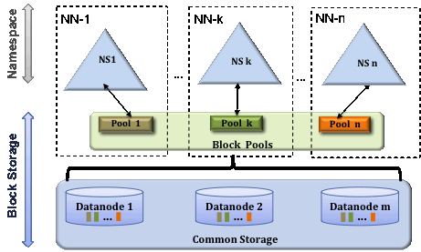
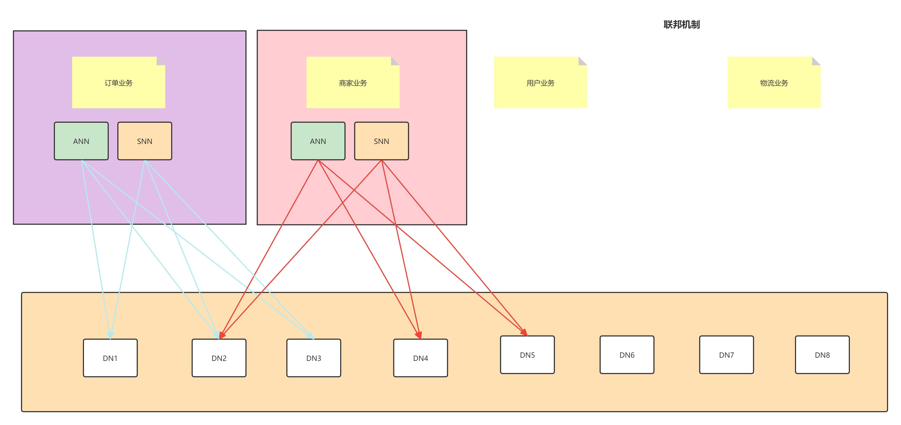

# HDFS Federation

## 背景

HDFS主要有两层

* 命名空间(Namespace)
    * 由目录、文件和块组成。
    * 它支持所有与命名空间相关的文件系统操作，如创建、删除、修改和列出文件和目录。

* 块存储服务(Block Storage Service)
    * 块管理(在Namenode中执行)
        * 通过处理注册和定期心跳维护Datanode集群成员关系。
        * 处理块报告并维护块的位置。
        * 支持块相关操作，如创建、删除、修改和获取块位置。
        * 管理副本放置，对复制不足的块进行块复制，并删除复制过度的块。
    * 存储——由datanode提供，通过在本地文件系统上存储块并允许读/写访问。

  以前的HDFS架构只允许整个集群使用一个命名空间。在该配置中，单个Namenode管理名称空间。HDFS Federation通过向HDFS添加对多个namenode
  /namespaces的支持来解决这个限制。

## 多个 namenode/名称空间

为了横向扩展名称服务，federation使用多个独立的 namenode/namespace。namenode是联合的;namenode是独立的，不需要相互协调。
datanode被所有namenode用作块的公共存储。每个Datanode向集群中的所有namenode注册。数据节点定期发送心跳和阻塞报告。它们还处理来自namenode的命令。

### 数据块池(Block Pool)

块池是属于单个命名空间的块的集合。
datanode存储集群中所有块池的块。每个块池独立管理。这允许命名空间为新块生成`Block id`
，而不需要与其他命名空间进行协调。 Namenode故障不影响Datanode为集群内其他Namenode提供服务。

命名空间和它的块池一起称为`命名空间卷`。它是一个独立的管理单元。当Namenode/namespace被删除时，对应的datanode上的块池也会被删除。
在集群升级过程中，每个命名空间卷作为一个单元进行升级。

### ClusterID

ClusterID标识符用于标识集群中的所有节点。当对Namenode进行格式化时，将提供或自动生成此标识符。集群中的所有namenode使用同一个ClusterID。

### 核心收益

* 命名空间可伸缩性：Federation增加了命名空间水平伸缩。大型部署或使用大量小文件的部署可以从名称空间扩展中获益，因为它允许向集群添加更多的namenode。
* 性能：文件系统吞吐量不受单个Namenode的限制。向集群中添加更多的namenode可以扩展文件系统的读写吞吐量。
* 隔离：单个Namenode在多用户环境中不提供隔离。例如，一个实验性应用程序可能会使Namenode过载，从而减慢生产关键应用程序的速度。
  通过使用多个namenode，可以将不同类别的应用程序和用户隔离到不同的命名空间。

## 配置

详见 [官网说明](https://hadoop.apache.org/docs/r2.8.5/hadoop-project-dist/hadoop-hdfs/Federation.html)

