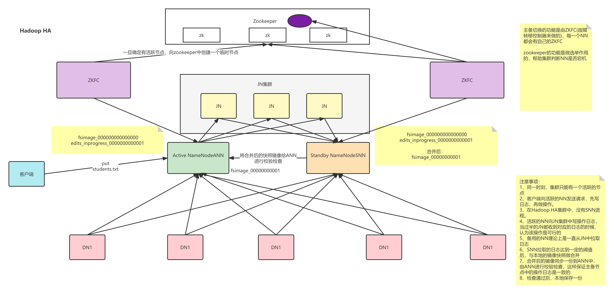
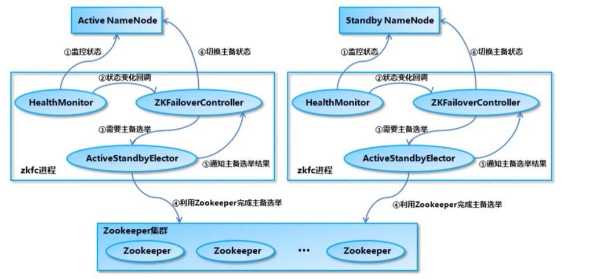

# HDFS High Availability Using the Quorum Journal Manager

## 背景

在Hadoop 2.0.0之前，NameNode是HDFS集群中的单点故障(SPOF)。
每个集群都有一个NameNode，如果该机器或进程不可用，那么整个集群将不可用，直到重新启动或在单独的机器上启动NameNode。

这在两个主要方面影响了HDFS集群的总可用性:

* 在发生意外事件(如机器崩溃)的情况下，集群将不可用，直到操作员重新启动NameNode。
* 计划中的维护事件(如NameNode机器上的软件或硬件升级)将导致集群停机的窗口。

HDFS的高可用性特性通过提供在同一集群中以主备配置和热备的方式运行两个冗余namenode的选项来解决上述问题。
这允许在机器崩溃的情况下快速故障转移到新的NameNode，或者为了计划维护而进行管理员发起的故障转移。

## 架构

在典型的HA集群中，两台独立的机器被配置为namenode。在任何时间点，只有一个namenode处于Active状态，而另一个处于Standby状态。
Active NameNode负责集群中的所有客户端操作，而Standby只是充当从属服务器，维护足够的状态，以便在必要时提供快速故障转移。

为了使备用节点与活动节点保持状态同步，两个节点都与一组称为“JournalNodes”(JNs)的独立守护进程通信。
当Active节点执行任何名称空间修改时，它会持久地将修改记录记录到JNs的大多数中。
备用节点能够读取来自JNs的编辑，并不断地监视它们以查看编辑日志的更改。当备用节点看到编辑时，它将它们应用到自己的namespace。
在发生故障转移的情况下，Standby将确保在将自身提升到Active状态之前已经从journalnodes读取了所有编辑。这可确保在发生故障转移之前，名称空间状态完全同步。

为了提供快速故障转移，备用节点还必须拥有关于集群中块位置的最新信息。为了实现这一点，datanode配置两个namenode的位置，并向两个namenode发送块位置信息和心跳。

对于HA集群的正确操作来说，一次只有一个namenode处于活动状态是至关重要的。否则，namespace状态很快就会在两者之间出现分歧，从而可能导致数据丢失或其他不正确的结果。
为了确保这个属性并防止所谓的“脑裂场景”，JournalNodes一次只允许一个NameNode写入。
在故障转移期间，将要变为活动的NameNode将简单地接管向JournalNodes写入的角色，这将有效地防止另一个NameNode继续处于活动状态，从而允许新的active安全地进行故障转移。

## 硬件资源

为了部署HA集群，需要准备以下内容:

* NameNode机器：运行主NameNode和备用NameNode的机器应该具有彼此相同的硬件，并且与非ha集群中使用的硬件相同。
* JournalNode机器：运行JournalNode的机器。JournalNode守护进程相对轻量级，因此这些守护进程可以合理地与其他Hadoop守护进程(
  例如namenode、JobTracker或YARN ResourceManager)一起配置在机器上。
  注意:必须至少有3个JournalNode守护进程，因为编辑日志修改必须写入大多数JNs。这将允许系统容忍单个机器的故障。
  也可以运行3个以上的JournalNode，但是为了实际增加系统可以容忍的故障数量，您应该运行奇数个JNs(即3、5、7等)。
  请注意，当使用N个JournalNodes运行时，系统最多可以容忍(N - 1) / 2个故障并继续正常运行。

注意，在HA集群中，Standby NameNode也执行命名空间状态的检查点，因此没有必要在HA集群中运行Secondary
NameNode、CheckpointNode或BackupNode。

## 部署

* 配置概述
   
  HA配置是向后兼容的，允许现有的单个NameNode配置无需更改即可工作。新配置的设计使得集群中的所有节点可以具有相同的配置，而无需根据节点的类型将不同的配置文件部署到不同的机器上。

  HA集群重用`nameservice ID`来识别单个HDFS实例，该实例实际上可能由多个HA
  namenode组成。此外，还为HA添加了一个名为`NameNode ID`的新抽象。
  集群中每个不同的NameNode都有一个不同的`NameNode ID`
  来区分它。为了支持所有NameNode的单个配置文件，相关的配置参数都以`NameNode ID`和`nameservice ID`作为后缀。

* 配置详细信息
   
  [官网说明](https://hadoop.apache.org/docs/r2.8.5/hadoop-project-dist/hadoop-hdfs/HDFSHighAvailabilityWithQJM.html)

  [安装样例](../../installation-ha/install-hdfs.md)

* 管理员命令

~~~
Usage: haadmin
    [-transitionToActive <serviceId>]
    [-transitionToStandby <serviceId>]
    [-failover [--forcefence] [--forceactive] <serviceId> <serviceId>]
    [-getServiceState <serviceId>]
    [-getAllServiceState]
    [-checkHealth <serviceId>]
    [-help <command>]
~~~

## 自动故障转移

仅配置JNs，需要手动故障转移。在这种模式下，即使主节点发生故障，系统也不会自动触发从主节点到备节点的故障切换。

以下配置和部署自动故障转移。
 自动故障转移为HDFS部署增加了两个新组件:`ZooKeeper quorum`和`ZKFailoverController`进程(缩写为`ZKFC`)。

### ZooKeeper

HDFS自动故障转移的实现依赖于ZooKeeper完成以下工作:

* 故障检测(Failure detection)：集群中的每台NameNode机器在ZooKeeper中维护一个持久会话。如果机器崩溃，ZooKeeper会话将过期，通知另一个NameNode应该触发故障转移。
* Active NameNode election：ZooKeeper提供了一种简单的机制来独占地选择一个节点为active。
  如果当前活动的NameNode崩溃，另一个节点可能会在ZooKeeper中获得一个特殊的排他锁，表明它应该成为下一个活动的NameNode。

### ZKFC

ZKFailoverController (ZKFC) 是一个ZooKeeper客户端，也监控和管理NameNode的状态。每台运行NameNode的机器也运行一个ZKFC,
ZKFC负责:

* 运行状况监控(Health monitoring)：ZKFC定期使用运行状况检查命令ping其本地NameNode。只要NameNode以健康状态及时响应，ZKFC就认为该节点是健康的。
  如果节点已崩溃、冻结或以其他方式进入不健康状态，则运行状况监控器将其标记为不健康状态。
* ZooKeeper session management：当本地NameNode运行正常时，ZKFC在ZooKeeper中打开会话。如果本地NameNode是活动的，它还持有一个特殊的“锁”znode。
  这个锁使用了ZooKeeper对“临时”节点的支持;会话过期后，锁节点将被自动删除
* ZooKeeper-based election：如果本地NameNode是健康的，并且ZKFC看到当前没有其他节点持有锁znode，它将自己尝试获取锁。
  如果它成功，那么它就“赢得了选举”，并负责运行故障转移以使其本地NameNode活动。
  故障转移过程类似于上面描述的手动故障转移:首先，如果需要，将之前的active隔离，然后本地NameNode转换为active状态。

在开始配置自动故障转移之前，应该关闭集群。在集群运行时，不能从手动故障转移设置转换到自动故障转移设置。

### [安装样例](../../installation-ha/install-hdfs.md)

### FAQ：

 

1、在任何给定的节点上，可以在其对应的NameNode之前或之后启动ZKFC。
 
2、如果ZooKeeper集群崩溃，不会触发自动故障转移。但是，HDFS将继续运行，没有任何影响。ZooKeeper重启后，HDFS会重新连接，没有问题。
 
3、即使配置了自动故障转移，也可以使用相同的 hdfs haadmin -failover 命令启动手动故障转移。它将执行协调的故障转移。

## HDFS Upgrade/Finalization/Rollback with HA Enabled

在不同版本的HDFS之间迁移时，有时只需安装较新的软件并重新启动集群即可。但是，有时候，升级您正在运行的HDFS版本可能需要更改磁盘上的数据。
在这种情况下，必须在安装新软件后使用`HDFS Upgrade/Finalize/Rollback`
功能。这个过程在HA环境中变得更加复杂，因为NN所依赖的磁盘元数据根据定义是分布式的，既分布在对中的两个`HA NN`上，
也分布在QJM用于共享编辑存储的JournalNodes上。本文档部分描述了在HA设置中使用`HDFS Upgrade/Finalize/Rollback`功能的过程。

### HA Upgrade

在进行HA升级前，操作人员需要完成以下操作:

* 像往常一样关闭所有的NN，然后安装更新的软件。
* 启动所有的JNs。请注意，在执行升级、回滚或结束操作时，所有JNs都必须运行，这一点至关重要。如果在运行这些操作时有任何JNs关闭，则操作将失败。
* 以`-upgrade`标志开始其中一个NN。
* 在启动时，这个NN将不会像HA设置中通常那样进入备用状态。相反，这个NN将立即进入活动状态，执行本地存储目录的升级，并执行共享编辑日志的升级。
* 此时，HA对中的另一个NN将与升级后的NN不同步。
  为了使其恢复同步并再次具有高可用性的设置，您应该通过运行带有`-bootstrapStandby`标志的NN来重新引导该NameNode。
  不能使用用'-upgrade'标志开始第二个NN。

### Finalize an HA upgrade

当NN正在运行并且其中一个是活动的时，操作人员将使用`hdfs dfsadmin -finalizeUpgrade`命令。
此时的活动NN将执行共享日志的最终化，其本地存储目录包含前一个FS状态(state)的NN将删除其本地状态。

### Rollback of an upgrade

两个NN都应该先关闭。操作人员应该在他们启动升级过程的NN上运行回滚命令，这将在那里的本地dirs以及共享日志(NFS或JNs)上执行回滚。
之后，启动这个NN，并在另一个NN上运行`-bootstrapStandby`，使两个NN与这个回滚的文件系统状态同步。

