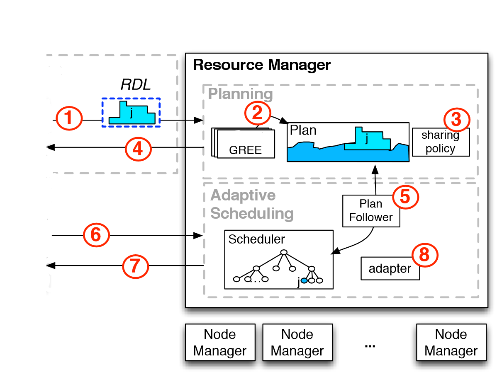

# Reservation System

## 概述

YARN的`ReservationSystem`为用户提供了超过(和提前)时间预留资源的能力，以确保重要的生产作业将可预测地运行。
`ReservationSystem`执行仔细的准入控制，并提供绝对资源数量的保证(而不是集群大小的%)。
`Reservation`既可以是可伸缩的，也可以具有组语义，并且可以具有随时间变化的资源需求。
`ReservationSystem`是`YARN ResourceManager`的一个组件。

## 流程

参照上图，典型的预订流程如下:

* 步骤0：用户(或代表用户的自动化工具)提交reservation创建请求，并接收包含ReservationId的响应。
* 步骤1：用户(或代表用户的自动化工具)提交由`Reservation定义语言(RDL)`和从步骤0检索到的ReservationId指定的预订请求。
  这描述了用户在一段时间内对资源的需求(例如，资源的skyline)和时间限制(例如，deadline)。
  这可以通过通常的`Client-to-RM`协议或通过RM的`REST api`以编程方式完成。
  如果使用相同的ReservationId提交预订，并且RDL相同，则不会创建新reservation，但请求是成功的。如果RDL不同，reservation将被拒绝，请求将不成功。
* 步骤2：`ReservationSystem`利用`ReservationAgent(图中的GREE)`在`Plan`中找到一个合理的reservation分配。
  `Plan`是一个跟踪当前接受的所有reservation和系统中可用资源的数据结构。
* 步骤3：SharingPolicy提供了一种方法来对被接受的reservation强制执行不变量，可能会拒绝reservation。
  例如，CapacityOvertimePolicy允许强制执行用户在其所有reservation中可以请求的瞬时最大容量和在一段时间内对资源积分的限制，
  例如，用户可以立即保留最多50%的集群容量，但在任何24小时内，用户不能超过平均值的10%。
* 步骤4：在成功验证之后，ReservationSystem向用户返回一个ReservationId(把它想象成一张机票)。
* 步骤5：当时间到来时，一个名为PlanFollower的新组件通过动态创建/调整/销毁队列，将计划的状态发布给调度器。
* 步骤6：用户只需将ReservationId作为ApplicationSubmissionContext的一部分包含进来，就可以将一个(或多个)作业提交到可保留队列。
* 步骤7：然后，Scheduler将从创建的特殊队列中提供容器，以确保资源保留得到尊重。
  在预留的限制范围内，用户可以保证访问资源，在此基础上，资源共享继续进行标准的`容量/公平性`共享。
* 步骤8：该系统包括适应集群容量下降的机制。这包括通过在可能的情况下`移动`预订来重新规划，或者拒绝先前接受的最小数量的预订(
  以确保其他预订将收到其全部数量)。

## 配置

配置ReservationSystem很简单。目前，我们已经在CapacityScheduler和FairScheduler中添加了对预订的支持。
您可以在capacity-scheduler.xml或fair-scheduler.xml中将任何叶队列标记为可用于“保留”(
有关详细信息，请参阅CapacityScheduler和FairScheduler)。
然后，该队列中的容量/公平份额可用于进行预订。作业仍然可以在没有保留的情况下提交到可保留队列，在这种情况下，它们将以最佳努力模式以在活动保留中运行的作业剩余的任何容量运行。

