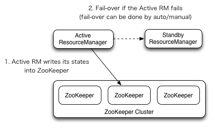

# ResourceManager High Availability

在`Hadoop 2.4`之前，ResourceManager在YARN集群中存在单点故障问题。现在`HA`特性以`主备ResourceManager对`的形式增加冗余，以消除这种单点故障。

## 架构

* RM Failover
   `ResourceManager HA`是通过主备架构实现的——在任何时候，一个RM处于`Active`状态，一个或多个RM处于`Standby`
  模式，等待在Active发生任何事情时接管。由管理员(通过CLI)触发状态转换，变为`活动状态`，或者通过`集成的故障转移控制器`
  启用`自动故障转移`。

    * 手动转换和故障转移
       
      当未启用自动故障转移时，管理员必须手动将其中一个rm转换为Active。要从一个RM故障转移到另一个RM，首先将Active-RM转换为Standby，然后将Standby-RM转换为Active。
      所有这些都可以使用`yarn rmadmin`命令行来完成。
    * 自动故障转移
       RM可以选择嵌入基于zookeeper的ActiveStandbyElector，以决定哪个RM应该是Active。当Active发生故障或变得无响应时，另一个RM被自动选为Active，然后接管。
      请注意，不需要像HDFS那样运行单独的ZKFC守护进程，因为在RM中嵌入的ActiveStandbyElector充当故障检测器和leader选择器，而不是单独的ZKFC守护进程。
    * RM故障转移时的Client、ApplicationMaster和NodeManager
       当有多个RM时，客户端和节点使用的配置(yarn-site.xml)应该列出所有RM。Client、ApplicationMasters(AMs)
      和NodeManagers(NMs)
      尝试以轮询的方式连接到RM，直到它们到达`Active RM`。如果`Active RM`宕机，它们将继续轮询，直到遇到`新 Active RM`。
      这个默认的重试逻辑实现为`org.apache.hadoop.yarn.client.ConfiguredRMFailoverProxyProvider`(
      可以通过实现`org.apache.hadoop.yarn.client.RMFailoverProxyProvider`并设置`yarn.client.failover-proxy-provider`
      为提供程序到类名，来覆盖此逻辑)。
      在`非HA`模式下运行时，需要设置`yarn.client.failover-no-ha-proxy-provider`来替代。

* 恢复之前active-RM的状态
   启用`ResourceManager Restart`后，提升为`活动状态的RM`将加载`RM内部状态`，并根据RM重启特性尽可能地从先前活动的位置继续操作。
  对于之前提交给RM的每个托管应用程序，都会生成一个新的尝试。应用程序可以定期执行`checkpoint`，以避免丢失任何工作。`状态存储`
  必须对`Active/Standby RM`都可见。
  目前，有两种用于持久化的RMStateStore实现(`FileSystemRMStateStore`和`ZKRMStateStore`)。
  `ZKRMStateStore`保证在任何时间点允许单个RM进行写操作，因此建议在HA集群中使用该存储。
  当使用ZKRMStateStore时，不需要单独的`隔离机制(fencing mechanism)`来处理多个RM可能承担Active角色的潜在分裂情况。
  当使用ZKRMStateStore时，建议不要在Zookeeper集群中设置`zookeeper.DigestAuthenticationProvider`
  属性，以确保Zookeeper管理员无法访问YARN应用程序或用户的凭据信息。

## 部署

大多数故障转移功能可以使用各种配置属性进行调优。以下是必需的/重要的配置列表。
更多信息，请参阅yarn-default.xml
有关设置状态存储的说明，请参见[ResourceManager HA](resourceManager-ha.md)文档。

### 配置

| 属性                                                  | 描述                                                                                                                                      |
|-----------------------------------------------------|-----------------------------------------------------------------------------------------------------------------------------------------|
| yarn.resourcemanager.zk-address                     | ZK-quorum的地址。用于状态存储和嵌入式领导者选举。                                                                                                           |
| yarn.resourcemanager.ha.enabled                     | 启用RM HA。                                                                                                                                |
| yarn.resourcemanager.ha.rm-ids                      | RM的逻辑id列表。例如"rm1、rm2"。                                                                                                                  |
| yarn.resourcemanager.hostname.rm-id                 | 对于每个rm-id，指定RM对应的主机名，或者每个RM的服务地址                                                                                                        |
| yarn.resourcemanager.address.rm-id                  | 对于每个rm-id，指定用于客户端提交作业的host:port。如果设置了，则覆盖`yarn.resourcemanager.hostname.rm-id`中设置的主机名。                                                  |
| yarn.resourcemanager.scheduler.address.rm-id        | 对于每个rm-id，指定ApplicationMasters获取资源的调度程序host:port。如果设置了，则覆盖`yarn.resourcemanager.hostname.rm-id`中设置的主机名。                                 |
| yarn.resourcemanager.resource-tracker.address.rm-id | 对于每个rm-id，指定用于NodeManagers连接的host:port。如果设置了，则覆盖`yarn.resourcemanager.hostname.rm-id`中设置的主机名。                                           |
| yarn.resourcemanager.admin.address.rm-id            | 对于每个rm-id，为管理命令指定host:port。如果设置了，则覆盖`yarn.resourcemanager.hostname.rm-id`中设置的主机名。                                                       |
| yarn.resourcemanager.webapp.address.rm-id           | 对于每个rm-id，指定RM web应用程序对应的host:port。如果将yarn.http.policy设置为HTTPS_ONLY，则不需要设置此项。如果设置了，则覆盖`yarn.resourcemanager.hostname.rm-id`中设置的主机名。     |
| yarn.resourcemanager.webapp.https.address.rm-id     | 对于每个rm-id，指定RM https web应用程序对应的host:port。如果将yarn.http.policy设置为HTTP_ONLY，则不需要设置此项。如果设置了，则覆盖`yarn.resourcemanager.hostname.rm-id`中设置的主机名 |
| yarn.resourcemanager.ha.id                          | 当前RM的ID。这是可选的;如果设置了，必须确保所有RM在配置中都有自己的ID。                                                                                                |
| yarn.resourcemanager.ha.automatic-failover.enabled  | 启用自动故障转移，只在启用HA时默认启用。                                                                                                                   |
| yarn.resourcemanager.ha.automatic-failover.embedded | 在启用自动故障转移时，使用嵌入式leader-elector选择Active RM。只在启用HA时默认启用。                                                                                  |
| yarn.resourcemanager.cluster-id                     | 集群ID。由leader-elector使用，以确保RM不会作为活动状态接管另一个集群。                                                                                            |
| yarn.client.failover-proxy-provider                 | Clients、AMs和NMs用于故障转移到Active RM的类，覆盖`org.apache.hadoop.yarn.client.ConfiguredRMFailoverProxyProvider`时用。                                |
| yarn.client.failover-max-attempts                   | FailoverProxyProvider尝试故障转移的最大次数。                                                                                                       |
| yarn.client.failover-sleep-base-ms                  | 用于计算故障转移之间的`指数延迟`的`睡眠基数`(以毫秒为单位)。                                                                                                       |
| yarn.client.failover-sleep-max-ms                   | 故障转移之间的最大睡眠时间(以毫秒为单位)。                                                                                                                  |
| yarn.client.failover-retries                        | 每次尝试连接到ResourceManager的重试次数，默认0。                                                                                                        |
| yarn.client.failover-retries-on-socket-timeouts     | 在套接字超时时，每次尝试连接到ResourceManager的重试次数，默认0。                                                                                                |

[yarn安装样例](../../installation-ha/install-yarn.md)

### 管理命令

* 检查RM的健康/状态
    ~~~
    $ yarn rmadmin -getServiceState rm1
    active
    
    $ yarn rmadmin -getServiceState rm2
    standby
    ~~~

* 如果启用了自动切换，则不能使用手动切换命令。虽然可以通过`–forcemanual`标志覆盖，但需要小心。
    ~~~
    $ yarn rmadmin -transitionToStandby rm1
    ~~~

### ResourceManager Web UI服务

假设备用RM已经启动并运行，备用RM会自动将所有web请求重定向到`Active RM`，除了`About`页面。

### Web Services

假设`备用RM`已启动并运行，在备用RM上调用`ResourceManager REST APIs`中描述的`RM web-services`将自动重定向到`主RM`。

