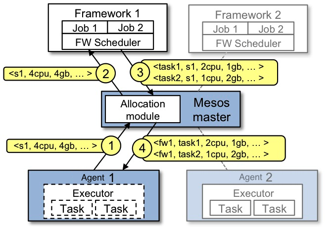

# Mesos Architecture

上图显示了 Mesos 的主要组成部分。Mesos
包括一个主守护进程（它管理在每个集群节点上运行的代理守护进程），以及在这些代理上运行任务的 Mesos `框架（framework）`。

`master`通过`resource offers`来实现`框架（framework）`间资源(CPU, RAM，)的细粒度共享。
每个`resource offer`包含一个`<agent ID, resource1: amount1, resource2: amount2, ...>`
(注意:由于关键字`slave`已被弃用，而使用`agent`，基于驱动程序的`框架（framework）`仍将接收带有`slave ID`的`offer`，
而使用`v1 HTTP API`的`框架（framework）`接收带有`agent ID`的`offer`)。
`master`根据给定的`组织策略(如公平共享 或 严格优先级)`决定向每个`框架（framework）`提供多少资源。
为了支持一系列不同的策略，`master`采用了`模块化架构`，可以通过`插件机制`轻松添加新的分配模块。

运行在 Mesos 之上的`框架（framework）`由两个组件组成：一个向`master`注册以提供资源的`scheduler`，以及一个在`agent`
节点上启动以运行框架任务的`executor`
进程（查看[App/Framework development guide](https://mesos.apache.org/documentation/latest/app-framework-development-guide/)
，已了解更多关于`框架（framework）`的`schedulers`和`executors`的信息）。
`master`决定向每个`框架（framework）`提供 ***多少*** 资源；同时，框架的`schedulers`决定需要使用 ***哪些*** 资源。
当`框架（framework）`接受提供的资源时，它向 Mesos 传递它希望在这些资源上运行的任务的描述。然后，Mesos 在相应的`agent`上启动任务。

## resource offer 的例子

下图显示了一个如何安排框架运行任务的示例。

让我们浏览一下图中的事件。

1. `Agent 1`向`master`报告它有 4个cpu 和 4gb空闲内存。然后，`master`调用分配策略模块，该模块告诉它应该为`framework 1`
   提供所有可用资源。
2. `master`向`framework 1`发送一个`resource offer`，描述`Agent 1`上可用的资源。
3. `框架（framework）`的`scheduler`用 在`agent`上运行的两个任务的相关信息 回复`master`，对第一个任务使用 <2个cpu, 1 GB RAM>
   ，对第二个任务使用 <1个cpu, 2 GB RAM>。
4. 最后，`master`将任务发送给`agent`，`agent`将适当的资源分配给`框架（framework）`的`executor`，`executor`依次启动两个任务(
   在图中用虚线边框表示)。由于 1个CPU 和 1 GB RAM 仍然未分配，分配模块现在可以将它们提供给`framework 2`。

此外，当 `任务完成，新资源释放` 时，这个`resource offer`过程会重复进行。

虽然 Mesos 提供的`thin 接口`允许它扩展并允许`框架（framework）`独立发展，
但仍然存在一个问题:在 Mesos 不知道这些约束的情况下，如何满足`框架（framework）`的约束？
例如，如果 Mesos 不知道哪些节点存储了`框架（framework）`所需的数据，`框架（framework）`如何实现数据局部性？
Mesos 通过简单地赋予`框架（framework）`***拒绝***`offer`的能力来解决这些问题。`框架（framework）`
将拒绝不满足其约束条件的`offer`，并接受满足其约束条件的`offer`。
特别是，我们发现一个简单的策略称为`延迟调度`，此时`框架（framework）`等待`有限的时间`来获取`存储输入数据的节点`
，以产生几乎最优的数据局部性。

您还可以在这篇[技术论文](https://www.usenix.org/conference/nsdi11/mesos-platform-fine-grained-resource-sharing-data-center)
中阅读更多关于 Mesos 架构的信息。

