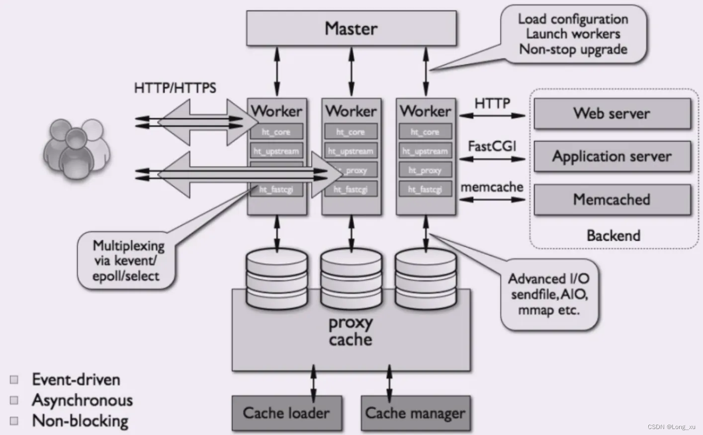
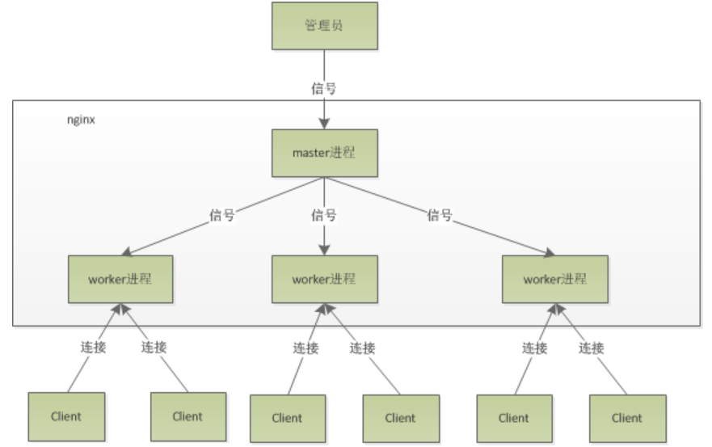

## nginx架构&原理

### 架构

### 进程模型
Nginx默认采用多进程工作方式，Nginx启动后，会运行一个master进程和多个worker进程。其中master充当整个进程组与用户的交互接口，同时对进程进行监护，管理worker进程来实现重启服务、平滑升级、更换日志文件、配置文件实时生效等功能。worker用来处理基本的网络事件，worker之间是平等的，他们共同竞争来处理来自客户端的请求。

### worker工作模式
worker对于连接是采用争抢的模式，谁先抢到就先交给谁处理，如果想要重新更新配置，由于已经抢到任务的worker不会参与争抢，那些空闲的worker就会去争抢连接，拿到连接后会自动更新配置信息，当那些有任务的worker完成任务后，会自动更新配置，这样就实现了无缝热部署。由于每个worker是独立的进程，如果有其中的一个worker出现问题，并不会影响其它worker继续进行争抢，在实现请求的过程，不会造成服务中断，建议worker数和服务器的CPU数相等是最为适宜的。

### 如何计算worker连接数？

如果只访问Nginx的静态资源，一个发送请求会占用了worker的2个连接数

而如果是作为反向代理服务器，一个发送请求会占用了worker的4个连接数

### 如何计算最大的并发数？

如果只访问nginx的静态资源，最大并发数量应该是：worker_connections * worker_processes / 2

而如果是作为反向代理服务器，最大并发数量应该是：worker_connections * worker_processes / 4