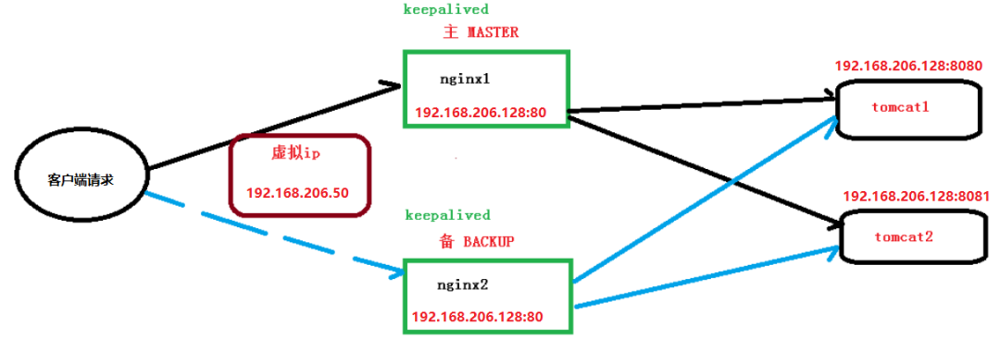

## nginx HA

采用的是`一主一备`的模式，当主节点Nginx挂掉，备份服务器Nginx立刻跟上，这样就保证了服务的高可用性。

## 步骤

### 1、主节点上安装 nginx
参照之前文档

### 2、主节点上安装 keepalived
* 修改 keepalived 的配置文件
~~~
! Configuration File for keepalived

global_defs {
   notification_email {
     acassen@firewall.loc
     failover@firewall.loc
     sysadmin@firewall.loc
   }
   notification_email_from Alexandre.Cassen@firewall.loc
   #邮件服务器通知地址（暂不配置，默认即可）
   smtp_server 192.168.200.1
   #邮件服务器超时时间（暂不配置，默认即可）
   smtp_connect_timeout 30
   #当前虚拟机的IP地址
   router_id 192.168.206.128
}

vrrp_script Monitor_Nginx {
 script "/etc/keepalived/nginx_check.sh"    #检测脚本执行的路径
 interval 2                                 #检测脚本执行的间隔
 weight 2                                   #检测脚本执行的权重
}

vrrp_instance VI_1 {
    state MASTER         #标识这个机器是MASTER还是BACKUP
    interface eth0       #当前机器的网卡名称  
    virtual_router_id 51 #虚拟路由的编号，主备必须一致
    priority 100         #主、备机取不同的优先级，主机值较大，备份机值较小
    advert_int 1         #（VRRP Multicast广播周期秒数）
    authentication {
        auth_type PASS   #（VRRP认证方式）
        auth_pass 1111   #（密码）
    }
    track_script {
  Monitor_Nginx #（调用Nginx进程检测脚本）
 }
    virtual_ipaddress {
        192.168.206.50  #虚拟IP地址
    }
}
~~~

* 新增keepalived的检测脚本
~~~
vi /etc/keepalived/nginx_check.sh

#!/bin/bash
if [ "$(ps -ef | grep "nginx: master process" | grep -v grep )" == "" ]
 then
 killall keepalived
fi
~~~

### 3、从节点上安装 nginx & keepalived
参考步骤1、2
~~~
! Configuration File for keepalived

global_defs {
   notification_email {
     acassen@firewall.loc
     failover@firewall.loc
     sysadmin@firewall.loc
   }
   notification_email_from Alexandre.Cassen@firewall.loc
   #邮件服务器通知地址（暂不配置，默认即可）
   smtp_server 192.168.200.1
   #邮件服务器超时时间（暂不配置，默认即可）
   smtp_connect_timeout 30
   #当前虚拟机的IP地址
   router_id 192.168.206.129
}

vrrp_script Monitor_Nginx {
 script "/etc/keepalived/nginx_check.sh"    #检测脚本执行的路径
 interval 2                                 #检测脚本执行的间隔
 weight 2                                   #检测脚本执行的权重
}

vrrp_instance VI_1 {
    state BACKUP         #标识这个机器是MASTER还是BACKUP
    interface eth1       #当前机器的网卡名称  
    virtual_router_id 51 #虚拟路由的编号，主备必须一致
    priority 10          #主、备机取不同的优先级，主机值较大，备份机值较小
    advert_int 1         #（VRRP Multicast广播周期秒数）
    authentication {
        auth_type PASS   #（VRRP认证方式）
        auth_pass 1111   #（密码）
    }
    track_script {
  Monitor_Nginx    #（调用Nginx进程检测脚本）
 }
    virtual_ipaddress {
        192.168.206.50   #虚拟IP地址
    }
}
~~~
