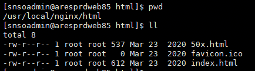
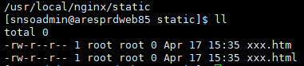

### nginx/html

* index.html
~~~
nginx 默认启动页面
~~~

* 50x.html
~~~
 默认访问错误返回的页面，凡是状态码是500 502 503 504 都会返回这个页面
~~~

* 部署静态资源

将所需部署静态资源上传至 nginx 服务器，例：/usr/local/nginx/static 目录下

~~~
location / {
    # 配置静态资源 根目录
    root   static;
    # 默认访问的静态资源（即页面）
    index  xxx.html xxx.htm;
}
~~~

