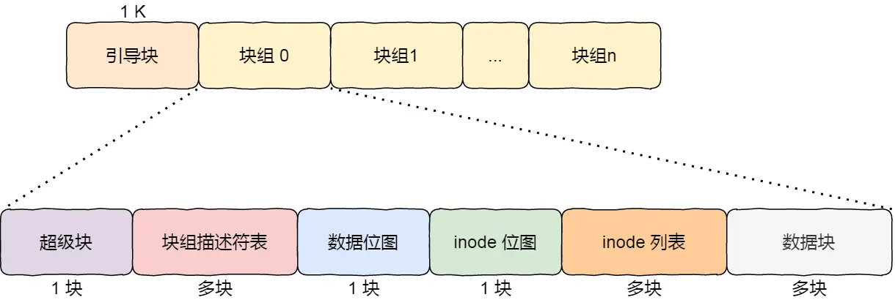
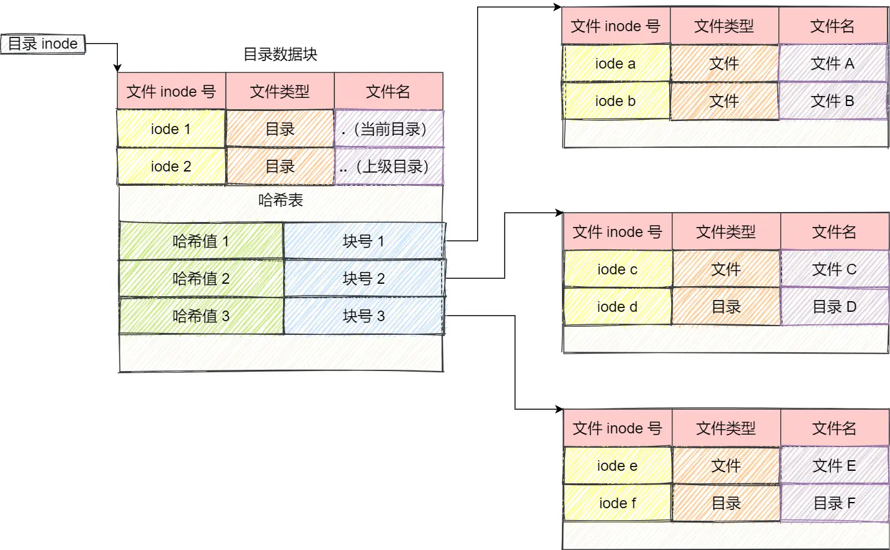

## 文件系统的基本组成

文件系统是操作系统中负责管理持久数据的子系统。

文件系统的基本数据单位是文件，它的目的是对磁盘上的文件进行组织管理，那组织的方式不同，就会形成不同的文件系统。

Linux 最经典的一句话是：「一切皆文件」，不仅普通的文件和目录，就连块设备、管道、socket 等，也都是统一交给文件系统管理的。

Linux 文件系统会为每个文件分配两个数据结构：***索引节点（index node）*** 和 ***目录项（directory entry）***
，它们主要用来记录文件的元信息和目录层次结构。

* 索引节点，也就是 inode，用来记录文件的元信息，比如 inode 编号、文件大小、访问权限、创建时间、修改时间、***数据在磁盘的位置***
  等等。索引节点是文件的 ***唯一*** 标识，它们之间一一对应，也同样都会被存储在硬盘中，所以 ***索引节点同样占用磁盘空间***。
* 目录项，也就是 dentry，用来记录文件的名字、***索引节点指针*** 以及与其他目录项的层级关联关系。多个目录项关联起来，就会形成目录结构，但它与索引节点不同的是，
  ***目录项是由内核维护的一个数据结构，不存放于磁盘，而是缓存在内存***。

目录项和目录不是一个东西。目录是个文件，持久化存储在磁盘，而目录项是内核一个数据结构，缓存在内存。
 
如果查询目录频繁从磁盘读，效率会很低，所以内核会把已经读过的目录用目录项这个数据结构缓存在内存，下次再次读到相同的目录时，只需从内存读就可以，大大提高了文件系统的效率。

### 文件数据是如何存储在磁盘的

磁盘读写的最小单位是 ***扇区*** ，扇区的大小只有 512B 大小，很明显，如果每次读写都以这么小为单位，那这读写的效率会非常低。

所以，文件系统把多个扇区组成了一个 ***逻辑块*** ，每次读写的最小单位就是逻辑块（数据块），Linux 中的逻辑块大小为 `4KB`
，也就是一次性读写
8 个扇区，这将大大提高了磁盘的读写的效率。

索引节点、目录项以及文件数据的关系

索引节点是存储在硬盘上的数据，那么为了加速文件的访问，通常会把索引节点加载到内存中。

另外，磁盘进行格式化的时候，会被分成三个存储区域，分别是超级块、索引节点区和数据块区。

* 超级块，用来存储文件系统的详细信息，比如块个数、块大小、空闲块等等。
* 索引节点区，用来存储索引节点；
* 数据块区，用来存储文件或目录数据；

我们不可能把超级块和索引节点区全部加载到内存，这样内存肯定撑不住，所以只有当需要使用的时候，才将其加载进内存，它们加载进内存的时机是不同的：

* 超级块：当文件系统挂载时进入内存；
* 索引节点区：当文件被访问时进入内存；

## 虚拟文件系统

文件系统的种类众多，而操作系统希望 ***对用户提供一个统一的接口***，于是在用户层与文件系统层引入了中间层，这个中间层就称为
***虚拟文件系统（Virtual File System，VFS）***。

在 Linux 文件系统中，用户空间、系统调用、虚拟文件系统、缓存、文件系统以及存储之间的关系如下图：

Linux 支持的文件系统也不少，根据存储位置的不同，可以把文件系统分为三类：

* 磁盘的文件系统，它是直接把数据存储在磁盘中，比如 Ext 2/3/4、XFS 等都是这类文件系统。
* 内存的文件系统，这类文件系统的数据不是存储在硬盘的，而是占用内存空间，我们经常用到的 /proc 和 /sys
  文件系统都属于这一类，读写这类文件，实际上是读写内核中相关的数据。
* 网络的文件系统，用来访问其他计算机主机数据的文件系统，比如 NFS、SMB 等等。

文件系统首先要先挂载到某个目录才可以正常使用，比如 Linux 系统在启动时，会把文件系统挂载到根目录。

## 文件的使用

~~~
fd = open(name, flag); # 打开文件
...
write(fd,...);         # 写数据
...
close(fd);             # 关闭文件
~~~

上面简单的代码是读取一个文件的过程：

* 首先用 open 系统调用打开文件，open 的参数中包含文件的路径名和文件名。
* 使用 write 写数据，其中 write 使用 open 所返回的文件描述符，并不使用文件名作为参数。
* 使用完文件后，要用 close 系统调用关闭文件，避免资源的泄露。

我们打开了一个文件后，操作系统会跟踪进程打开的所有文件，所谓的跟踪呢，就是操作系统为每个进程维护一个打开文件表，文件表里的每一项代表「文件描述符」，所以说文件描述符是打开文件的标识。

## 文件的存储

* 如果存放文件所需的数据块小于 10 块，则采用直接查找的方式；
* 如果存放文件所需的数据块超过 10 块，则采用一级间接索引方式；
* 如果前面两种方式都不够存放大文件，则采用二级间接索引方式；
* 如果二级间接索引也不够存放大文件，这采用三级间接索引方式；

## 空闲空间管理

* 空闲表法：仅当有少量的空闲区时才有较好的效果。如果存储空间中有着大量的小的空闲区，则空闲表变得很大，这样查询效率会很低。
* 空闲链表法：简单，但不能随机访问，工作效率低，因为每当在链上增加或移动空闲块时需要做很多 I/O
  操作，同时数据块的指针消耗了一定的存储空间。不适合用于大型文件系统。
* 位图法：位图是利用二进制的一位来表示磁盘中一个盘块的使用情况，磁盘上所有的盘块都有一个二进制位与之对应。
  ~~~
  1111110011111110001110110111111100111 ...
  ~~~
  在 Linux 文件系统就采用了位图的方式来管理空闲空间，不仅用于数据空闲块的管理，还用于 inode 空闲块的管理，因为 inode
  也是存储在磁盘的，自然也要有对其管理。

## 文件系统的结构

Linux Ext2 整个文件系统的结构和块组的内容，文件系统都由大量块组组成，在硬盘上相继排布：

* 超级块，包含的是文件系统的重要信息，比如 inode 总个数、块总个数、每个块组的 inode 个数、每个块组的块个数等等。
* 块组描述符，包含文件系统中各个块组的状态，比如块组中空闲块和 inode 的数目等，每个块组都包含了文件系统中「所有块组的组描述符信息」。
* 数据位图和 inode 位图， 用于表示对应的数据块或 inode 是空闲的，还是被使用中。
* inode 列表，包含了块组中所有的 inode，inode 用于保存文件系统中与各个文件和目录相关的所有元数据。
* 数据块，包含文件的有用数据。

每个块组里有很多重复的信息，比如超级块和块组描述符表，这两个都是全局信息，而且非常的重要，这么做是有两个原因：

* 如果系统崩溃破坏了超级块或块组描述符，有关文件系统结构和内容的所有信息都会丢失。如果有冗余的副本，该信息是可能恢复的。
* 通过使文件和管理数据尽可能接近，减少了磁头寻道和旋转，这可以提高文件系统的性能。

不过，Ext2 的后续版本采用了稀疏技术。该做法是，超级块和块组描述符表不再存储到文件系统的每个块组中，而是只写入到块组 0、块组 1
和其他 ID 可以表示为 3、 5、7 的幂的块组中。

## 目录的存储

和普通文件不同的是，***普通文件的块里面保存的是文件数据，而目录文件的块里面保存的是目录里面一项一项的文件信息***。

## 软链接和硬链接

硬链接是 ***多个目录项中的「索引节点」指向一个文件*** ，也就是指向同一个 inode，但是 inode 是不可能跨越文件系统的，每个文件系统都有各自的
inode 数据结构和列表，所以 ***硬链接是不可用于跨文件系统的*** 。由于多个目录项都是指向一个 inode，那么
***只有删除文件的所有硬链接以及源文件时，系统才会彻底删除该文件***。

软链接相当于重新创建一个文件，这个文件有 ***独立的 inode***，但是这个 ***文件的内容是另外一个文件的路径***
，所以访问软链接的时候，实际上相当于访问到了另外一个文件，所以 ***软链接是可以跨文件系统的***，甚至
***目标文件被删除了，链接文件还是在的，只不过指向的文件找不到了而已***。

## 文件 I/O

### 缓冲与非缓冲 I/O

文件操作的标准库是可以实现数据的缓存，那么根据「是否利用标准库缓冲」，可以把文件 I/O 分为缓冲 I/O 和非缓冲 I/O：

* 缓冲 I/O，利用的是标准库的缓存实现文件的加速访问，而标准库再通过系统调用访问文件。
* 非缓冲 I/O，直接通过系统调用访问文件，不经过标准库缓存。

这里所说的「缓冲」特指标准库内部实现的缓冲。

比方说，很多程序遇到换行时才真正输出，而换行前的内容，其实就是被标准库暂时缓存了起来，这样做的目的是，减少系统调用的次数，毕竟系统调用是有
CPU 上下文切换的开销的。

### 直接与非直接 I/O

所以 Linux 内核为了减少磁盘 I/O 次数，在系统调用后，会把用户数据拷贝到内核中缓存起来，这个内核缓存空间也就是「页缓存」，只有当缓存满足某些条件的时候，才发起磁盘
I/O 的请求。

根据是「否利用操作系统的缓存」，可以把文件 I/O 分为直接 I/O 与非直接 I/O：

* 直接 I/O，不会发生内核缓存和用户程序之间数据复制，而是直接经过文件系统访问磁盘。
* 非直接 I/O，读操作时，数据从内核缓存中拷贝给用户程序，写操作时，数据从用户程序拷贝给内核缓存，再由内核决定什么时候写入数据到磁盘。

以下几种场景会触发内核缓存的数据写入磁盘：

* 在调用 write 的最后，当发现内核缓存的数据太多的时候，内核会把数据写到磁盘上；
* 用户主动调用 sync，内核缓存会刷到磁盘上；
* 当内存十分紧张，无法再分配页面时，也会把内核缓存的数据刷到磁盘上；
* 内核缓存的数据的缓存时间超过某个时间时，也会把数据刷到磁盘上；

### 阻塞与非阻塞 I/O

* 阻塞 I/O，当用户程序执行 read ，线程会被阻塞，一直等到内核数据准备好，并把数据从内核缓冲区拷贝到应用程序的缓冲区中，当拷贝过程完成，read
  才会返回。 阻塞等待的是「内核数据准备好」和「数据从内核态拷贝到用户态」这两个过程。
* 非阻塞 I/O，非阻塞的 read 请求在数据未准备好的情况下立即返回，可以继续往下执行，此时应用程序不断轮询内核（多次调用
  read），直到数据准备好，内核将数据拷贝到应用程序缓冲区，read 调用才可以获取到结果。
* I/O 多路复用：select/poll/epoll，如果没有事件发生，那么当前线程就会发生阻塞，这时 CPU 会切换其他线程执行任务，等内核发现有事件到来的时候，会唤醒阻塞在
  I/O 多路复用接口的线程，然后用户可以进行后续的事件处理。I/O 多路复用接口最大的优势在于，用户可以在一个线程内同时处理多个
  socket 的 IO 请求

### 同步与异步 I/O

无论是阻塞 I/O、非阻塞 I/O，还是基于非阻塞 I/O 的多路复用
***都是同步调用。因为它们在 read 调用时，内核将数据从内核空间拷贝到应用程序空间，过程都是需要等待的，也就是说这个过程是同步的，如果内核实现的拷贝效率不高，read
调用就会在这个同步过程中等待比较长的时间***。

真正的 ***异步 I/O*** 是「内核数据准备好」和「数据从内核态拷贝到用户态」这两个过程都不用等待。

当我们发起 `aio_read` 之后，就立即返回，内核自动将数据从内核空间拷贝到应用程序空间，这个拷贝过程同样是异步的，内核自动完成的，和前面的同步操作不一样，应用程序并不需要主动发起拷贝动作。

