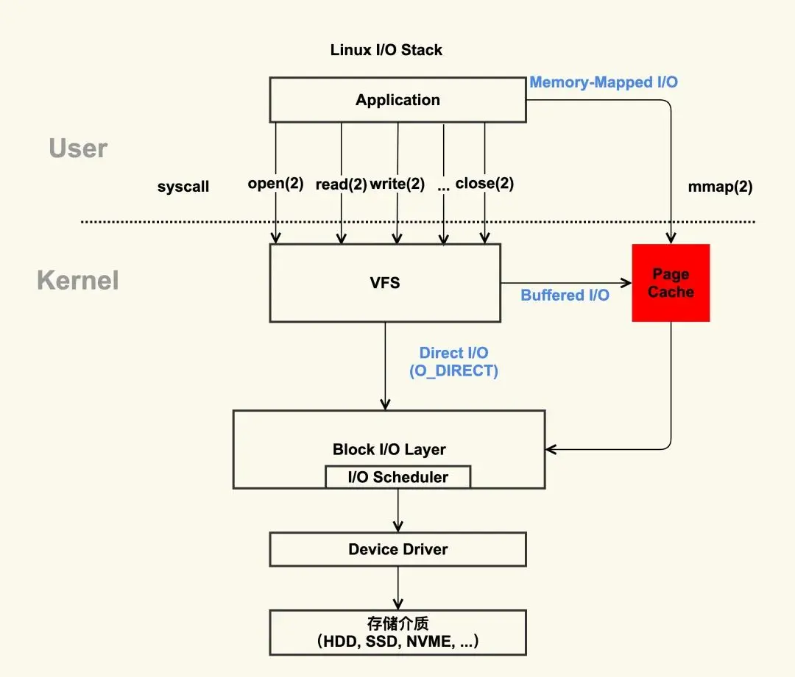

正常情况下不会丢。非直接IO，数据进 page cache，内核会找个合适的时机，将 page cache 中的数据持久化到磁盘。

但是如果 page cache 里的文件数据，在持久化到磁盘化到磁盘之前，系统发生了崩溃，那这部分数据就会丢失了。

当然， 我们也可以在程序里调用 fsync 函数，在写文文件的时候，立刻将文件数据持久化到磁盘，这样就可以解决系统崩溃导致的文件数据丢失的问题。

## Page Cache

上图中，红色部分为 Page Cache。可见 Page Cache 的本质是由 Linux 内核管理的内存区域。我们通过 mmap 以及 buffered I/O
将文件读取到内存空间实际上都是读取到 Page Cache 中。

### 如何查看系统的 Page Cache

通过读取 /proc/meminfo 文件，能够实时获取系统内存情况：

~~~
$ cat /proc/meminfo
...
Buffers:            1224 kB
Cached:           111472 kB
SwapCached:        36364 kB
Active:          6224232 kB
Inactive:         979432 kB
Active(anon):    6173036 kB
Inactive(anon):   927932 kB
Active(file):      51196 kB
Inactive(file):    51500 kB
...
Shmem:             10000 kB
...
SReclaimable:      43532 kB
...
~~~

根据上面的数据，你可以简单得出这样的公式（等式两边之和都是 112696 KB）：

~~~
Buffers + Cached + SwapCached = Active(file) + Inactive(file) + Shmem + SwapCached
~~~

两边等式都是 Page Cache，即：

~~~
Page Cache = Buffers + Cached + SwapCached
~~~

### page 与 Page Cache

page 是内存管理分配的基本单位， Page Cache 由多个 page 构成。page 在操作系统中通常为 4KB 大小（32bits/64bits），而 Page Cache
的大小则为 4KB 的整数倍。

***另一方面，并不是所有 page 都被组织为 Page Cache***。

Linux 系统上供用户可访问的内存分为两个类型，即：

* File-backed pages：文件备份页也就是 Page Cache 中的 page，对应于磁盘上的若干数据块；对于这些页最大的问题是脏页回盘；
* Anonymous pages：匿名页不对应磁盘上的任何磁盘数据块，它们是进程的运行是内存空间（例如方法栈、局部变量表等属性）；

从磁盘中加载到内存的数据不仅仅放在 Page Cache 中，还放在 buffer cache 中。

### Swap 与缺页中断

Swap 机制指的是当物理内存不够用，内存管理单元（Memory Management Unit，MMU）需要提供调度算法来回收相关内存空间，然后将清理出来的内存空间给当前内存申请方。

Linux 通过一个 swappiness 参数来控制 Swap 机制：这个参数值可为 0-100，控制系统 swap 的优先级：

* 高数值：较高频率的 swap，进程不活跃时主动将其转换出物理内存。
* 低数值：较低频率的 swap，这可以确保交互时不因为内存空间频繁地交换到磁盘而增加响应延迟。

### 为什么 SwapCached 也是 Page Cache 的一部分？

这是因为当匿名页（Inactive(anon) 以及 Active(anon)）先被交换（swap out）到磁盘上后，然后再加载回（swap in）内存中，由于读入到内存后原来的
Swap File 还在，所以 SwapCached 也可以认为是 File-backed page，即属于 Page Cache。

### Page Cache 与 buffer cache

Page Cache 用于缓存文件的页数据，buffer cache 用于缓存块设备（如磁盘）的块数据。

* 页是逻辑上的概念，因此 Page Cache 是与文件系统同级的；
* 块是物理上的概念，因此 buffer cache 是与块设备驱动程序同级的。

***在 2.4 版本内核之后，两块缓存近似融合在了一起：如果一个文件的页加载到了 Page Cache，那么同时 buffer cache
只需要维护块指向页的指针就可以了***。

## Page Cache 的优劣势

### 优势

* 加快数据访问
* 减少 I/O 次数，提高系统磁盘 I/O 吞吐量

### 劣势

* 需要占用额外物理内存空间，物理内存在比较紧俏的时候可能会导致频繁的 swap 操作，最终导致系统的磁盘 I/O 负载的上升。
* 对应用层并没有提供很好的管理 API，几乎是透明管理。应用层即使想优化 Page Cache 的使用策略也很难进行。因此一些应用选择在用户空间实现自己的
  page 管理，而不使用 page cache，例如 MySQL InnoDB 存储引擎以 16KB 的页进行管理。
* 在某些应用场景下比 Direct I/O 多一次磁盘读 I/O 以及磁盘写 I/O，Direct I/O 不需要 内核空间 与 用户空间 之间的数据拷贝。

