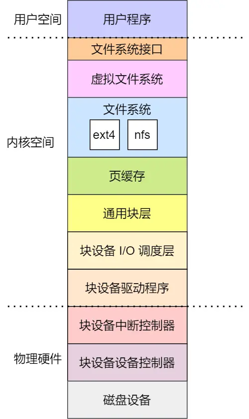

## 设备控制器

设备控制器里有芯片，它可执行自己的逻辑，也有自己的寄存器，用来与 CPU 进行通信，比如：

* 通过写入这些寄存器，操作系统可以命令设备发送数据、接收数据、开启或关闭，或者执行某些其他操作。
* 通过读取这些寄存器，操作系统可以了解设备的状态，是否准备好接收一个新的命令等。

设备控制器有三类寄存器，它们分别是
***状态寄存器（Status Register）、 命令寄存器（Command Register）以及数据寄存器（Data Register）***。

三个寄存器的作用：

* `数据寄存器`，CPU 向 I/O 设备写入需要传输的数据，比如要打印的内容是「Hello」，CPU 就要先发送一个 H 字符给到对应的 I/O 设备。
* `命令寄存器`，CPU 发送一个命令，告诉 I/O 设备，要进行输入/输出操作，于是就会交给 I/O 设备去工作，任务完成后，会把状态寄存器里面的状态标记为完成。
* `状态寄存器`，目的是告诉 CPU ，现在已经在工作或工作已经完成，如果已经在工作状态，CPU
  再发送数据或者命令过来，都是没有用的，直到前面的工作已经完成，状态寄存标记成已完成，CPU 才能发送下一个字符和命令。

输入输出设备可分为两大类 ：***块设备（Block Device）和字符设备（Character Device）***。

* `块设备`，把数据存储在固定大小的块中，每个块有自己的地址，硬盘、USB 是常见的块设备。
* `字符设备`，以字符为单位发送或接收一个字符流，字符设备是不可寻址的，也没有任何寻道操作，鼠标是常见的字符设备。

块设备通常传输的数据量会非常大，为了减少对设备的频繁操作，于是控制器设立了一个可读写的***数据缓冲区***。

* CPU 写入数据到控制器的缓冲区时，当缓冲区的数据囤够了一部分，才会发给设备。
* CPU 从控制器的缓冲区读取数据时，也需要缓冲区囤够了一部分，才拷贝到内存。

那 CPU 是如何与设备的控制寄存器和数据缓冲区进行通信的？存在两个方法：

* `端口 I/O`，每个控制寄存器被分配一个 I/O 端口，可以通过特殊的汇编指令操作这些寄存器，比如 in/out 类似的指令。
* `内存映射 I/O`，将所有控制寄存器映射到内存空间中，这样就可以像读写内存一样读写数据缓冲区。

## I/O 控制方式

中断 + DMA

中断有两种，一种软中断，例如代码调用 INT 指令触发，一种是硬件中断，就是硬件通过中断控制器触发的。

DMA 的工作方式如下：

* CPU 需对 DMA 控制器下发指令，告诉它想读取多少数据，读完的数据放在内存的某个地方就可以了；
* 接下来，DMA 控制器会向磁盘控制器发出指令，通知它从磁盘读数据到其内部的缓冲区中，接着磁盘控制器将缓冲区的数据传输到内存；
* 当磁盘控制器把数据传输到内存的操作完成后，磁盘控制器在总线上发出一个确认成功的信号到 DMA 控制器；
* DMA 控制器收到信号后，DMA 控制器发中断通知 CPU 指令完成，CPU 就可以直接用内存里面现成的数据了；

## 设备驱动程序

每种设备的控制器的寄存器、缓冲区等使用模式都是不同的，所以为了屏蔽「设备控制器」的差异，引入了 ***设备驱动程序***。

设备控制器不属于操作系统范畴，它是属于硬件，而设备驱动程序属于操作系统的一部分，操作系统的内核代码可以像本地调用代码一样使用设备驱动程序的接口，而设备驱动程序是面向设备控制器的代码，它发出操控设备控制器的指令后，才可以操作设备控制器。

不同的设备控制器虽然功能不同，但是 ***设备驱动程序会提供统一的接口给操作系统*** ，这样不同的设备驱动程序，就可以以相同的方式接入操作系统。

设备完成了事情，则会发送中断来通知操作系统。那操作系统就需要有一个地方来处理这个中断，这个地方也就是在设备驱动程序里，它会及时响应控制器发来的中断请求，并根据这个中断的类型调用响应的
***中断处理程序*** 进行处理。

中断处理程序的处理流程：

* 在 I/O 时，设备控制器如果已经准备好数据，则会通过中断控制器向 CPU 发送中断请求；
* 保存被中断进程的 CPU 上下文；
* 转入相应的设备中断处理函数；
* 进行中断处理；
* 恢复被中断进程的上下文；

## 通用块层

对于块设备，为了减少不同块设备的差异带来的影响，Linux 通过一个统一的 ***通用块层***，来管理不同的块设备。

通用块层是处于文件系统和磁盘驱动中间的一个块设备抽象层，它主要有两个功能：

* 第一个功能，向上为文件系统和应用程序，提供访问块设备的标准接口，向下把各种不同的磁盘设备抽象为统一的块设备，并在内核层面，提供一个框架来管理这些设备的驱动程序；
* 第二个功能，通用层还会给文件系统和应用程序发来的 I/O 请求排队，接着会对队列重新排序、请求合并等方式，也就是 I/O
  调度，主要目的是为了提高磁盘读写的效率。

Linux 内存支持 5 种 I/O 调度算法，分别是：

* 没有调度算法：不对文件系统和应用程序的 I/O 做任何处理，这种算法常用在虚拟机 I/O 中，此时磁盘 I/O 调度算法交由物理机系统负责。
* 先入先出调度算法：最简单的 I/O 调度算法，先进入 I/O 调度队列的 I/O 请求先发生。
* 完全公平调度算法：大部分系统都把这个算法作为默认的 I/O 调度器，它为每个进程维护了一个 I/O 调度队列，并按照时间片来均匀分布每个进程的
  I/O 请求。
* 优先级调度：优先级高的 I/O 请求先发生， 它适用于运行大量进程的系统，像是桌面环境、多媒体应用等。
* 最终期限调度算法：分别为读、写请求创建了不同的 I/O 队列，这样可以提高机械磁盘的吞吐量，并确保达到最终期限的请求被优先处理，适用于在
  I/O 压力比较大的场景，比如数据库等。

## 存储系统 I/O 软件分层

Linux 存储系统的 I/O 由上到下可以分为三个层次，分别是文件系统层、通用块层、设备层。

三个层次的作用是：

* 文件系统层，包括虚拟文件系统和其他文件系统的具体实现，它向上为应用程序统一提供了标准的文件访问接口，向下会通过通用块层来存储和管理磁盘数据。
* 通用块层，包括块设备的 I/O 队列和 I/O 调度器，它会对文件系统的 I/O 请求进行排队，再通过 I/O 调度器，选择一个 I/O
  发给下一层的设备层。
* 设备层，包括硬件设备、设备控制器和驱动程序，负责最终物理设备的 I/O 操作。

有了文件系统接口之后，不但可以通过文件系统的命令行操作设备，也可以通过应用程序，调用 `read`、`write` 函数，就像读写文件一样操作设备，所以说设备在
Linux 下，也只是一个特殊的文件。

除了读写操作，还需要有检查特定于设备的功能和属性。于是，需要 `ioctl` 接口，它表示输入输出控制接口，是用于配置和修改特定设备属性的通用接口。

存储系统的 I/O 是整个系统最慢的一个环节，所以 Linux 提供了不少缓存机制来提高 I/O 的效率。

* 为了提高文件访问的效率，会使用 ***页缓存、索引节点缓存、目录项缓存*** 等多种缓存机制，目的是为了减少对块设备的直接调用。
* 为了提高块设备的访问效率， 会使用 ***缓冲区*** ，来缓存块设备的数据。

## 键盘敲入字母时，期间发生了什么？

CPU 里面的内存接口，直接和系统总线通信，然后系统总线再接入一个 I/O 桥接器，这个 I/O 桥接器，另一边接入了内存总线，使得 CPU
和内存通信。再另一边，又接入了一个 I/O 总线，用来连接 I/O 设备，比如键盘、显示器等。

那当用户输入了键盘字符，***键盘控制器*** 就会产生扫描码数据，并将其缓冲在键盘控制器的寄存器中，紧接着键盘控制器通过总线给
CPU 发送 ***中断请求***。

CPU 收到中断请求后，操作系统会 ***保存被中断进程的 CPU 上下文*** ，然后调用键盘的 ***中断处理程序***。

键盘的中断处理程序是在 ***键盘驱动程序*** 初始化时注册的，那键盘 ***中断处理函数 ***
的功能就是从键盘控制器的寄存器的缓冲区读取扫描码，再根据扫描码找到用户在键盘输入的字符，如果输入的字符是显示字符，那就会把扫描码翻译成对应显示字符的
ASCII 码，比如用户在键盘输入的是字母 A，是显示字符，于是就会把扫描码翻译成 A 字符的 ASCII 码。

得到了显示字符的 ASCII 码后，就会把 ASCII
码放到「读缓冲区队列」，接下来就是要把显示字符显示屏幕了，显示设备的驱动程序会定时从「读缓冲区队列」读取数据放到「写缓冲区队列」，最后把「写缓冲区队列」的数据一个一个写入到显示设备的控制器的寄存器中的数据缓冲区，最后将这些数据显示在屏幕里。

显示出结果后，***恢复被中断进程的上下文***。

