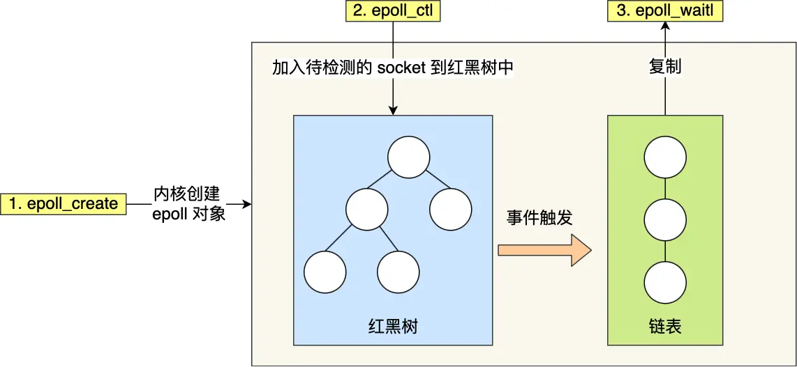

最基础的 TCP 的 Socket 编程，它是阻塞 I/O 模型，基本上只能一对一通信，那为了服务更多的客户端，我们需要改进网络 I/O 模型。

比较传统的方式是使用多进程/线程模型，每来一个客户端连接，就分配一个进程/线程，然后后续的读写都在对应的进程/线程，这种方式处理
100 个客户端没问题，但是当客户端增大到 10000 个时，10000 个进程/线程的调度、上下文切换以及它们占用的内存，都会成为瓶颈。

为了解决上面这个问题，就出现了 I/O 的多路复用，可以只在一个进程里处理多个文件的 I/O，Linux 下有三种提供 I/O 多路复用的
API，分别是：select、poll、epoll。 ***进程可以通过一个系统调用函数从内核中获取多个事件***。

select 和 poll 并没有本质区别，它们内部都是使用「线性结构」来存储进程关注的 Socket 集合。
在使用的时候，首先需要把关注的 Socket 集合通过 select/poll 系统调用从用户态拷贝到内核态，然后由内核检测事件，当有网络事件产生时，内核需要遍历进程关注
Socket 集合，找到对应的 Socket，并设置其状态为可读/可写，然后把整个 Socket 集合从内核态拷贝到用户态，用户态还要继续遍历整个
Socket 集合找到可读/可写的 Socket，然后对其处理。

select 和 poll 的缺陷在于，当客户端越多，也就是 Socket 集合越大，Socket 集合的遍历和拷贝会带来很大的开销，因此也很难应对
C10K。

epoll 是解决 C10K 问题的利器，通过两个方面解决了 select/poll 的问题。

* epoll 在内核里使用 ***「红黑树」*** 来关注进程所有待检测的 Socket，红黑树是个高效的数据结构，增删改一般时间复杂度是 O(
  logN)，通过对这棵黑红树的管理，不需要像 select/poll 在每次操作时都传入整个 Socket 集合，减少了内核和用户空间大量的数据拷贝和内存分配。
* epoll 使用事件驱动的机制，内核里 ***维护了一个「链表」来记录就绪事件*** ，只将有事件发生的 Socket 集合传递给应用程序，不需要像
  select/poll 那样轮询扫描整个集合（包含有和无事件的 Socket ），大大提高了检测的效率。

而且，epoll 支持边缘触发和水平触发的方式，而 select/poll 只支持水平触发，一般而言，边缘触发的方式会比水平触发的效率高，边缘触发可以减少
epoll_wait 的系统调用次数，系统调用也是有一定的开销的。

* 使用边缘触发模式时，当被监控的 Socket 描述符上有可读事件发生时，服务器端只会从 epoll_wait 中苏醒一次，即使进程没有调用
  read 函数从内核读取数据，也依然只苏醒一次，因此我们程序要保证一次性将内核缓冲区的数据读取完；
* 使用水平触发模式时，当被监控的 Socket 上有可读事件发生时，服务器端不断地从 epoll_wait 中苏醒，直到内核缓冲区数据被 read
  函数读完才结束，目的是告诉我们有数据需要读取；

