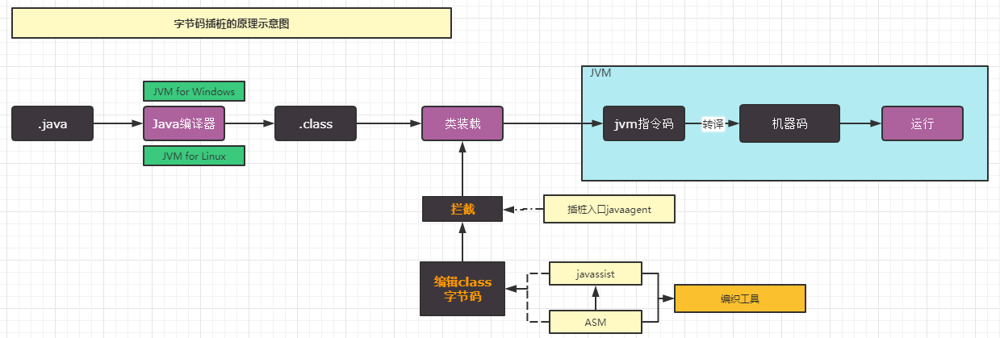

# 字节码

#### java代码运行机制

_7aihe1u.png>)

#### java动态字节码技术



### 动态字节码技术有哪些

-   ASM 是一个 Java 字节码操作分析框架，它能被用来动态生成类或者增强既有类的功能。ASM 可以直接产生二进制 class 文件，也可以在类被加载入 Java 虚拟机之前动态改变类行为ASM 从类文件中读入信息后，能够改变类行为，分析类信息，甚至能够根据用户要求生成新类，简单说就是ASM通过修改class文件来达到修改增强类的功能，但需要会操作字节码指令，学习使用成本高
-   javassit 底层基于ASM , 是一个开源的分析、编辑和创建Java字节码的类库。其主要的优点，在于简单，而 且快速，直接使用java编码的形式，而不需要了解虚拟机指令，就能动态改变类的结构，或者动态生成

javaagent 与普通java类运行对比

####

|      | 运行时.jar              | javaagent.jar                                                |
| ---- | -------------------- | ------------------------------------------------------------ |
| 入口方法 | main(Stirng\[] args) | premain(String ，instrument)                                  |
| 参数配置 | main-class           | premain-class                                                |
| 运行方式 | java -jar xxx.jar    | java -jar xxx.jar -javaagent:xxx.jar=xxx \<br />必须依附其他的jar执行 |

如何使用javaagent？

1.  定义一个 `MANIFEST.MF` 文件，必须包含 `Premain-Class` 选项，通常也会加入`Can-Redefine-Classes`和`Can-Retransform-Classes` 选项。 （maven项目的话也可以使用maven plugin 进行配置）
2.  创建一个`Premain-Class`指定的类，类中包含`premain` 方法，方法逻辑由用户自己确定。
3.  将 `premain` 的类和 `MANIFEST.MF` 文件打成 jar 包。
4.  使用参数 `-javaagent: jar`包路径 启动要代理的方法

maven-plugin配置方式：

```纯文本
<plugin>
    <groupId>org.apache.maven.plugins</groupId>
    <artifactId>maven-jar-plugin</artifactId>
    <version>3.2.0</version>
    <configuration>
        <archive>
            <!--自动添加META-INF/MANIFEST.MF -->
            <manifest>
                <addClasspath>true</addClasspath>
            </manifest>
            <manifestEntries>
                <Premain-Class>com.lcr.agent.javassist.AgentMain</Premain-Class>
                <Can-Redefine-Classes>true</Can-Redefine-Classes>
                <Can-Retransform-Classes>true</Can-Retransform-Classes>
            </manifestEntries>
        </archive>
    </configuration>
</plugin>
```

**MANIFREST.MF文件的作用**

```纯文本
Premain-Class ：包含 premain 方法的类（类的全路径名）

Agent-Class ：包含 agentmain 方法的类（类的全路径名）

Boot-Class-Path ：设置引导类加载器搜索的路径列表。查找类的特定于平台的机制失败后，引导类加载器会搜索这些路径。按列出的顺序搜索路径。列表中的路径由一个或多个空格分开。路径使用分层 URI 的路径组件语法。如果该路径以斜杠字符（“/”）开头，则为绝对路径，否则为相对路径。相对路径根据代理 JAR 文件的绝对路径解析。忽略格式不正确的路径和不存在的路径。如果代理是在 VM 启动之后某一时刻启动的，则忽略不表示 JAR 文件的路径。（可选）

Can-Redefine-Classes ：true表示能重定义此代理所需的类，默认值为 false（可选）

Can-Retransform-Classes ：true 表示能重转换此代理所需的类，默认值为 false （可选）

Can-Set-Native-Method-Prefix： true表示能设置此代理所需的本机方法前缀，默认值为 false（可选）
```
