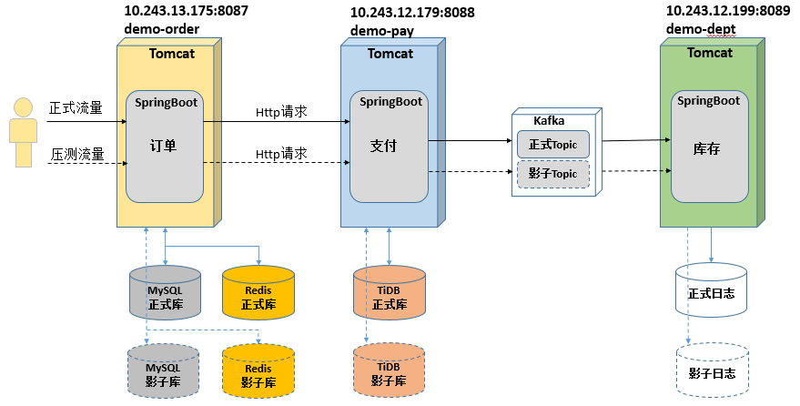
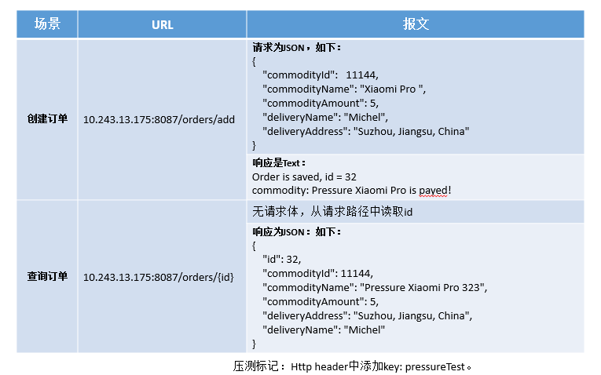

# 探针测试

#### 测试环境架构图

#### 测试环境服务器

MySQL：

正式库： jdbc:mysql://10.47.190.216:3306/agent fabu Ec2PjjYu3M10

影子库： jdbc:mysql://10.47.201.8:3306/agent fabu Stor4D673iOR

Kafka:

10.243.57.176

Redis:

redis sentinel集群：

ip:10.243.100.29 port:26379

ip:10.243.100.30 port:26379

ip:10.243.100.31 port:2637

redis集群：

name=mymaster

ip:10.243.66.170 port:6379

ip:10.243.66.169 port:6379

测试环境机器列表：

tomcat: 2c4g0g

10.243.13.175 snsoadmin qoUS03 \*.

10.243.12.179 snsoadmin fjON86@&

10.243.12.199 snsoadmin zuSB93#,

#### Demo应用代码库地址

[http://git.cnsuning.com/ares/full-link-agent-demo.git](web://urllink//http://git.cnsuning.com/ares/full-link-agent-demo.git "http://git.cnsuning.com/ares/full-link-agent-demo.git")

#### 测试接口如下

#### 测试应用部署方式

1.  把编译打包好的测试应用的Jar包上传到服务器/home/snsoadmin目录。
2.  把编译生成的Agent jar包(在deploy\agent目录中)，打成一个压缩包上传到/home/snsoadmin目录。
3.  每个服务器的/home/snsoadmin目录中，都有两个脚本，例如demo-pay应用：

    start\_pay.sh：不带Agent启动应用。

    start\_pay\_with\_agent.sh:带Agent启动应用。
